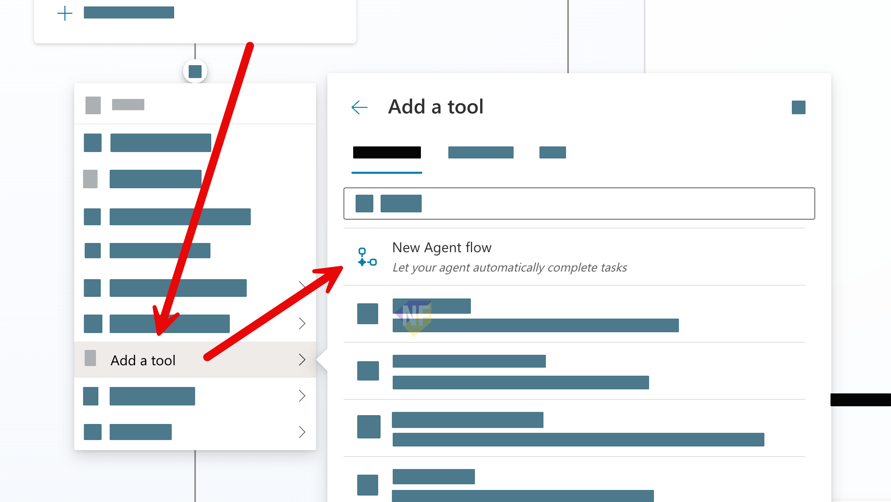
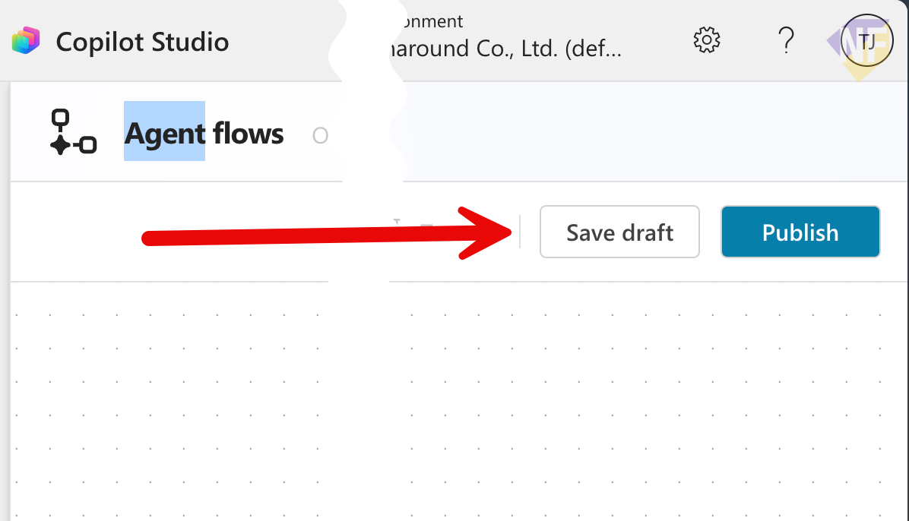
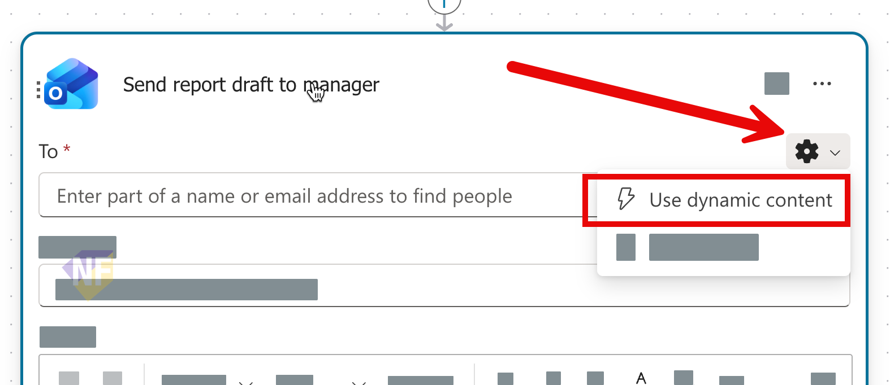

# Exercise: Add an Email Tool and Publish

## Exercise Overview

- **เวลา:** 13:00–14:30 (90 นาที)
- **เป้าหมาย:** สร้าง email Agent Flow แบบเล็ก ยืนยันข้อมูลก่อนส่ง ทดสอบ แล้วเผยแพร่สู่ช่องทางที่อนุญาต
- **ผลลัพธ์:** email flow ที่ทำงานหนึ่งครั้งและ agent ที่ publish แล้ว

## Prerequisites

- Copilot Champion Assistant จาก Section 2
- Outlook connection ที่ได้รับอนุญาต; ใช้อีเมลของผู้เรียนเองเป็นผู้รับทดสอบ
- tenant policy อาจปิด connector, publishing หรือ Teams; เมื่อถูกจำกัดให้ทำถึง checkpoint และชม trainer demo
- อ้างอิง [publishing and channels](https://learn.microsoft.com/en-us/microsoft-copilot-studio/publication-fundamentals-publish-channels) และ [sharing](https://learn.microsoft.com/en-us/microsoft-copilot-studio/admin-share-bots?tabs=teams)

> **หมายเหตุเกี่ยวกับภาพ:** ภาพมาจาก source exercise เดิมโดยไม่แก้ไข จึงอาจเห็นชื่อผู้ใช้ tenant บริษัท ชื่อ flow หรือตัวแปรเดิม ให้ยึดชื่อ flow และตัวแปรที่เขียนในขั้นตอนปัจจุบัน

## Scenario 1: ส่งสรุปการเริ่มใช้ให้ตัวเอง

ผู้ใช้ขอให้อีเมล checklist ไปยังตนเอง เอเจนต์ต้องเก็บ recipient, subject และ content แสดงสรุปเพื่อขอ confirmation แล้วจึงเรียก flow ห้ามส่งให้บุคคลอื่นในกิจกรรมนี้

### Practice 1: Create a minimal email Agent Flow

#### Steps

1. เปิด agent ไปที่ **Tools** หรือ **Actions** แล้วเลือก **Add a tool** > **New Agent flow**



2. เมื่อหน้า designer เปิด ให้เลือก **Save draft** ก่อนตั้งค่าต่อ



3. ตั้งชื่อ `Send Copilot adoption checklist`
4. ใน trigger **When an agent calls the flow** เพิ่ม text inputs 3 รายการ: `RecipientEmail`, `EmailSubject`, `EmailBody`


5. เพิ่ม action **Office 365 Outlook — Send an email (V2)**


6. map ค่าแบบ dynamic content: `RecipientEmail` ไปที่ **To**, `EmailSubject` ไปที่ **Subject**, และ `EmailBody` ไปที่ **Body**



7. เพิ่ม output `DeliveryStatus` และคืนค่า `Email request completed` หลัง action สำเร็จ


8. เลือก **Save draft** ตรวจ connection แล้วเลือก **Publish** สำหรับ flow เมื่อไม่มี error
9. กลับไปที่ agent เลือก **Add a tool** และเพิ่ม flow ที่เผยแพร่แล้ว


### Practice 2: Confirm, send, publish, and share

#### Steps

1. เพิ่ม instruction สำหรับ tool behavior:

```text
Before calling the email tool, collect RecipientEmail, EmailSubject, and EmailBody.
Show all three values to the user and ask for explicit confirmation.
Call the tool only after the user confirms.
For this workshop, only send to the signed-in learner's own email address.
Never guess an address or silently change the content.
```

2. ใน **Test your agent** พิมพ์:

```text
ส่ง checklist เริ่มใช้ Copilot 5 ข้อไปที่อีเมลของฉัน
```

3. ป้อนอีเมลของตนเองเมื่อ agent ถาม ตรวจ recipient, subject และ body จากนั้นตอบยืนยัน
4. ตรวจ Inbox และเปิดข้อความเพื่อยืนยันว่าผู้รับ เนื้อหา และรูปแบบตรงกับ preview
5. เลือก **Publish** ที่ระดับ agent และยืนยัน publish ล่าสุด
6. ไปที่ **Channels** แล้วเปิด **Demo website** สำหรับการสาธิตเท่านั้น; ห้ามใช้ demo website เป็น production endpoint
7. ที่ **Microsoft Teams** เลือกการตั้งค่าที่ trainer อนุญาต จากนั้นเพิ่มหรือแชร์ agent เฉพาะ audience ทดสอบ
8. หาก policy/licensing ไม่อนุญาต Teams ให้บันทึก screenshot หรือข้อความจำกัดและจบที่ published agent โดยไม่ขยายสิทธิ์

## Checkpoint

- flow ใช้เพียง 3 inputs และส่งหาผู้เรียนเองหลัง explicit confirmation
- email ที่ได้รับตรงกับ preview และไม่มีข้อมูลลับ
- agent ถูก publish ก่อนเปิด channel; Demo website ใช้เพื่อทดลอง ไม่ใช่ production
- sharing audience และ Teams availability เป็นไปตาม tenant policy และ license

## Expected Output

อีเมลทดสอบหนึ่งฉบับ, Agent Flow ที่ publish แล้ว และ Copilot Champion Assistant ที่ publish พร้อม channel decision

## Optional Extension

เพิ่ม validation ให้ flow ปฏิเสธ recipient ที่ไม่ตรงกับอีเมลผู้เรียน แล้วทดสอบ negative case โดยไม่ส่งข้อความจริง
