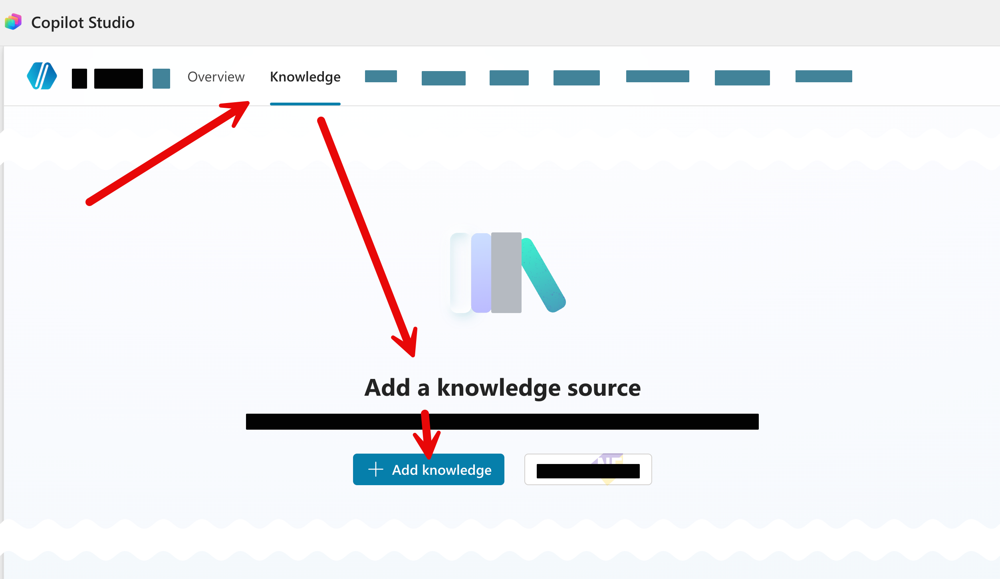
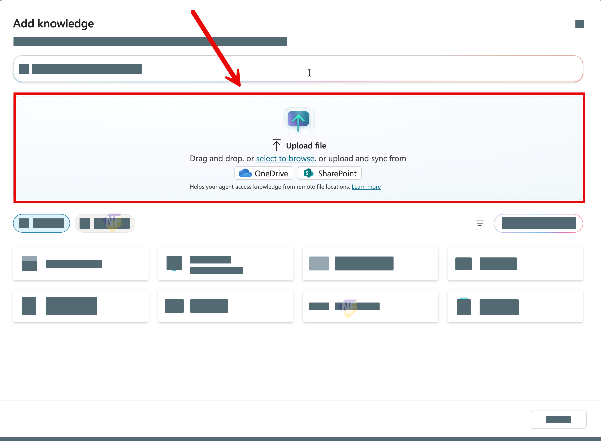
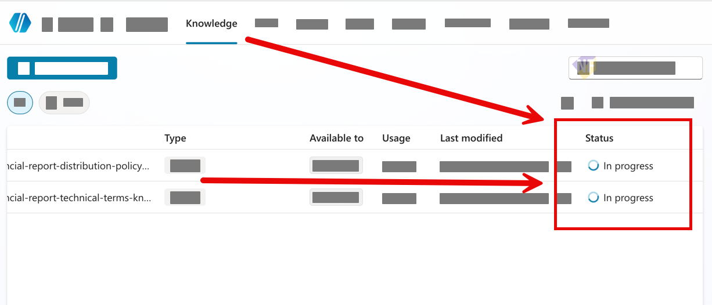

# แบบฝึกหัดที่ 4:  Knowledge

🔑 **ต้องการ M365 Copilot License + สิทธิ์เข้าใช้ Copilot Studio**

แบบฝึกหัดนี้จะพาเราต่อยอด **Financial Report Assistant** ที่สร้างไว้ให้รองรับการคุยได้มากขึ้น 

จุดสำคัญของแบบฝึกหัดนี้คือ **ไม่ต้องสร้าง Topic ใหม่** ให้เริ่มจาก Agent เดิมที่มี `Monthly Report Intake` อยู่แล้ว แล้วปรับ **Instructions** และ **Orchestration** ให้ Agent ตัดสินใจเส้นทางบทสนทนาได้ลื่นขึ้น


---

## Practice 1: เตรียม Knowledge ให้พร้อม (Technical Terms)

1. ไปที่แท็บ **Knowledge** ของ Agent
2. กด **Add knowledge**
   
3. อัปโหลดไฟล์

   ```text
   financial-report-technical-terms-knowledge.docx
   ```

   
4. กด **Add to agent**
   
5. ตรวจสถานะให้เป็น **Ready** ก่อนเริ่มทดสอบ
   

> 💡 Tip: ถ้า status ของไฟล์ยังเป็น `In Progress` ตัว knowledge จะยังไม่สามารถนำมาใช้ได้

---

## Practice 2: ปรับ Agent Instructions 

1. ไปที่หน้า **Overview** ของ Agent แล้วแก้ส่วน **Instructions**
2. เพิ่มข้อความให้ชัดว่า Agent อธิบาย technical term โดยอาศัยข้อมูลจาก knowledge ที่อัปโหลดไว้แล้ว
3. สามารถใช้ตัวอย่างข้อความนี้แทนที่ลงไปได้ **แล้วถ้าเกิดไปลบการเรียกใช้ตัวแปรใน instruction เดิมให้ทำการเพิ่มตัวแปรกลับไปเป็นแบบเดิมด้วย**

```text
You are Financial Report Assistant for enterprise business users.

Scope:
- Explain financial reporting technical terms using approved knowledge.

Rules:
- If user asks the meaning of financial reporting technical terms, answer with **grounded knowledge** and keep explanation concise.
- If request is outside finance reporting scope, ask user to rephrase within scope.
```

4. กด **Save**

> ⚠️ **Note:** ในแบบฝึกหัดนี้ยังไม่ต้องเพิ่ม trigger ใหม่หรือสร้าง Topic ใหม่

---

## Practice 3: เปิด orchestration เพื่อให้คุยแบบผสมได้

1. ไปที่ **Settings** ของ Agent
2. ตรวจส่วน **Orchestration** ให้เป็นโหมด generative เพื่อให้ Agent ตัดสินใจเส้นทางบทสนทนาได้
3. บันทึกการตั้งค่า

> 💡 Tip: ในแบบฝึกหัดถัดไป เราจะต่อยอดจาก Topic เดิมอีกครั้ง แต่จะเพิ่ม action สำหรับส่งรายงานต่อให้ครบกระบวนการ

---

## Practice 4: ทดสอบ 

ให้ทดสอบใน **Test your agent** ตามลำดับนี้

1. สลับเป็นคำถามเชิง technical term ในบทสนทนาเดียวกัน

   ```text
   Variance Percent คืออะไร และควรตีความอย่างไรในรายงานรายเดือน
   ```

2. ทดสอบอีกคำถามเชิงความรู้

   ```text
   EBITDA margin ต่างจาก gross margin อย่างไร
   ```

3. ทดสอบ out-of-scope 1 เคส

   ```text
   ช่วยแนะนำร้านกาแฟใกล้ออฟฟิศ
   ```

สิ่งที่ต้องสังเกต:
- Agent ยังทำ structured flow สำหรับงานรายงานได้
- Agent ตอบคำถาม technical term ได้โดยอิง knowledge
- คำถามนอกขอบเขตไม่ควรถูกตอบมั่ว

---

## สรุป

ในแบบฝึกหัดนี้ พวกเราได้เพิ่ม knowledge ให้กับ Financial Report Assistant โดยใช้ Agent orchestration และ knowledge เดิม 

ขั้นตอนถัดไป → [เพิ่ม Agent Flow และใช้ Send an email (V2) สำหรับส่งรายงาน](../exercise-4-agent-flow-as-a-tools/README.md)

   > ⚠️ Note: ในแบบฝึกหัดนี้ให้ใช้ `UserKnowledgeQuestion` เหมือนกับ branch แรก เพื่อให้ทั้ง 2 เส้นทางรับคำถามจากตัวแปรเดียวกัน และเปรียบเทียบผลการ route ได้ง่าย

