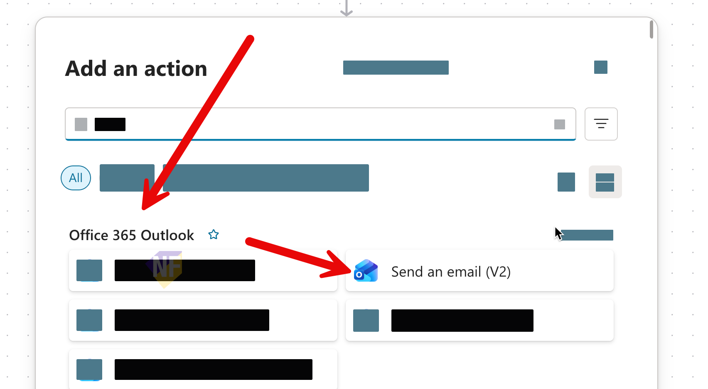
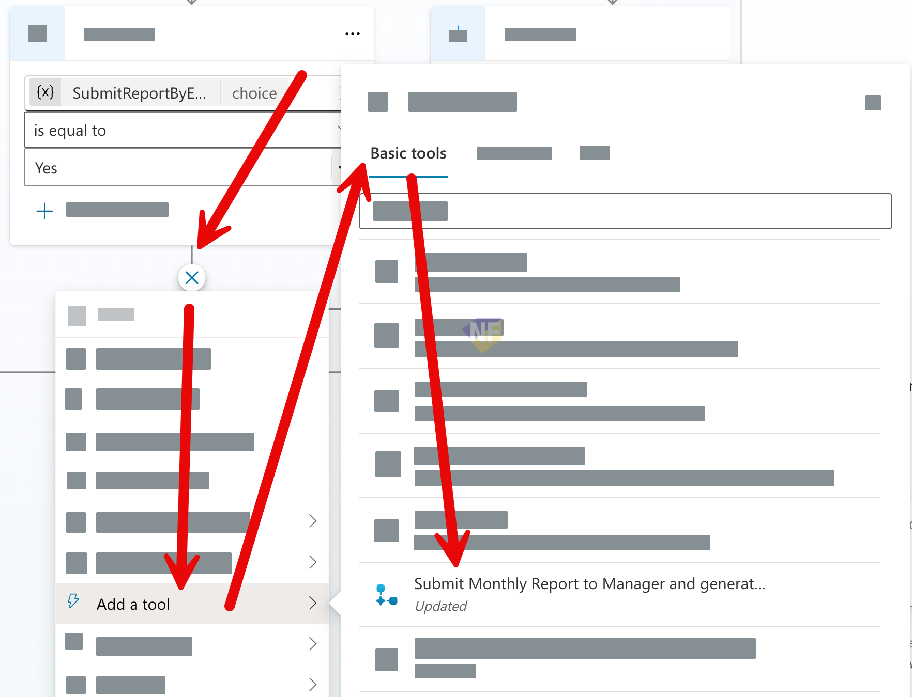

# แบบฝึกหัดที่ 5: เพิ่ม Agent Flow สำหรับส่ง email

🔑 **ต้องการ M365 Copilot License + สิทธิ์เข้าใช้ Copilot Studio**

แบบฝึกหัดนี้จะพาเราไปสู่การทำ **Action / Automation** ผ่าน **Agent Flow** ใน Copilot Studio โดยยังคงใช้สถานการณ์ของ `Financial Report Assistant` เดิม เพื่อให้ สามารถส่งสรุปรายงานทางอีเมลไปยังผู้รับที่ต้องการได้ผ่าน flow ธุรกิจที่ควบคุม input, output, และข้อความตอบกลับได้ชัดเจนกว่าเดิม


---

## Practice 1: ทบทวน flow เดิมและกำหนดเป้าหมายของ action

1. เปิด Agent `Financial Report Assistant` ที่สร้างจาก Module 2
2. เช็คดู instructions และ orchestration ของ Agent ว่ายังเหมาะสมกับการทำงานแบบ hybrid conversation หรือไม่

---

## Practice 2: สร้าง Agent Flow และใช้ Send an email (V2)

1. จากเมนูด้านซ้ายของ Copilot Studio portal ให้เลือก flow > กด **Create new flow** > ตั้งชื่อ flow ว่า

   ```text
   Send Result by Email 
   ```
2. เราจะเข้าสู่หน้า Agent flow designer ให้กดปุ่ม **Save draft** ก่อนที่จะดำเนินขั้นตอนต่อไป
   
3. จากด้านบนซ้าย ให้อยู่ในส่วนของหน้า Designer > คลิกที่ชื่อเพื่อเปลี่ยนชื่อเป็น
   - ชื่อ flow:
      ```text
      Send Result by Email 
      ```
   - Input parameters: `AnalysisSummary`, `ReviewerEmail`
   - Output parameters: `ResponseMessage`
   - ใน flow นี้ให้สร้างขั้นตอนธุรกิจแบบตรงไปตรงมา: ส่งอีเมลสรุปผลไปยัง reviewer แล้วส่งข้อความยืนยันกลับไปที่ Agent

4. ที่ action `When an agent calls the flow` ให้เพิ่ม input parameters 2 ค่าเป็นประเภทดังนี้

   ```text
   AnalysisSummary (text)
   ```
   ```text
   ReviewerEmail (email)
   ```
   

5. สังเกตว่า input เหล่านี้คือค่าที่ Topic จะส่งเข้ามาให้ flow ใช้งานต่อใน action อื่นๆ
6. ใต้ action `When an agent calls the flow` ให้เพิ่ม action `Send an email (V2)` จาก Office 365 Outlook
   
7. กำหนดค่าหลักของ `Send an email (V2)` ตามนี้

   ### To
   1. จากช่อง To ให้กดเลือกปุ่มรูปเฟือง (⚙) เพื่อเลือก **Use dynamic content**
   2. จากนั้นเลือกหา Action ชื่อ `When an agent calls the flow`
   3. เลือกชื่อตัวแปร ReviewerEmail ที่เราสร้างไว้
   

   ```text
   ReviewerEmail
   ```

   ### Subject
   คัดลอกข้อความนี้ไปใส่ในช่อง Subject
   ```text
   Monthly financial report summary
   ```

   ### Body
   คัดลอกข้อความนี้ไปใส่ในช่อง Body โดยทำการแทนที่ค่าตัวแปร `{{AnalysisSummary}}` ด้วย input parameter `AnalysisSummary` ที่เราสร้างไว้ใน action `When an agent calls the flow` เช่นเดียวกับขั้นตอนที่ทำในช่อง To
   ```html
   <p>Hello,</p>
   <p>Here is the monthly financial report summary generated by the agent.</p>
   <p>{{AnalysisSummary}}</p>
   ```

8. ที่ action `Respond to the agent` ให้กำหนดชื่อของตัวแปร output กลับมายัง Agent 1 ค่า

   ```text
   ResponseMessage
   ```

9. ให้คัดลอกตัวอย่างข้อความกำหนดลงในค่าตัวแปร **ResponseMessage** โดยให้แทนที่ข้อความ `{{ReviewerEmail}}` ด้วยตัวแปร input `ReviewerEmail` ที่เราสร้างไว้ใน action `When an agent calls the flow`

   ### ResponseMessage
   ```text
   Report summary sent to {{ReviewerEmail}}.
   ```
   
10. กด **Save draft** และ **Publish** ให้เรียบร้อย

> ⚠️ **Note:** Microsoft Learn ระบุว่า `Send an email (V2)` ไม่ได้ส่ง `message id` กลับมาให้ใช้ต่อในแบบตรงๆ ดังนั้นในแบบฝึกหัดนี้ให้ใช้ `ResponseMessage` เป็นผลลัพธ์หลักที่ Topic จะนำไปแสดงในแชต

---

## Practice 4: ต่อ Topic เดิมให้เรียก Tool

1. กลับไปที่ Agent Designer และเปิด Topic `Monthly Report Intake`
2. ไปที่ node `Ask Recipient Email`
3. ต่อจาก `Ask Recipient Email` ให้เพิ่ม **Add a Tool** แล้วเลือก Agent flow `Send Monthly Report Summary Email`
   
4. map ค่า input ของ Tool ตามนี้

   #### AnalysisSummary
   ```text
   FinancialAnalysisResult.text
   ```

   #### ReviewerEmail
   ```text
   ReviewerEmail
   ```

   > 💡 **Tip:** ถ้า map แบบ record ทั้งก้อนแล้วใช้งานยาก ให้เลือก field `.text` จาก `FinancialAnalysisResult` โดยตรง

5. สร้าง output variable ใหม่สำหรับผลลัพธ์ของ Tool เช่น

   ```text
   SubmitMonthlyReportResultMessage
   ```

6. เพิ่ม **Message** node ต่อจาก Tool node เพื่อแสดงผลลัพธ์ที่ส่งกลับมาจาก flow โดยให้ทำการแทนที่ค่าตัวแปรลงไปในส่วนของ message ดังนี้

   #### Node name:
   ```text
   Show submit report result
   ```

   #### Message:
   ```text
   {{SubmitMonthlyReportResultMessage}}
   ```

7. ปิดท้ายเส้นทางนี้ด้วย **End current topic**
8. ส่วนเส้นทาง `Keep as Draft (No)` ให้แสดงข้อความยืนยันว่าเก็บผลลัพธ์ไว้เป็น draft แล้วจึงใช้ **End current topic**

> ⚠️ **Note:** ถ้าต้องการลดความซับซ้อน ให้เริ่มจากการใช้ `FinancialAnalysisResult` แบบเต็มทั้งก้อนเป็น `AnalysisSummary` ไปก่อน ยังไม่จำเป็นต้องแยกย่อยเป็น KPI หรือ risk ในแบบฝึกหัดนี้

---

## Practice 5: ทดสอบ Happy Path และ Cancel Path

1. เปิด **Test your agent**
2. เริ่มด้วย prompt ตัวอย่างนี้

   ```text
   ช่วยสรุปรายงานการเงินรายเดือน
   ```

3. ตอบค่าระหว่างทางให้ครบจนได้ผลวิเคราะห์จาก `FinancialAnalysisResult`
4. เมื่อระบบถามว่าต้องการส่งทางอีเมลหรือไม่ ให้ทดสอบ **Happy Path** โดยตอบ

   ```text
   Yes
   ```

5. ใส่อีเมลผู้รับ เช่น

   ```text
   finance-manager@krungsri.example
   ```

6. ตรวจว่าระบบเรียก Tool สำเร็จและมีข้อความยืนยันกลับมา เช่น

   ```text
   Report summary sent to finance-manager@krungsri.example.
   ```

7. จากนั้นทดสอบ **Cancel Path** อีกรอบ โดยเริ่ม flow เดิมใหม่ แต่ที่คำถาม `Ask Send Report by Email` ให้ตอบ

   ```text
   No
   ```

8. Expected result ของเส้นทางนี้คือ
   - ระบบไม่เรียก Tool
   - ระบบแจ้งว่าเก็บ draft ไว้เรียบร้อยแล้ว
   - Topic จบอย่างปลอดภัย

---

## สรุป

ในแบบฝึกหัดนี้ พวกเราได้เพิ่มความสามารถเชิงธุรกิจให้ Agent เดิมด้วย Agent Flow ที่รับค่าจาก Topic ไปใช้กับ `Send an email (V2)` แล้วส่ง `ResponseMessage` กลับมายัง Topic เดิม ทำให้ Agent ไม่ได้แค่วิเคราะห์ข้อมูล แต่สามารถส่งสรุปรายงานต่อทางอีเมลได้ทันที

ขั้นตอนถัดไป → [กลับไปที่สารบัญ Copilot Studio](../README.md)