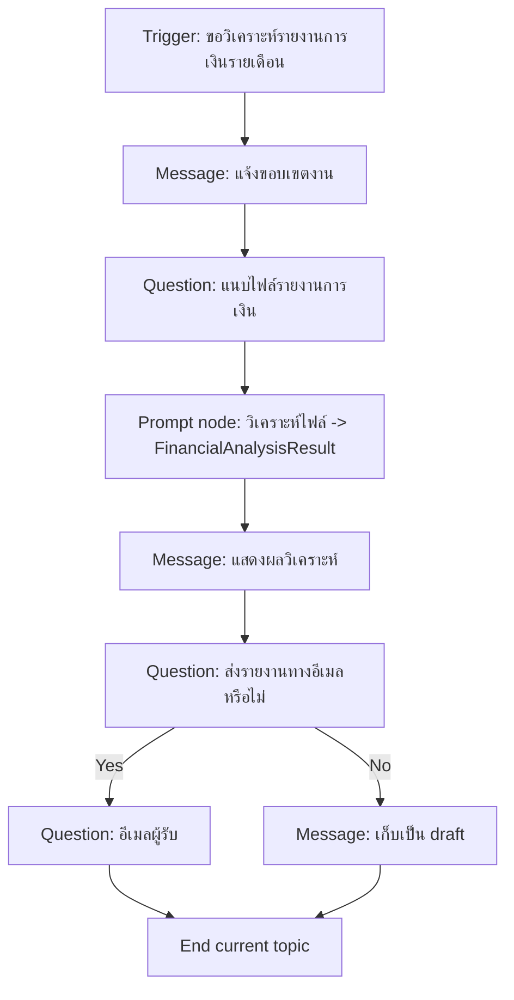
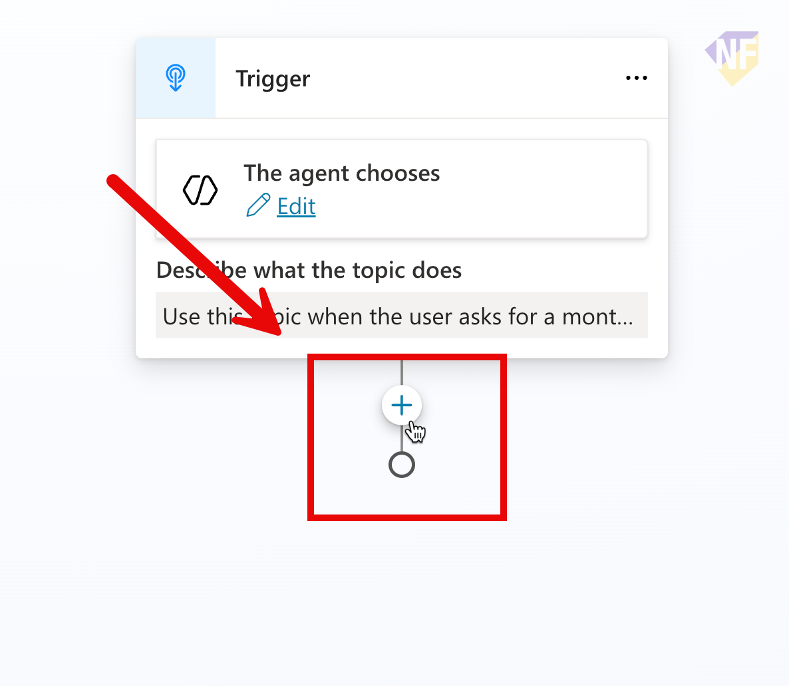
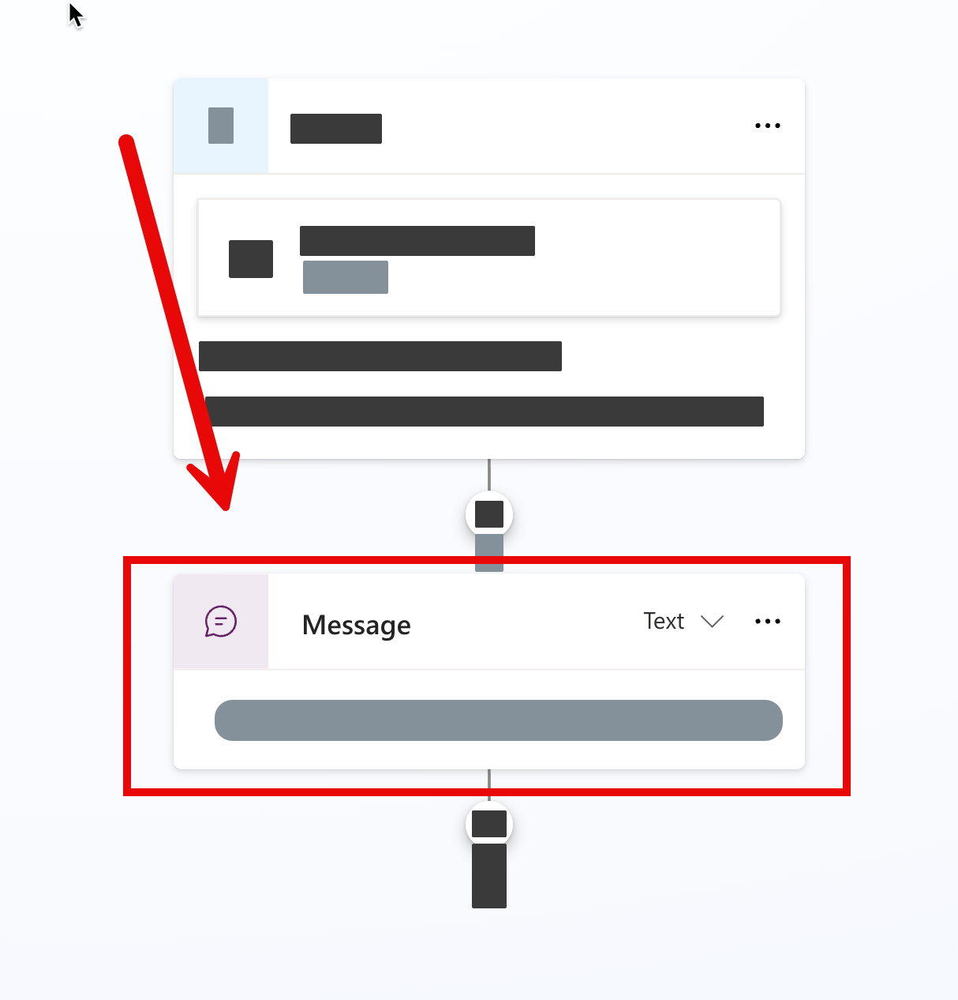
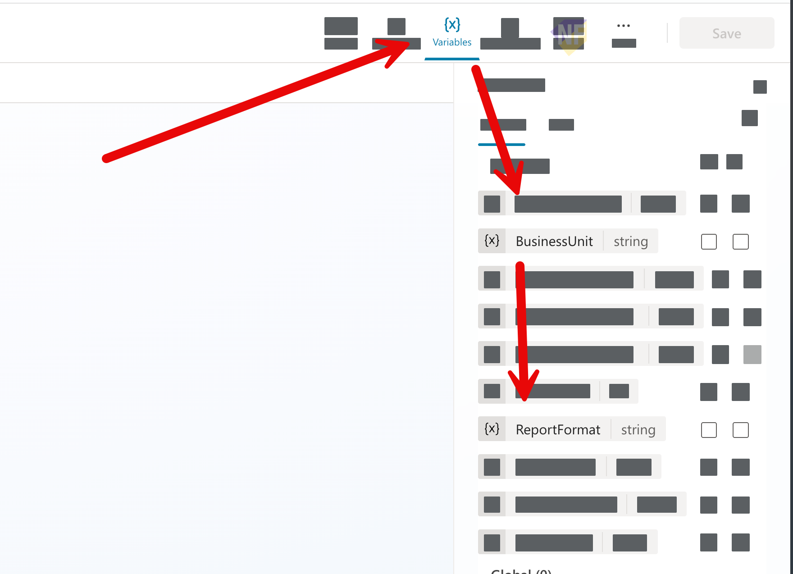

# แบบฝึกหัดที่ 3: ออกแบบ Topic วิเคราะห์รายงานการเงินจากไฟล์ Excel ด้วย Prompt node

🔑 **ต้องการ M365 Copilot License + สิทธิ์เข้าใช้ Copilot Studio**

แบบฝึกหัดนี้จะพาเราสร้าง Topic แรกของ **Krungsri Financial Report Assistant** โดยให้ผู้ใช้แนบไฟล์รายงานการเงินรายเดือน (Excel) เข้ามาในบทสนทนา แล้วให้ Agent ใช้ **Prompt node** วิเคราะห์ไฟล์นั้นตาม prompt ที่เรากำหนดไว้ล่วงหน้า เพื่อให้ได้ผลสรุปที่พร้อมส่งต่อทางอีเมลในแบบฝึกหัดถัดไป



---

## Practice 1: สร้าง Topic และตั้ง Description สำหรับ Trigger

1. เข้า [https://copilotstudio.microsoft.com](https://copilotstudio.microsoft.com) แล้วเปิด Agent `Financial Report Assistant` ของพวกเรา
2. ไปที่ **Topics** และกด **Add a topic** เลือก **Blank Topic**
   
3. ด้านบนขวา ให้คลิกตั้งชื่อ Topic ว่า `Monthly Report Intake`
   
4. ลงมาที่ Trigger node และใส่ Description prompt เพื่อช่วยให้ Agent เลือก Topic นี้ได้แม่นขึ้น เช่น:

   ```
   Use this topic when the user asks Krungsri's Financial Report Assistant to analyze a monthly financial report.
   The user will attach an Excel workbook containing the report data.
   Typical requests include: "ช่วยวิเคราะห์รายงานการเงินรายเดือนของ Krungsri ให้หน่อย", "สรุปผลจากไฟล์รายงานการเงินที่แนบมาให้หน่อย", "Analyze this month's financial report file"
   ```

   
5. กดปุ่ม **Save** ด้านบนขวาเพื่อบันทึกการเปลี่ยนแปลงทั้งหมด
6. ทดสอบ prompt

   ```
   ช่วยวิเคราะห์รายงานการเงินรายเดือนของ Krungsri ให้หน่อย
   ```
7. ตรวจสอบว่า Agent มีการเลือก Topic นี้หรือไม่

> 💡 **Tip:** ใน Description ให้ระบุเจตนาของผู้ใช้อย่างชัดเจนว่าเป็นการวิเคราะห์รายงานการเงินจากไฟล์แนบ เพื่อช่วยให้ Agent เลือก Topic นี้ได้แม่นยำขึ้น

---

## Practice 2: ส่งข้อความแจ้งขอบเขตงานด้วย Message node

1. ด้านล่าง Trigger node ให้คลิกปุ่ม **+** แล้วเลือก **Send a message** node
   
2. คลิกที่ชื่อด้านบนของ Message node แล้วตั้งชื่อว่า

   ```
   Inform about data collection
   ```
3. ในช่อง Message ให้ใส่ข้อความด้านล่างเพื่อแจ้งผู้ใช้

   ```
   ก่อนที่ฉันจะช่วยวิเคราะห์รายงานการเงินของ Krungsri ได้ ขอให้แนบไฟล์รายงานการเงินรายเดือน (Excel) เข้ามาในแชตนี้ได้เลยค่ะ
   ```
   

---

## Practice 3: เพิ่มคำถามให้แนบไฟล์รายงานการเงิน

1. จากด้านล่างของ Message node ให้กด **+** แล้วเลือก **Ask a question** node
2. คลิกที่ชื่อด้านบนของ Question node แล้วตั้งชื่อว่า

   ```
   Ask for report file
   ```
3. ใช้ข้อความด้านล่างสำหรับช่อง Message

   ```
   กรุณาแนบไฟล์รายงานการเงินรายเดือน (.xlsx) ที่ต้องการให้วิเคราะห์
   ```
4. ให้เลือกประเภทการเก็บข้อมูลเป็น **File** (attachment) เพื่อให้ผู้ใช้แนบไฟล์ Excel ได้โดยตรง
5. บันทึกคำตอบไว้ในตัวแปร โดยคลิกเลือก Save response as แล้วกรอกชื่อ `ReportFile` ลงไปในช่อง Variable name
6. กดปุ่ม **Save** ด้านบนขวาเพื่อบันทึกการเปลี่ยนแปลงทั้งหมด

> 💡 **Tip:** ใช้ไฟล์ตัวอย่าง [`Krungsri-Monthly-Financial-Report-May2026.xlsx`](../files/Krungsri-Monthly-Financial-Report-May2026.xlsx) เป็นไฟล์ทดสอบสำหรับ Practice นี้ ไฟล์นี้มี 4 ชีต (`Summary`, `Revenue`, `Costs`, `Variance_Analysis`) ครอบคลุมข้อมูลของ Retail Banking, Corporate Banking, SME Banking และ Card & Payments

---

## Practice 4: เพิ่ม Prompt node เพื่อวิเคราะห์ไฟล์

1. จากด้านล่างของ Question node `Ask for report file` ให้กด **+** แล้วเลือก **Prompt**
2. ตั้งชื่อ Prompt node ว่า

   ```
   Analyze monthly financial report
   ```
3. เลือก input ของ Prompt เป็นตัวแปร `ReportFile` ที่เก็บไว้จาก Practice 3
4. ใส่ prompt สำหรับ 1 use case ตัวอย่างการวิเคราะห์ ดังนี้ (แก้ไขคำได้ตามทีม):

   ```
   คุณคือนักวิเคราะห์การเงินของธนาคาร Krungsri
   จากไฟล์รายงานการเงินรายเดือนที่แนบมา ({{ReportFile}}) ให้สรุปเป็น Executive Summary ภาษาไทย ความยาวไม่เกิน 200 คำ ประกอบด้วย:
   - ภาพรวมรายได้และค่าใช้จ่ายหลักตาม Business Unit
   - Variance ที่สำคัญเทียบกับ Budget พร้อมสาเหตุโดยย่อ
   - ความเสี่ยงหรือประเด็นที่ควรจับตาในเดือนนี้
   ```
5. บันทึกผลลัพธ์ของ Prompt ไว้ในตัวแปรชื่อ

   ```
   FinancialAnalysisResult
   ```
6. กดปุ่ม **Save** ด้านบนขวาเพื่อบันทึกการเปลี่ยนแปลงทั้งหมด

> ⚠️ **Note:** ในแบบฝึกหัดนี้ให้ใช้ prompt ตัวอย่างข้างต้นแค่ 1 use case ก่อน (สรุป Executive Summary) เพื่อให้ flow เรียบง่ายและทดสอบได้เร็ว ทีมสามารถต่อยอด prompt เพิ่มเติมได้เองภายหลัง

---

## Practice 5: แสดงผลวิเคราะห์กลับให้ผู้ใช้

1. จากด้านล่างของ Prompt node ให้กด **+** แล้วเลือก **Send a message**
2. ตั้งชื่อ Message node ว่า

   ```
   Show analysis result
   ```
3. ใส่ข้อความในช่อง Message โดยแทรกตัวแปร

   ```
   {{FinancialAnalysisResult}}
   ```

---

## Practice 6: ถามว่าต้องการส่งรายงานทางอีเมลหรือไม่

1. จากด้านล่างของ Message node `Show analysis result` ให้กด **+** แล้วเลือก **Ask a question**
2. ตั้งชื่อ Question node ว่า

   ```
   Ask Send Report by Email
   ```
3. ใช้ข้อความด้านล่างสำหรับช่อง Message

   ```
   ต้องการให้ส่งสรุปผลวิเคราะห์นี้ทางอีเมลไปยังผู้ตรวจสอบหรือไม่คะ (Yes/No)
   ```
4. เลือกประเภทการเก็บข้อมูลเป็น **Confirmation** (Yes/No)
5. บันทึกคำตอบไว้ในตัวแปรชื่อ

   ```
   SubmitReportByEmail
   ```

---

## Practice 7: แยกเส้นทาง Yes / No

1. จากด้านล่างของ Question node ให้กด **+** แล้วเลือก **Add a condition**
2. เงื่อนไข Yes: `SubmitReportByEmail` **is equal to** `Yes`
   - เพิ่ม **Ask a question** node ชื่อ `Ask Recipient Email` เพื่อถามอีเมลผู้รับ

     ```
     รบกวนขออีเมลของผู้ตรวจสอบที่ต้องการส่งรายงานให้หน่อยค่ะ
     ```

   - เลือกประเภทข้อมูลเป็น **Email** และบันทึกไว้ในตัวแปรชื่อ `ReviewerEmail`
   - ปิดท้ายเส้นทางนี้ด้วย **Topic management** > **End current topic**

     > 💡 ในแบบฝึกหัดถัดไป (เพิ่ม Agent Flow) เราจะกลับมาต่อจาก node `Ask Recipient Email` เพื่อเรียก Tool ส่งอีเมลก่อนถึง End current topic

3. เงื่อนไข All other conditions (No): เพิ่ม **Send a message** แจ้งว่าเก็บผลลัพธ์ไว้เป็น draft แล้วปิดท้ายด้วย **End current topic**

   ```
   รับทราบค่ะ เก็บผลวิเคราะห์นี้ไว้เป็น draft ให้แล้ว
   ```

---

## Practice 8: ตรวจสอบตัวแปรที่เก็บได้

1. คลิกที่ **Variables** ด้านบนขวา แล้วตรวจสอบว่าตอนนี้มีตัวแปรหลักคือ:
   - `ReportFile`
   - `FinancialAnalysisResult`
   - `SubmitReportByEmail`
   - `ReviewerEmail`
   
2. กดปุ่ม **Save** ด้านบนขวาเพื่อบันทึกการเปลี่ยนแปลงทั้งหมด

---

## Practice 9: ปรับ instructions ของ Agent ให้เรียกใช้งาน Topic เมื่อตรงตามเงื่อนไข

1. ไปที่หน้า **Overview** ของ Agent แล้วลงมาด้านล่างที่ **Instructions**
2. กดปุ่ม **Edit** เพื่อแก้ไข Instructions
3. ด้านท้ายของ Instructions ให้เพิ่มข้อความเพื่อบอก Agent ว่าเมื่อใดควรเรียกใช้ Topic นี้ เช่น:

   ```
   - If user asks for monthly financial report analysis, use
   ```
4. พิมพ์ `/` และเลือก Topic `Monthly Report Intake`
5. กดปุ่ม **Save** เพื่อบันทึกการเปลี่ยนแปลง

---

## Practice 10: ทดสอบ Topic รอบแรก

1. เปิดหน้าต่าง **Test** ด้านขวา
2. ทดสอบด้วยคำสั่ง:

   ```
   ช่วยวิเคราะห์รายงานการเงินรายเดือนของ Krungsri ให้หน่อย
   ```
3. เมื่อ Agent ขอไฟล์แนบ ให้แนบไฟล์ [`Krungsri-Monthly-Financial-Report-May2026.xlsx`](../files/Krungsri-Monthly-Financial-Report-May2026.xlsx)
4. ตรวจสอบว่า Agent แสดงผลวิเคราะห์แบบ Executive Summary กลับมา
5. ทดสอบตอบ `Yes` เพื่อดูว่า Agent ถามอีเมลผู้รับต่อ และทดสอบตอบ `No` อีกรอบเพื่อตรวจสอบเส้นทาง draft
6. บันทึกสิ่งที่ต้องปรับ 2-3 จุด เช่น prompt ยังสรุปไม่ตรงประเด็น หรือคำถามยังไม่ชัด

---

## สรุป

ในแบบฝึกหัดนี้ พวกเราได้สร้าง Topic `Monthly Report Intake` ที่รับไฟล์ Excel รายงานการเงินของ Krungsri แล้วใช้ **Prompt node** วิเคราะห์ตาม prompt ที่กำหนดไว้ 1 use case จนได้ตัวแปร `FinancialAnalysisResult` พร้อมแยกเส้นทางถามผู้ใช้ว่าต้องการส่งอีเมลต่อหรือไม่

ขั้นตอนถัดไป → [เพิ่ม Knowledge ให้ Agent ตอบคำศัพท์ทางการเงิน](../exercise-3-knowledge/README.md)
