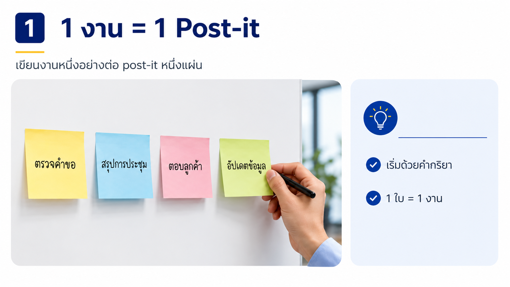
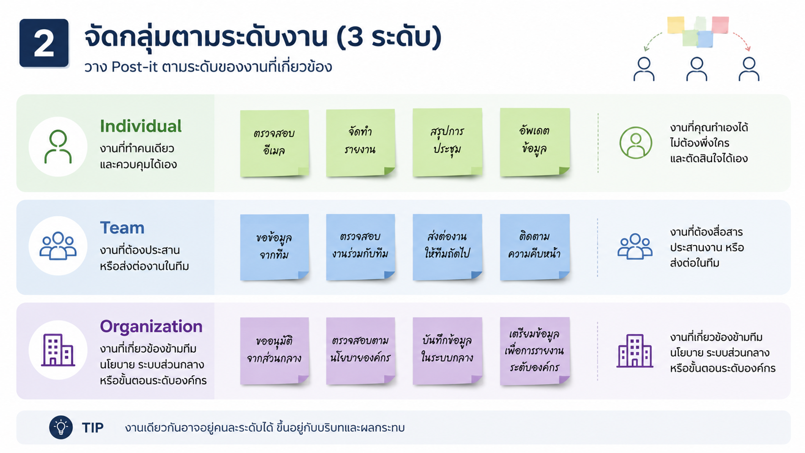
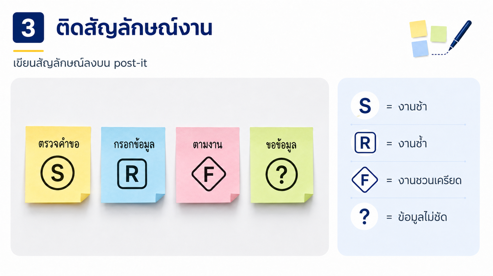

# Exercise: Map Work Friction

## Exercise Overview

- **เป้าหมาย:** ให้เราสามารถสังเกตเห็นภาพงานประจำวันและระบุจุดที่ช้า ซ้ำ เครียด 
- **ผลลัพธ์:** Work Friction Map หนึ่งแผ่นและ pain point ที่วงไว้ 3 จุด

## Prerequisites

- post-it ต่อคน ปากกาเมจิก flipchart และ [Work Friction Map](../../templates/work-friction-map.md)

## Scenario 1: ลองมองงานเหมือนครัวที่กำลังยุ่ง

ทีมของพวกเรามีงานเข้ามาหลายทาง บางงานรอข้อมูล บางงานต้องทำซ้ำ และบางงานไม่ชัดว่าใครรับช่วงต่อ แม้แต่ตอนทำงานใน nextflow ก่อนเลือก AI พวกเราต้องเห็นจุดที่เกิดคอขวดในการทำงานให้ชัด เหมือนหาจุดที่อาหารค้างอยู่ในครัว ก่อนซื้ออุปกรณ์ใหม่

### Practice 1: เขียนแผนที่งานประจำวัน

#### Steps

1. เขียนงานหนึ่งอย่างต่อ post-it หนึ่งแผ่น เริ่มทุกใบด้วยคำกริยาในการทำงานนั้นๆ เช่น “ตรวจคำขอ” หรือ “สรุปการประชุม”

	

2. อ่าน post-it ทีละใบ แล้วถามว่า **“งานนี้ต้องพึ่งใครบ้าง ถึงจะทำงานนี้ให้เสร็จได้?”** จากนั้นวางตามเกณฑ์นี้:
	- **Individual**: ทำให้เสร็จได้ด้วยตนเอง ไม่ต้องรอหรือประสานงานกับผู้อื่น เช่น 
    	- เขียนรายงานส่วนของตนเอง
    	- ตรวจเอกสารที่ตนเองรับผิดชอบ
    	- สรุปการประชุมที่ตนเองเข้าร่วม
	- **Team**: ต้องรอข้อมูล ขอความเห็น อนุมัติ หรือส่งต่องานกับคนในทีมเดียวกัน เช่น 
    	- รวบรวมสถานะงานจากสมาชิกในทีม
    	- ขออนุมัติจากหัวหน้าทีม
    	- ส่งงานต่อให้เพื่อนร่วมทีม
    	- ส่งแบบฟอร์มให้ลูกค้าเซ็นต์
	- **Organization**: ต้องประสานข้ามทีม หรือขึ้นอยู่กับนโยบาย ระบบส่วนกลาง และการอนุมัติระดับองค์กร เช่น 
    	- ขอสิทธิ์เข้าถึงระบบจากฝ่าย IT 
    	- ขออนุมัติจากผู้บริหาร
    	- รอการตอบกลับจากหน่วยงานอื่น

	> **วิธีตัดสินเมื่อไม่แน่ใจ:** เลือกระดับสูงสุดที่จำเป็นเพื่อให้งานเสร็จ เช่น เราเริ่มทำคนเดียว แต่ต้องรอฝ่ายอื่น จัดเป็น **Organization**

	

3. เขียนเพิ่มเครื่องหมายกำกับงาน:
	- `S`: งานที่ช้า (slow)
	- `R`: งานที่ทำซ้ำ (repetitive)
	- `F`: งานที่สร้างความกังวล เครียด หมดไฟ (frustrating)
	- `?`: งานที่มีข้อมูลไม่ชัดเจน จนไม่สามารถระบุปัญหาได้ 

	

> เลือกงานหนึ่งใบแล้วอธิบายให้คนในกลุ่มของพวกเราฟังว่า “ฉันอยากให้งานนี้ง่ายขึ้น เร็วขึ้น หรือชัดขึ้นอย่างไร”
4. ย้ายงานทั้งหมดลงบริเวณที่กำหนด ศึกษางานของเพื่อนร่วมทีม ถ้า**เจองานที่ซ้ำกันให้แปะงานนั้นรวมเข้าด้วยกัน**
5. เลือก 3 งานที่**ดูเป็น pain point ที่กลุ่มคิดว่าควรแก้ไขก่อนงานอื่น** และวงรอบด้วยสีแดง

## Checkpoint

- pain point ทุกจุดบอกได้ว่าเกิดตรงไหนและสร้างผลกระทบอะไร
- หากคำอธิบายเป็นเพียง “งานเยอะ” ให้ลองถามกันต่อว่า “งานส่วนใด รออะไร และใครได้รับผล” (ไม่งั้นทีม TA กับพลจะเข้าไปถามเองน้า)

## Expected Output

Work Friction Map ที่แยกงานตามระดับและชี้ 3 จุดติดขัดด้วยหลักฐานจากประสบการณ์จริง
