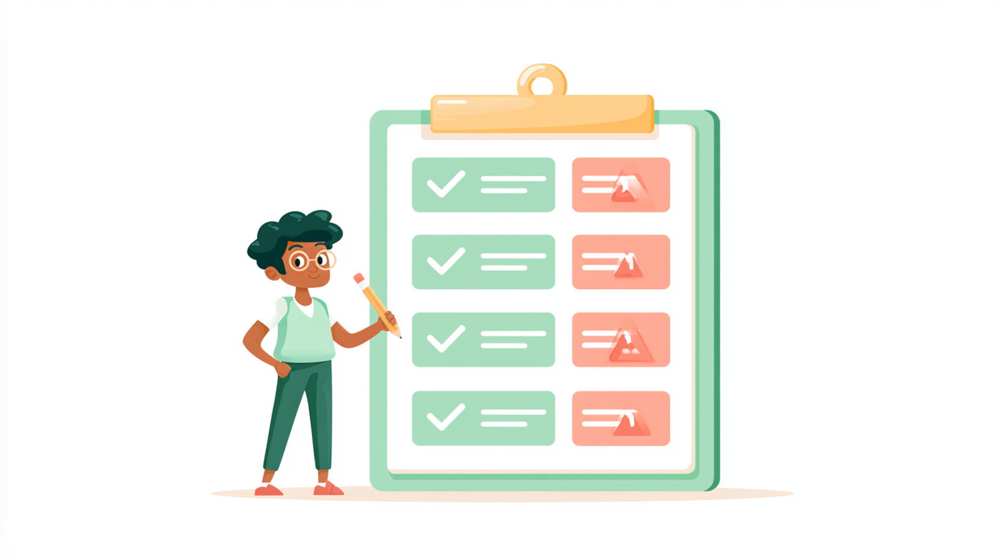

# Exercise: Prioritize the Pain Point

## Exercise Overview

- **เป้าหมาย:** เลือก pain point ที่คุ้มค่าจะนำไปออกแบบ workflow ใหม่
- **ผลลัพธ์:** pain-point theme ที่เลือก พร้อมคะแนน ผลโหวต และหลักฐานสนับสนุน

## Prerequisites

- Work Friction Map จาก Section 1
- post-it ปากกา dot sticker คนละ 3 จุด flipchart และ [Pain Point Priority Matrix](../../templates/pain-point-priority-matrix.md)

## Scenario 1: เลือก paint point ที่คุ้มค่าลงไม้ลงมือ เอ้ย ลงแรงแก้ไข

ในความเป็นจริง พวกเราไม่มีเวลาปรับ หรือแก้ทุกปัญหาในการทำงานที่มีพร้อมกัน จึงต้องรวมปัญหาที่คล้ายกันและเลือกที่พบบ่อยที่สุด และสร้างความลำบาก มีผลต่องานจริงมากที่สุด เพื่อให้ทีมสามารถออกแบบ workflow ใหม่ได้อย่างคุ้มค่าและมีโอกาสสำเร็จสูง

### Practice 1: จัดกลุ่ม โหวต และเลือก pain point

#### Step 1: เตรียม pain point และตารางโหวตคะแนน

1. เริ่มจาก pain point บน Work Friction Map จาก Exercise ก่อนหน้า แล้วนำ post-it เหล่านั้นมาใช้ต่อในกิจกรรมนี้
	> **หากยังไม่มี pain point:** ใช้เวลา 3 นาที เขียนความลำบากจากงานจริง 3 เรื่อง เรื่องละหนึ่ง post-it 
2. วาดตารางและพิจารณาให้คะแนน [Pain Point Priority Matrix](../../templates/pain-point-priority-matrix.md) 

#### Step 2: วาง pain point และโหวตคะแนน

1. วาง pain point ทั้งหมดลงในด้านซ้ายของตาราง Pain Point Priority Matrix
2. สมาชิกในทีมแต่ละคนจะมี 3 คะแนน เพื่อโหวตให้กับแต่ละด้าน
3. ให้ค่อยๆ พิจารณาให้คะแนนทีละด้าน เช่น business impact, frequency, frustration, feasibility (resource) และ feasibility (skill) โดยให้คะแนน 1–3 คะแนนต่อด้าน
   
    > เช่น สมาชิกในทีมมี 5 คน พิจารณาด้าน business impact แล้วมีการโหวตคะแนนเป็น 3, 2, 1, 3, 2 คะแนน รวมเป็น 11 คะแนน จากนั้นจึงพิจารณาด้าน frequency และทำซ้ำจนครบทุกด้าน

##### แนวทางการให้คะแนน

- **Business impact**: พิจารณาว่าปัญหานี้มีผลกระทบต่อธุรกิจมากน้อยเพียงใด เช่น ทำให้เสียเวลา เสียโอกาส หรือเสียเงิน
  - 1 คะแนน: ผลกระทบเล็กน้อยต่อธุรกิจ
  - 2 คะแนน: ผลกระทบปานกลางต่อธุรกิจ
  - 3 คะแนน: ผลกระทบมากต่อธุรกิจ

- **Frequency**: พิจารณาว่าปัญหานี้เกิดขึ้นบ่อยเพียงใด เช่น เกิดขึ้นทุกวัน ทุกสัปดาห์ หรือทุกเดือน
  - 1 คะแนน: เกิดขึ้นไม่บ่อย (เช่น เดือนละครั้ง)
  - 2 คะแนน: เกิดขึ้นปานกลาง (เช่น สัปดาห์ละครั้ง)
  - 3 คะแนน: เกิดขึ้นบ่อย (เช่น ทุกวัน)

- **Frustration**: พิจารณาว่าปัญหานี้สร้างความเครียดหรือความไม่พอใจมากน้อยเพียงใด เช่น ทำให้เสียเวลา ทำให้เกิดความสับสน หรือทำให้เกิดความไม่พอใจ
  - 1 คะแนน: สร้างความไม่พอใจเล็กน้อย
  - 2 คะแนน: สร้างความไม่พอใจปานกลาง
  - 3 คะแนน: สร้างความไม่พอใจมาก

- **Feasibility (Resource)**: พิจารณาว่ามีทรัพยากร เวลา งบประมาณ หรือเครื่องมือเพียงพอสำหรับแก้ไขปัญหานี้หรือไม่
  - 1 คะแนน: ต้องใช้ทรัพยากร เวลา หรืองบประมาณมาก และยังไม่มีความพร้อม
  - 2 คะแนน: ต้องใช้ทรัพยากรปานกลาง และสามารถจัดหาเพิ่มเติมได้
  - 3 คะแนน: ใช้ทรัพยากรน้อย หรือมีทรัพยากรพร้อมดำเนินการ

- **Feasibility (Skill)**: พิจารณาว่าทีมมีความรู้และทักษะที่จำเป็นสำหรับแก้ไขปัญหานี้หรือไม่
  - 1 คะแนน: ยังขาดทักษะสำคัญและต้องใช้เวลาเรียนรู้หรือพึ่งผู้เชี่ยวชาญ
  - 2 คะแนน: มีทักษะบางส่วนและต้องพัฒนาเพิ่มเติม
  - 3 คะแนน: ทีมมีทักษะพร้อมและสามารถเริ่มดำเนินการได้

#### Step 3: ท่านผู้ตรวจการ

1. ในกลุ่มกำหนดให้ 2 คนเป็นผู้ตรวจการ (Checker) 
2. ให้คนในกลุ่มไปขอผู้ตรวจการจากกลุ่มอื่นมาที่กลุ่มตัวเอง
3. อธิบายเนื้องาน, ปัญหา, และทำไม pain point ที่ได้คะแนนสูงสุดถึงคุ้มค่าที่จะนำมาใช้ AI เพื่อแก้ไขมากที่สุด ให้แก่ผู้ตรวจการฟัง 
4. ผู้ตรวจการไม่เข้าใจตรงไหนให้ถามกลุ่มได้เลย
5. กลุ่มทำซ้ำอีกรอบโดยให้ไปหาท่านผู้ตรวจการจากอีกกลุ่ม (ที่ไม่ซ้ำกับกลุ่มเดิม)

## Checkpoint

- เลือก pain-point theme เดียวที่มีคะแนน ผลโหวต และหลักฐานสนับสนุน
- scope เล็กพอสำหรับการออกแบบหรือทดลองหนึ่ง workflow
- ยังไม่ล็อกคำตอบว่า “ต้องใช้ AI” ก่อนออกแบบงาน

## Expected Output

Pain-point theme ที่ทีมเลือก พร้อมคะแนน ผลโหวต และเหตุผลว่าทำไมทีมเลือกเรื่องนี้
