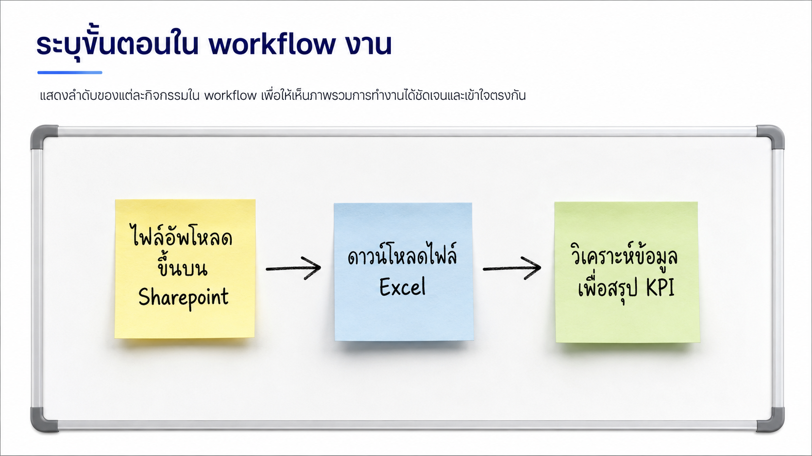
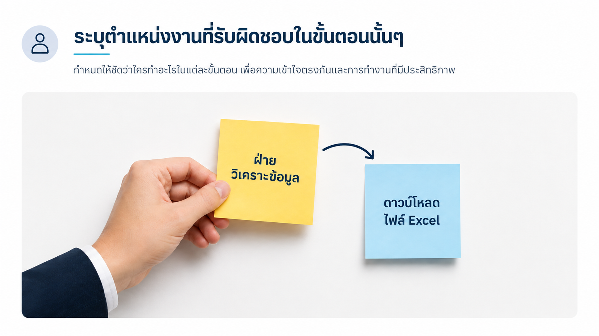
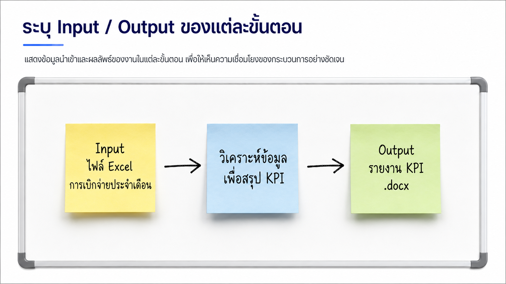
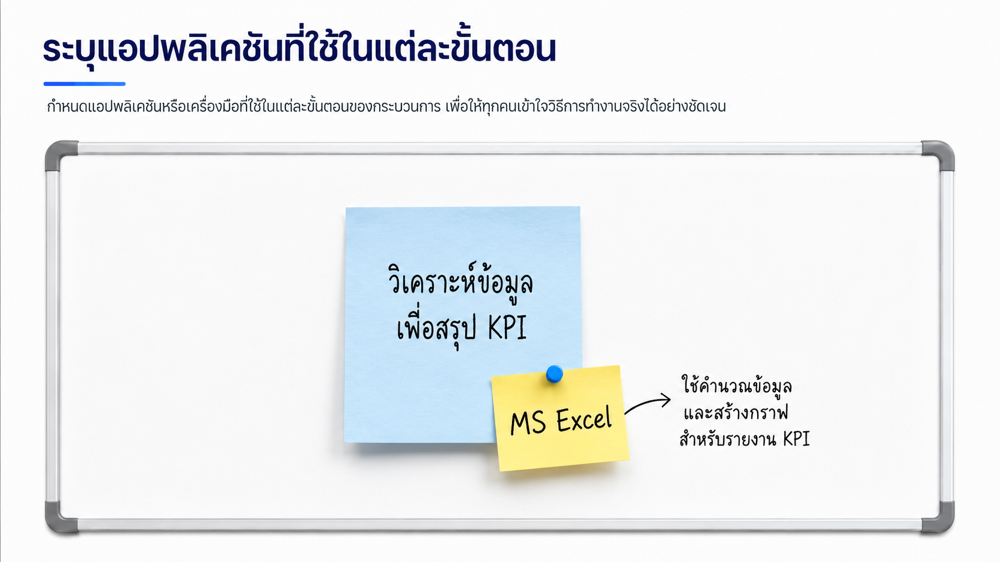
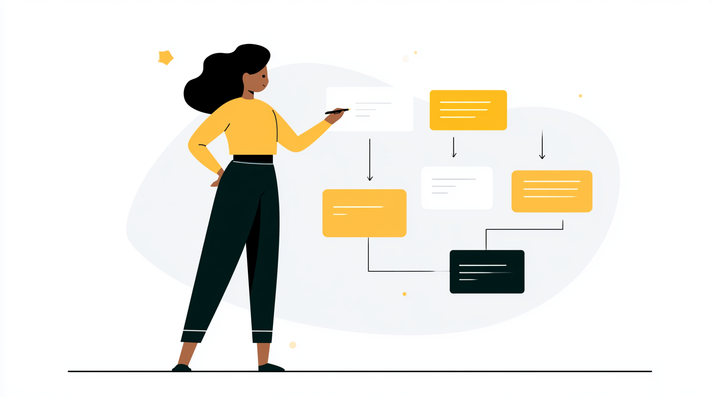
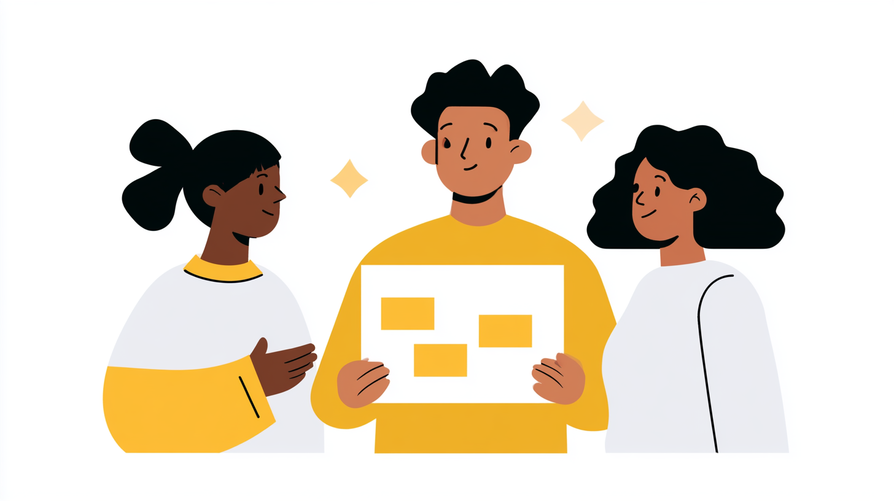

# Exercise: Redesign the Human + AI Workflow

## Exercise Overview

- **เป้าหมาย:** แยก workflow เป็นขั้นตอน
- **ผลลัพธ์:** current/future workflow และ AI Use Canvas ฉบับร่าง

## Prerequisites

- Pain-point theme ที่เลือกจาก Section 2
- [Human Workflow Map](../../templates/human-ai-workflow-map.md) 

## Scenario 1: เจาะจงขั้นตอนให้ชัดเจน ก่อนเพิ่ม AI

ทีมต้องการลดเวลารอ แต่ยังต้องรักษาความถูกต้องของขั้นตอนการทำางน และผู้รับผิดชอบของงานแต่ละส่วน การออกแบบจึงต้องสามารถบอกว่าแต่ละขัั้นตอนปกติทำอะไรบ้าง เพื่อให้ภายหลังสามารถระบุได้ว่า AI ช่วยเตรียมอะไร มนุษย์ตัดสินอะไร และจุดใดต้องทำร่วมกัน

### Practice 1: วาด current state "AS-IS" workflow สำหรับ pain point ที่เลือก

#### Steps 1: ระบุขั้นตอน และผู้รับผิดชอบ/ทำขั้นตอนนั้นๆ

1. นำ pain point การทำงานที่เลือกจากแบบฝึกหัดก่อนหน้านี้ มาเขียนเป็นขั้นตอนการทำงานลงบน post-it หนึ่งใบต่อหนึ่งขั้นตอน 
2. เริ่มจากจุดเริ่มต้น, ขั้นตอนที่ 1 , ขั้นตอนที่ 2, จนถึงผลลัพธ์สุดท้าย
3. วาง post-it ขั้นตอนบน flipchart  หนึ่งใบต่อหนึ่งขั้นตอน ตั้งแต่ trigger ถึงผลลัพธ์สุดท้าย

4. เขียนผู้รับผิดชอบงานแต่ละขั้นตอน ลงบน post-it แยก และแปะเข้ากับขั้นตอนนั้นๆ

#### Step 2: ระบุ input และ output ของ workflow

6. เขียน input 1 อย่างต่อ 1 ใบ และแปะลงบน workflow นั้นๆ เช่น
    - การรับเรื่องร้องเรียน ก็จะมี post-it ของ **Customer Complaint Form** หรือ **Email**
    - การส่งรายงาน ก็จะมี post-it ของ **Report Template** หรือ **Excel File**
7. เขียน output 1 อย่างต่อ 1 ใบ และแปะลงบนขั้นตอนนั้นๆ เช่น
    - การส่งรายงาน ก็จะมี post-it ของ **Report PDF** หรือ **Email**
    - การแจ้งเตือน ก็จะมี post-it ของ **Notification Email** หรือ **Teams Message**

#### Step 3: ระบุโปรแกรม/เครื่องมือปัจจุบันที่ใช้ในขั้นตอน

8. หากมีขั้นตอนใด ใช้งานโปรแกรมไหนเป็นพิเศษ เช่น word, excel, powerpoint, outlook, teams, sharepoint ให้เขียนชื่อโปรแกรมลงบน post-it ต่างหาก และแปะลงบนขั้นตอนนั้นๆ
9. ทำจนได้ workflow map ที่ชัดเจนว่าแต่ละขั้นตอนทำอะไร ใครทำ และมี input/output อะไรบ้าง
10.  เสร็จแล้วถ่ายรูปเก็บไว้ได้

> ลองเรียกเพื่อนเราที่ไม่ได้อยู่กลุ่มเดียวกัน มาดู workflow map ของเราว่าเข้าใจไหมถ้าเราไม่ได้อธิบาย และถ้าเพื่อนเราถามว่า “ขั้นตอนนี้ทำอะไร?” หรือ “ใครทำขั้นตอนนี้?”  แสดงว่าเรายังต้องปรับ workflow map ตรงส่วนนั้นให้ชัดเจนขึ้น

### Practice 2: วาด workflow สำหรับงานตัวเอง 

#### Steps

1. เลือกงานตัวเองที่เขียนไว้ตอนเช้ามา 1 งาน
2. ฝึกเขียน workflow map ของงานตัวเองลงบน A4 เพื่ออธิบายการทำงานของเราให้เพื่อนฟัง
3. อธิบาย workflow map ของเราให้เพื่อนฟัง หลังเพื่อนถามรายละเอียด ให้ปรับปรุง workflow ของเราให้สมบูรณ์ขึ้น

    

4. เพื่อนจะเซ็นลายเซ็นกำกับไว้หลังจากเราปรับปรุง workflow map ของเราให้สมบูรณ์แล้ว
5. ทำแบบเดียวกันอีก 2 รอบ กับเพื่อน 2 คน (รวมแล้วต้องมี 3 ลายเซ็น)
6. เสร็จแล้วถ่ายรูปเก็บไว้ได้

### (Optional) Practice 3: ออกแบบ future state  "TO-BE" workflow

#### Steps

1. สังเกตและพิจารณา workflow map ที่ได้และพิจารณาว่าตามขั้นตอนต่อไปนี้
   1. ติด post-it **Human** เมื่อขั้นตอนนั้นต้องใช้การตัดสินใจ การอนุมัติ หรือการตรวจสอบจากมนุษย์ (ไม่อาจปล่อยให้ AI ทำงานแทนได้)
   2. ติด post-it **AI** เมื่อเป็นการค้นหาข้อมูล, สรุปงาน, ประมวลผล หรือทำงานซ้ำ ๆ ที่ AI สามารถทำได้ 
   > จุดนี้ถ้า step ไหนแน่ใจว่าใช้ AI ทำได้ ให้ใส่ได้เลย แต่ถ้าไม่แน่ใจ ให้ใส่ **Human** ไว้
2. ถ่ายข้อมูลจาก workflow ลง [AI Use Canvas](https://raw.githubusercontent.com/teerasej/mini-m365-copilot-champion-1/main/templates/AI%20Use%20Canvas%20Template.pptx): user, problem, workflow, AI role, data, guardrail และ expected value
3. โชว์ canvas กับอีกทีมและถามว่า “AI ได้ข้อมูลจากไหน” กับ “ใครตรวจผลลัพธ์”

## Checkpoint

- current state และ future state มีจุดเริ่ม/จบชัดเจน
- ทุกขั้นมี owner และ human checkpoint สำหรับงานสำคัญ
- AI role เป็นงานที่สังเกตได้ เช่น “สรุปอีเมล 10 ฉบับเป็นประเด็น” ไม่ใช่ “ช่วยงานทั้งหมด”

## Expected Output

Human + AI Workflow Map ที่ออกแบบใหม่และ AI Use Canvas ฉบับร่างหนึ่งแผ่น

## Optional Extension

เพิ่ม fallback path สำหรับกรณีข้อมูลไม่ครบ AI ตอบไม่ได้ หรือผู้ใช้ไม่อนุมัติร่าง
