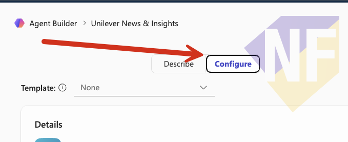
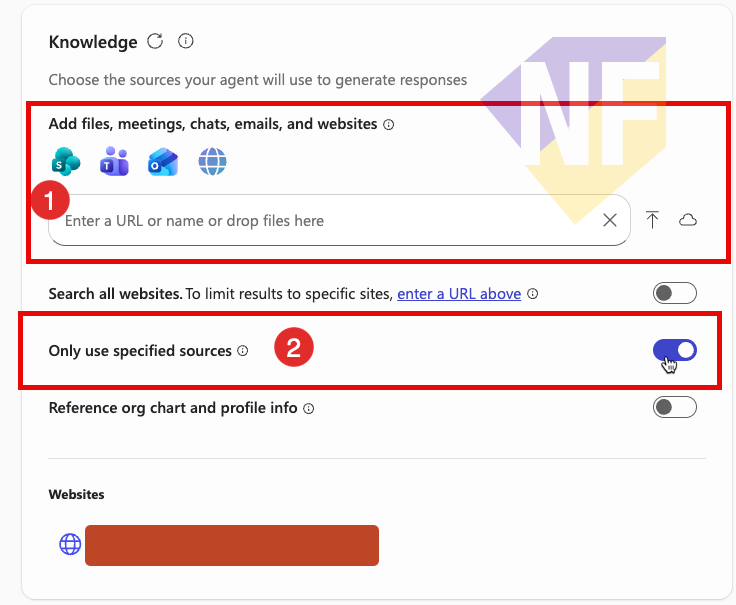
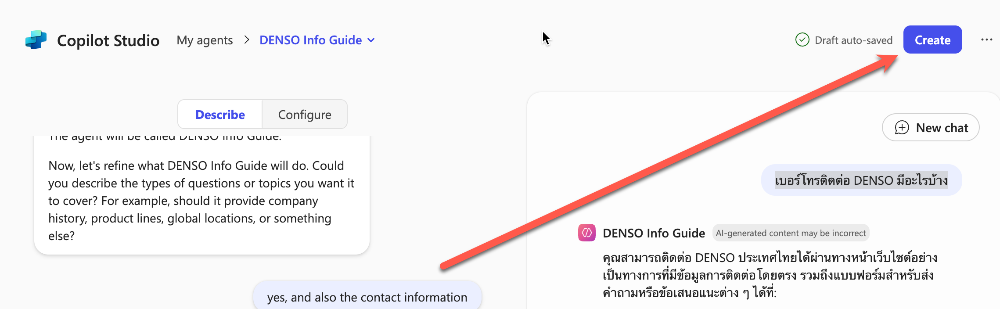
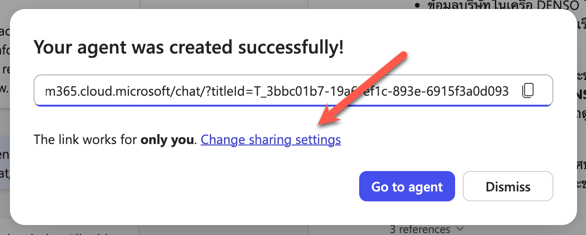
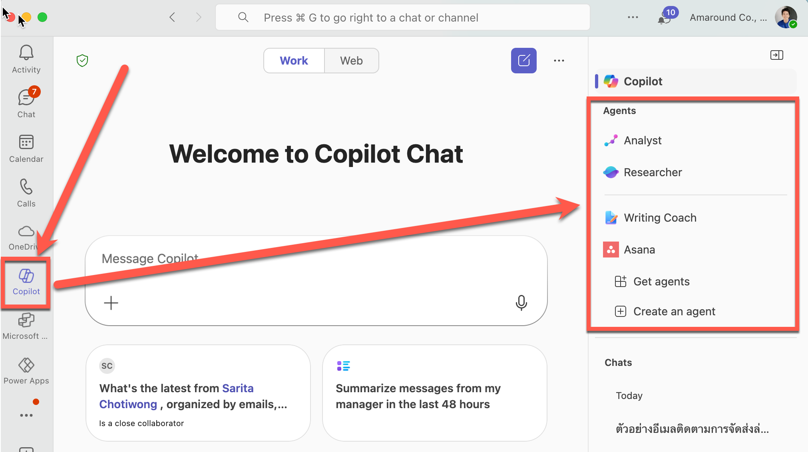

# สร้าง Agent AI ตัวแรกของพวกเรา

ข้อความโต้ตอบในแบบฝึกหัดนี้ของ Copilot อาจจะแตกต่างกันไป ซึ่งอาจจะเหมือน หรือไม่เหมือนกับตัวอย่างก็ได้ ให้พวกเราลองสังเกตดีๆ นะครับ


## ขั้นตอนการกำหนดหน้าที่ของ Agent แบบแชทคุยกัน (Describe)

1. เปิด Copilot Chat [https://m365copilot.com/](https://m365copilot.com/)
2. ในเมนูด้านข้าง ให้เลือก **Chat** > **Agents** > **Create Agent** หน้าต่างจะแยกเป็นด้านซ้ายสำหรับตั้งค่าการทำงานของ Agent ส่วนด้านขวาจะเป็นตัวอย่างพรีวิว Agent เพื่อให้ทดสอบพูดคุย
    
3. ให้แน่ใจว่าส่วนการตั้งค่าเป็นโหมด Describe
4. ขั้นตอนแรก Copilot จะถามให้เราอธิบายว่า Agent จะทำอะไรได้บ้าง ให้คัดลอกข้อความด้านล่างไปตอบให้แชท และกด enter
    
    ```
    Help Krungsri Bank staff quickly find and understand banking products, account information, loan processes, and company announcements from the official website
    ```

5. Copilot จะคิดชื่อ และรายละเอียดของ Agent มาให้เรา ให้กดดูในส่วนของ Configure จากด้านบน ซึ่งเราสามารถแก้ไขชื่อ และรายละเอียดได้ตามต้องการ
   


6. เลื่อนลงมาด้านล่าง เพื่อเพิ่มข้อมูล Knowledge ให้ Copilot ซึ่งในที่นี้ 
    1. เราสามารถแจ้ง URL ของ website ที่ต้องการให้ Agent ใช้เป็นแหล่งข้อมูลได้

    ```
    https://www.krungsri.com/
    ```
    2. เลือกเปิด **Only use specified sources** เพื่อให้แน่ใจว่า Agent จะใช้แหล่งข้อมูลที่เรากำหนดเท่านั้น
    
    
    > ถ้า URL ยาวไป สังเกตว่า Copilot จะแจ้งกลับมาว่า สำหรับ URL จะได้แค่ลึก 2 level นะ (เช่น `www.web.com/1/2`)และจะตัดให้เองอัตโนมััติ ดังนั้นจุดนี้ต้องดูว่าแหล่งข้อมูลบนเว็บของเราพร้อมมั้ย ถ้าจะเอามาใช้

11. เมื่อให้ข้อมูลพอสมควรแล้ว เราสามารถทดสอบคุยกับ agent ได้เลย **จากห้องแชททางขวาได้เลย**
    ```
    สินเชื่อส่วนบุคคลของกรุงศรีมีแบบไหนบ้าง
    ```

8.  เมื่อพอใจแล้ว เราสามารถกดปุ่ม Create ด้านบนขวาของหน้าจอ Create Agent ได้
   

9.  เมื่อ Agent ถูกสร้างเสร็จแล้ว เราสามารถเริ่มใช้งาน Agent ได้ทันที หรือจะกดเปลี่ยนรูปแบบการแชร์ ให้คนอื่นใช้งานด้วยก็ได้ 

    
    - จากนั้นให้เลือก **Anyone** หรือ **Specific User in your organization** และกด **Save**
    - เรียบร้อยแล้วก็สามารถ copy link เพื่อส่งให้เพื่อนในทีมเข้ามาใช้ในองค์กรได้เลย
    > เคล็ดลับ: โดยปกติ Agent ที่ถูกสร้างขึ้นจะสามารถใช้ได้เฉพาะตัวผู้สร้าง และเต็มที่คือภายในองค์กรของผู้สร้าง agent เท่านั้น

> เคล็ดลับ: ถ้าเราเพิ่ม agent เข้ามาในบัญชีแล้ว เรายังสามารถคุยกับ agent ผ่าน Microsoft Team ในส่วนของ Copilot ได้ด้วยนะ
> 