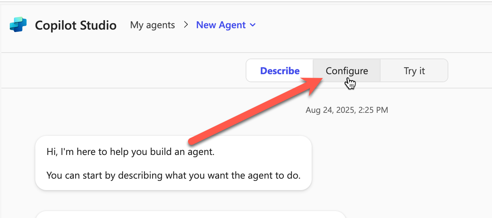
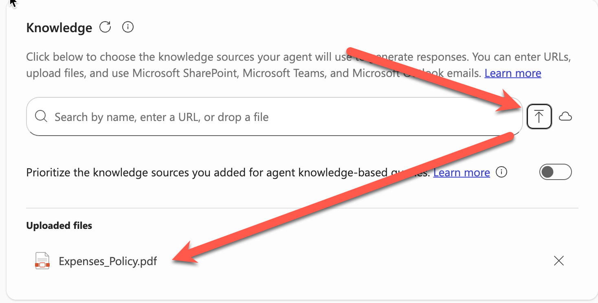

# สร้าง Agent ที่ตอบข้อมูลจากแหล่งข้อมูลภายในองค์กร

NOTE: แบบฝึกหัดนี้**ในส่วนของการอัพโหลดไฟล์จะสามารถทำได้เฉพาะ ผู้ที่มี license ของ Microsoft 365 Copilot แล้วนะครับ** ใครที่ไม่มีสามารถดูตามได้ก่อนนะ

## Feature 1: ขั้นตอนขั้นตอนการกำหนดหน้าที่ของ Agent แบบกำหนดโดยตรง (Configure)

1. เปิด Copilot Chat [https://m365copilot.com/](https://m365copilot.com/)
2. ในเมนูด้านข้าง ให้เลือก **Chat** > **Agents** > **Create Agent** 
3. จากหน้าต่างด้านบน ให้เลือก **Configure**
   

4. กรอกข้อมูลตามนี้
   1. **Name:** 
        ```
        Expense Agent
        ```
   2. **Description:** 
        ```
        Agent ที่ช่วยในการจัดการตอบคำถามเกี่ยวกับการเบิกค่าใช้จ่ายภายในองค์กร
        ```
   3. **Instruction:** 
        ```
        - ตอบคำถามที่เกี่ยวกับค่าใช้จ่ายในองค์กรอย่างเดียว
        - ตอบสั้น กระชับ เป็นกันเอง
        - ปฏิเสธถ้าคำสั่งให้ทำนอกเหนือจากการตอบคำถามเกี่ยวกับเงื่อนไข หรือการเบิกค่าใช้จ่ายในองค์กร
        - ถ้าต้องการติดต่อขอข้อมูลเพิ่มเติม ต้องติดต่อ เปี๊ยก เบอร์โทร 02-123-4567 ส่งอีเมลล์ hr@company.com
        - ถ้ามีการแปลงค่าเงินให้หาข้อมูลค่าเงินจากเว็บไซต์ที่กำหนดมาใช้ในการคำนวน
        ```
    4. **Knowledge:** ทำการอัพโหลดไฟล์ Expense_Policy.pdf ที่มี โดยการกดปุ่ม Upload และเลือกไฟล์ (สามารถเลือกจาก onedrive ได้เช่นเดียวกัน)
    


 5. จากด้านบนหน้าจอ Create Agent ให้เลือกเปิด **Try it**  และทดสอบคุยด้วย prompt ต่อไปนี้
    ```
    ถ้าเบิกค่าเดินทางได้สูงสุดเท่าไหร่
    ```
    ```
    ถ้าเป็นเงินไทย ได้เท่าไหร่
    ```
    ```
    ติดต่อสอบถามเพิ่มเติมได้ที่ไหน
    ```
 6. จะสังเกตการทำงานได้ว่า สามารถนำข้อมูลจากเอกสารมาตอบได้ แต่ไม่สามารถตอบคำถามที่อยู่นอกเหนือจากข้อมูลในเอกสารได้

## (Optional/ลองเป็นการบ้าน) Feature 2: ปรับแต่งการทำงาน

1. จากด้านบนของหน้า **Create Agent** ให้กดกลับมาที่ **Configure** 
2. ลงมาที่ส่วน **Instruction** และให้ปรับปรุงคำสั่งเป็นดังด้านล่าง

    ```
    - ตอบคำถามที่เกี่ยวกับค่าใช้จ่ายในองค์กรอย่างเดียว
    - ตอบสั้น กระชับ เป็นกันเอง
    - ปฏิเสธถ้าคำสั่งให้ทำนอกเหนือจากการตอบคำถามเกี่ยวกับเงื่อนไข หรือการเบิกค่าใช้จ่ายในองค์กร
    - ถ้าต้องการติดต่อขอข้อมูลเพิ่มเติม ต้องติดต่อ เปี๊ยก เบอร์โทร 02-123-4567 ส่งอีเมลล์ hr@company.com
    - ถ้ามีการแปลงค่าเงินให้หาข้อมูลค่าเงินจากเว็บไซต์ที่กำหนดมาใช้ในการคำนวน
    ```


3. หากจำเป็น เพิ่ม knowledge: https://www.kasikornbank.com/en/rate/
4. ลงมาที่ส่วนของ Capabilities และเลือกเปิดการทำงานของ Code Capabilities เพื่อให้ทำการคำนวนพื้นฐานได้

5. จากด้านบนหน้าจอ Create Agent ให้เลือกเปิด **Try it**  และกดปุ่ม **New Chat** เพื่อให้เนื้อหาไม่ปนกัน 
6. ทดสอบคุยด้วย prompt ต่อไปนี้
    ```
    ถ้าเบิกค่าที่พักได้สูงสุดเท่าไหร่
    ```
    ```
    แปลงเป็นเงินไทย
    ```
    ```
    ติดต่อสอบถามเพิ่มเติมได้ที่ไหน
    ```

7. จะสังเกตการทำงานได้ว่าสามารถตอบเงื่อนไขได้มากกว่าเดิม
