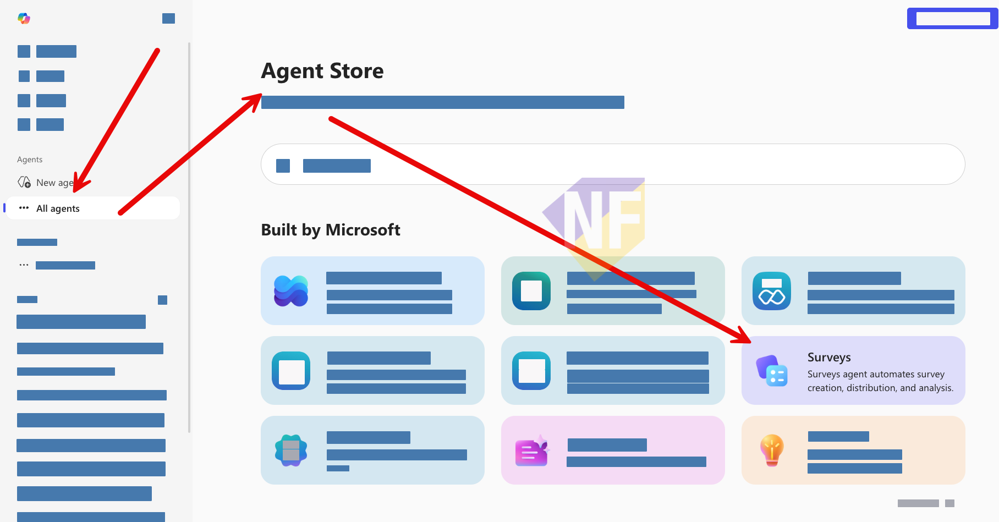
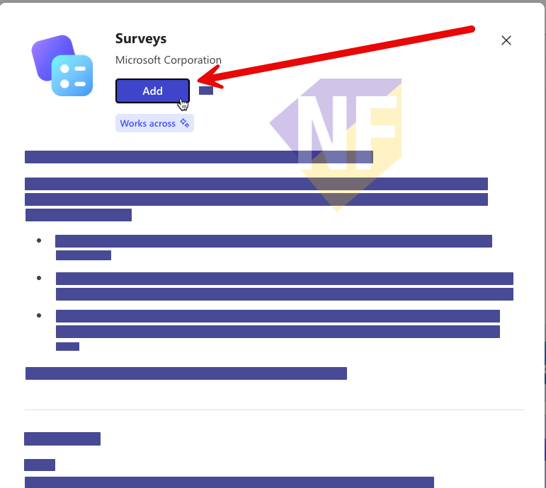
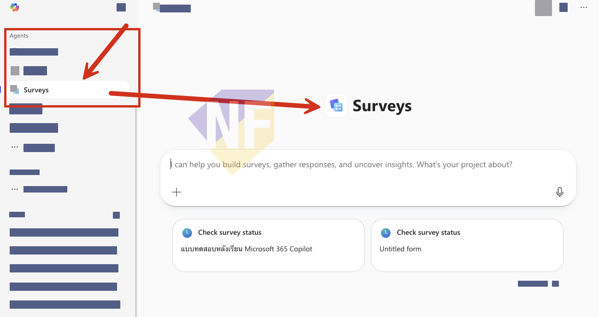

# ทดสอบเรียกใช้ Surveys Agent (ตัวช่วยสร้างแบบสำรวจผ่าน Microsoft Forms)

**เป้าหมาย:** ให้ผู้เรียนได้ทดลองใช้งาน **Surveys Agent** ซึ่งเป็น Agent สำเร็จรูปจาก Microsoft ที่ทำงานร่วมกับ **Microsoft Forms** โดยตรง สามารถช่วยออกแบบแบบสำรวจ, ส่งแบบสำรวจไปยังผู้ตอบ, ติดตามสถานะการตอบกลับ และสรุปผลวิเคราะห์ข้อมูลได้อัตโนมัติ

> การเข้าใช้งาน Agent อาจขึ้นอยู่กับการตั้งค่าขององค์กรที่กำหนดไว้ หากไม่สามารถเข้าถึงการใช้งานได้ สามารถดูตามไปก่อนได้ และโปรดติดต่อผู้ดูแลระบบภายหลัง


## ขั้นตอน

### 1. เปิด Microsoft 365 Copilot และค้นหา Surveys Agent

1. เปิด Microsoft 365 Copilot [https://m365copilot.com](https://m365copilot.com) หรือ [https://copilot.microsoft.com/](https://copilot.microsoft.com/) แล้วลงชื่อเข้าใช้ด้วยบัญชี Microsoft 365 ของเราที่ได้รับจากองค์กร
   
2. ไปที่ **Agent Store** โดยเลือก **All agents** จากเมนูด้านซ้าย
3. ค้นหา **Surveys** ในหมวด **"Built by Microsoft"** หรือจะติดตั้งโดยตรงจากลิงก์นี้ได้เลย: [https://aka.ms/GetSurveysAgent](https://aka.ms/GetSurveysAgent)
   
4. กดเพิ่ม Surveys Agent ลงในบัญชีของเรา โดยคลิกที่ปุ่ม **Add agent**
    
    > NOTE: ในขั้นตอนนี้ถ้ากดไม่ได้ และขึ้นข้อความประมาณว่า **Your organization has prevented this agent from being installed.** นั่นคือ Admin ไม่ได้เปิดให้ใช้ Agent ตัวนี้นะครับ ดูตามได้ก่อนเลย

5. เมื่อเพิ่มเรียบร้อยแล้ว Surveys Agent จะปรากฏในหัวข้อ **Agents** ที่เมนูด้านซ้าย
   

### 2. สร้างแบบสำรวจด้วย Prompt

6. คลิกเลือก **Surveys** จากเมนู Agents ด้านซ้าย เพื่อเปิดห้องแชท
7. พิมพ์ prompt เพื่อบอก Agent ว่าต้องการสร้างแบบสำรวจแบบไหน ลองคัดลอกข้อความด้านล่างไปใช้ได้เลย

    ```
    Help me create an employee satisfaction survey about workplace benefits and work environment
    ```

8. Surveys Agent จะสร้างตัวอย่างแบบสำรวจ (Preview) ขึ้นมา พร้อมแสดงคำถามที่ออกแบบให้ ซึ่งเบื้องหลัง Agent จะสร้างแบบสำรวจนี้บน **Microsoft Forms** ให้อัตโนมัติ

### 3. ตรวจสอบและแก้ไขแบบสำรวจ (Optional)

9. ในหน้า Preview เราสามารถดูคำถามทั้งหมดที่ Agent สร้างให้ได้ในมุมมองแบบ **side-by-side**
10. ถ้าต้องการปรับแก้ ลองพิมพ์ prompt เพิ่มเติม เช่น

    ```
    Add 2 more questions about manager support and career growth opportunities
    ```

11. หรือจะเข้าไปแก้ไขโดยตรงใน Microsoft Forms ก็ได้เช่นกัน

### 4. ส่งแบบสำรวจ (Distribute)

12. เมื่อพอใจกับแบบสำรวจแล้ว Agent อาจจะแนะนำ **แผนการกระจายแบบสำรวจ** ที่เหมาะสม ได้แก่
    - ช่องทางการส่ง (เช่น Email, Microsoft Teams)
    - กลยุทธ์การเก็บข้อมูล
    - ไทม์ไลน์ในการติดตาม
13. เลือกช่องทางที่ต้องการ แล้วให้ Agent ส่งแบบสำรวจออกไป เช่นทดสอบโดยใช้คำสั่งนี้
   ```
   Send the survey to [email address] 
   ```

### (เสริม) ติดตามผลและดู Insights

14. Surveys Agent จะ **ติดตามสถานะการตอบกลับ** อัตโนมัติ และส่ง reminder ผ่าน Outlook ให้ผู้ที่ยังไม่ตอบ
15. เมื่อได้รับการตอบกลับเพียงพอ Agent จะสรุปผลเป็น **insights** พร้อม **ข้อเสนอแนะเชิงปฏิบัติ (actionable insights)**
16. สามารถ **export ผลลัพธ์เป็น Excel** ได้ ซึ่งจะรวมทั้งข้อมูลดิบ (raw data) และผลสรุป (summarized findings) เพื่อแชร์ให้ทีมร่วมวิเคราะห์ต่อได้

> **เคล็ดลับ:** Surveys Agent ไม่ใช่แค่ตัวช่วยสร้างคำถาม แต่เป็นตัวจัดการ workflow ของแบบสำรวจทั้งหมดตั้งแต่สร้าง ส่ง ติดตาม จนถึงวิเคราะห์ผล ช่วยประหยัดเวลาได้มากเลย

> **เคล็ดลับ:** ถ้าเราเพิ่ม Agent เข้ามาในบัญชีแล้ว เรายังสามารถคุยกับ Agent ผ่าน Microsoft Teams ในส่วนของ Copilot ได้ด้วยนะ

> **อ้างอิง:** [Get started with Surveys Agent in Microsoft 365 Copilot](https://support.microsoft.com/en-us/topic/get-started-with-surveys-agent-in-microsoft-365-copilot-ddad28f2-386b-4f81-8a07-8ac4ee8f6bd8)

