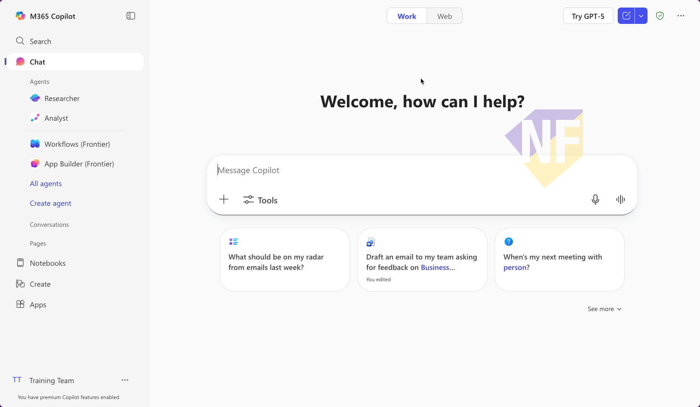
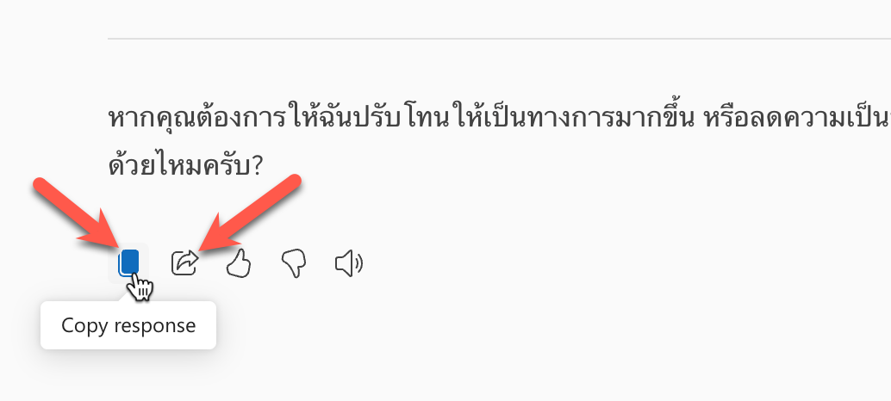
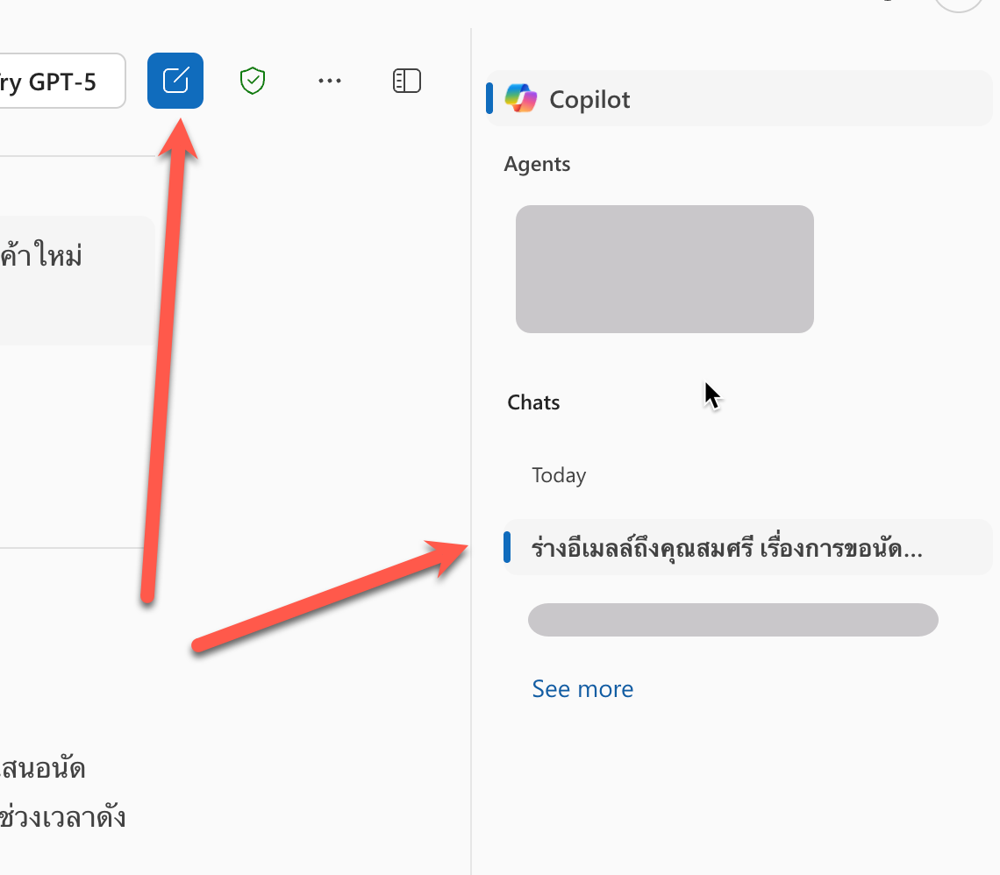
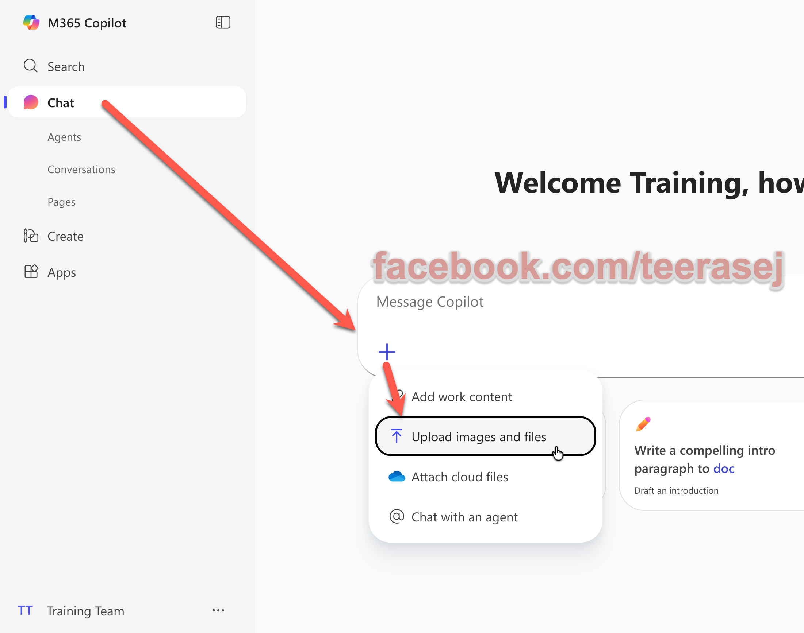

# Part 2: Copilot Chat


## 1. การเข้าใช้งาน M365 Copilot

1. เปิด link [https://m365copilot.com/](https://m365copilot.com/) หรือ [https://office.com](https://office.com)
2. Login ด้วย Microsoft account ขององค์กร
3. เราจะเห็นเข้ามาที่ Copilot Chat ตามภาพ



### 2. เช็คก่อน เราใช้ Copilot แบบ free หรือแบบ license

- **สำหรับคนที่ใช้ Copilot แบบมี license** จะมีให้เลือกโหมด **Work | Web** ที่ต้องเลือกให้เหมาะสมนะครับ ซึ่งการใช้งานในส่วนนี้ **จะใช้เป็นโหมด Web** 
- สำหรับคนที่ใช้ Copilot Chat (แบบ free) จะไม่มีให้เลือก ซึ่งจะใช้ได้แค่โหมด **Web** เท่านั้น


> ในบางกรณี อาจจะเห็นเมนูสลับข้างกับภาพตัวอย่าง แต่องค์ประกอบอยู่ครบก็โอเค


## 3. การร่างอีเมลล์

1. เปิด link [https://m365copilot.com/](https://m365copilot.com/)
2. คัดลอกข้อความ prompt ด้านล่างไปใส่ในช่อง Chat โดยแก้ไข `[name]` เป็นชื่อของผู้รับ และ `[topic]` เป็นหัวข้อที่ต้องการพูดคุย

ตัวอย่าง

```
ร่างอีเมลล์ถึงพวกเราสมศรี เรื่องการขอนัดคุยเรื่องการเปิดตัวเครื่องซักผ้าปี 2026 โดยอยากนัดเวลา 10.00 น.
```

1. กด enter หรือกดปุ่มส่ง (>)
2. ตรวจสอบผลลัพธ์ 
3. ทดสอบปรับสำนวนของแบบร่างอีเมลล์ โดยการคัดลอกข้อความด้านล่างไปใส่ในช่อง Chat

```
ปรับสำนวนให้เป็นทางการ เนื้อหาสั้นลง และใส่เบอร์ติดต่อเป็น 02-123-4567
```

4. ตรวจสอบผลลัพธ์ 
5. กดปุ่มด้านล่างข้อความผลลัพธ์ เพื่อคัดลอกข้อความไปใช้ หรือ ทดสอบกดปุ่ม Share ที่อยู่ด้านข้าง และส่งให้เพื่อนเพื่อเปิดดูเข้ามาดูข้อความใช้งาน 




## 4. การสร้างห้องแชทใหม่ และย้อนกลับไปคุยเรื่องก่อนหน้าด้วย Chat History 

1. จากหน้าจอปัจจุบันให้สังเกตด้านข้างที่มีการแสดงประวัติการสนทนา ซึ่งเราสามารถคลิกเพื่อดูรายละเอียดของการสนทนาก่อนหน้าได้
2. กดปุ่มสร้าง Chat ใหม่ด้านบน เพื่อขึ้นการสนทนาใหม่



3. คัดลอกข้อความด้่านล่างไปใส่ในช่อง Chat 

```
หาข่าว [องค์กร] ที่สำคัญในปี 202ุ6
```

4. ตรวจสอบผลลัพธ์

## 5. การให้ Copilot ทำงานกับไฟล์แทนเรา

1. ดาวน์โหลดไฟล์ PDF จาก [ที่นี่](https://github.com/teerasej/ai-for-everyone/blob/main/files/Expenses_Policy.pdf) หรือใช้ file ที่ได้จาก zip ที่ดาวน์โหลดตอนแรก
2. กดปุ่มสร้างห้องแชทใหม่
3. จากกล่องข้อความแชท ให้กดปุ่ม "+" และเลือก **Upload images or files**

4. เลือกอัพโหลดไฟล์ **Expenses_Policy.pdf** 
5. พิมพ์ข้อความต่อจากชื่อไฟล์ที่อัพโหลดตามด้านล่าง และตรวจสอบผลลัพธ์ที่ได้

```
งบอะไรเบิกได้เยอะสุด 
```

> เคล็ดลับ: ในที่นี้ถ้าเรามีไฟล์บน OneDrive จะเห็นว่า เราสามารถกดเปิดไฟล์จาก OneDrive ได้ด้วย

## 6. สร้างรูปภาพเพื่อนำไปใช้งาน 

1. ขึ้นห้องแชทใหม่
2. คัดลอกข้อความด้านล่างไปใส่ในช่อง Chat และส่งข้อความ

```
สร้างรูปภาพของครอบครัว มีพ่อ แม่ ลูก ช่วยกันล้างจานอยู่ในครัว
```

3. ตรวจสอบผลลัพธ์


