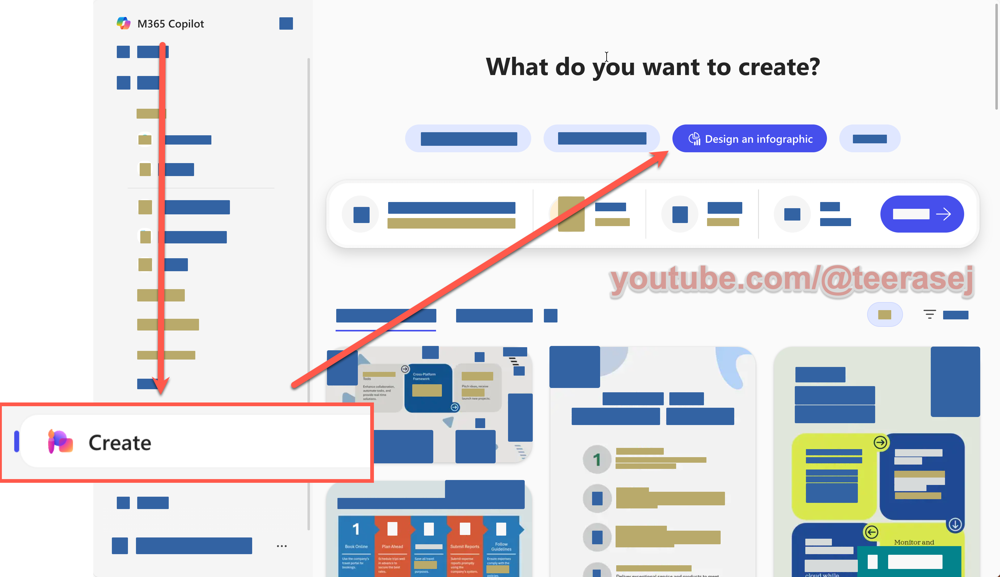
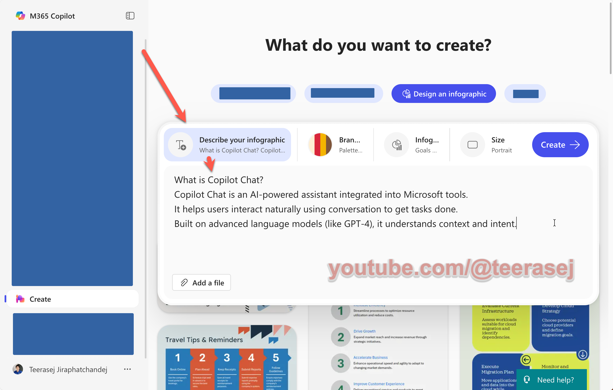
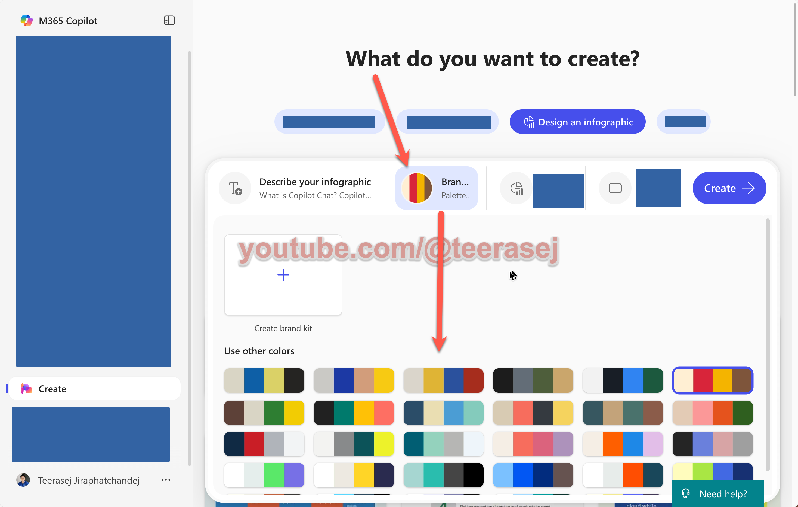
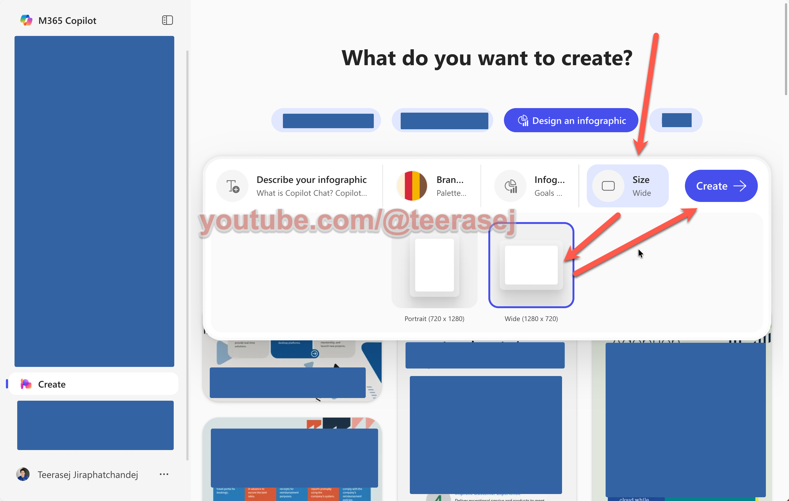

# Copilot - Create Mode

## ขั้นตอนการเข้าใช้งาน

1. เปิด link [https://m365copilot.com/](https://m365copilot.com/)
   - หรือ [https://copilot.microsoft.com](https://copilot.microsoft.com)
2. Login ด้วย Microsoft account ขององค์กร
3. เราจะเห็นเข้ามาที่ Copilot Chat ตามภาพ
4. กดเลือกเมนู Create


## สร้าง Infographic ด้วย Copilot Create

1. จากรายการไอเดียด้านบน ให้เลือก **Design an infographic**
    

2. ในช่อง **Describe your infographic** ให้ copy ข้อความด้านล่างไปวาง เพื่อใช้เป็นเนื้อหา infographic
   ```
   What is Copilot Chat?
   Copilot Chat is an AI-powered assistant integrated into Microsoft tools.
   It helps users interact naturally using conversation to get tasks done.
   Built on advanced language models (like GPT-4), it understands context and intent.
   
   ```
    

3. ในช่อง **Brand** ที่อยู่ถัดมา ให้เลือกสีที่มีอยู่ในรายการตามชอบ
    

4. ในช่อง **Infographic** ที่อยู่ถัดมา ให้เลือก **Goal and Lists**
5. ในช่อง **Size** ที่อยู่ถัดมา ให้เลือก **Wide**
   
6. กด Create และรอผลลัพธ์
7. เมื่อได้ผลลัพธ์แล้ว เราสามารถกดที่ภาพเพื่อดูภาพขนาดใหญ่ขึ้น หรือกด Download เพื่อดาวน์โหลดภาพได้
