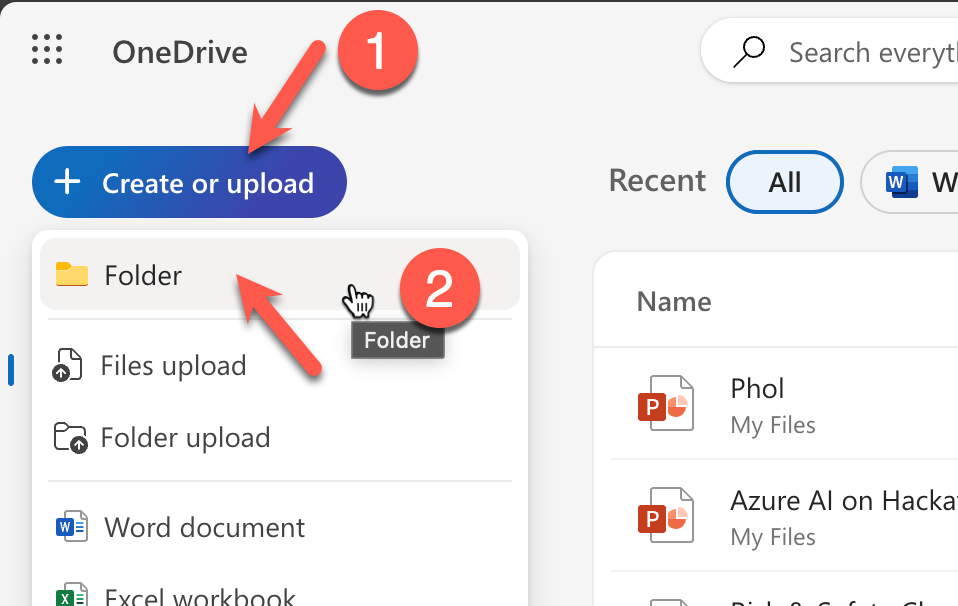
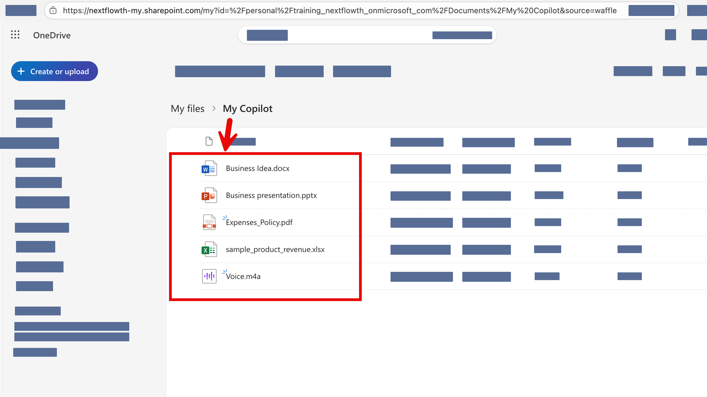

# อัพโหลดไฟล์เข้า OneDrive

## 1. ดาวน์โหลดไฟล์สำหรับใช้ในเวิร์คชอป
- [ดาวน์โหลดไฟล์ที่นี่ (zip file)](https://github.com/teerasej/ai-for-everyone/raw/cpall-1/files/CPAll-copilot.zip)
- แตก zip file ออกมาเพื่อใช้งาน

## 2. ล๊อคอินเข้าใช้งาน OneDrive
-  [https://onedrive.live.com/](https://onedrive.live.com/)
  
## 3. สร้าง folder ใหม่ชื่อ **MyCopilot** จากการกดปุ่ม **Create or upload > Folder**
   

## 4. อัพโหลดไฟล์ที่เตรียมไว้ทั้งหมดจาก zip file ที่แตกออกมา ไปที่ OneDrive 
   