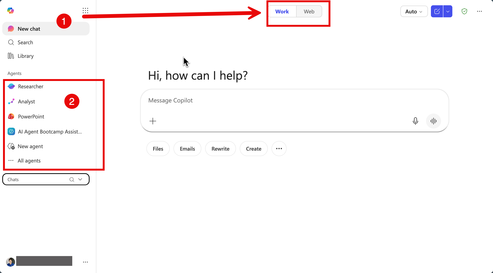
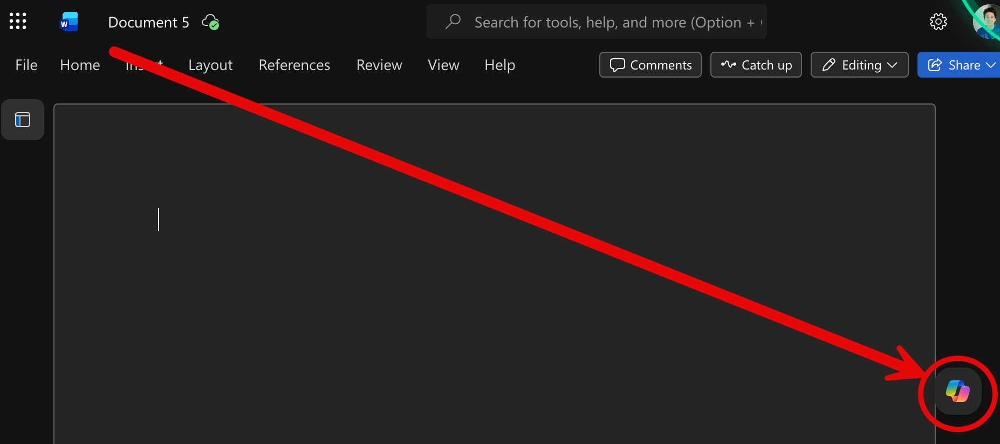
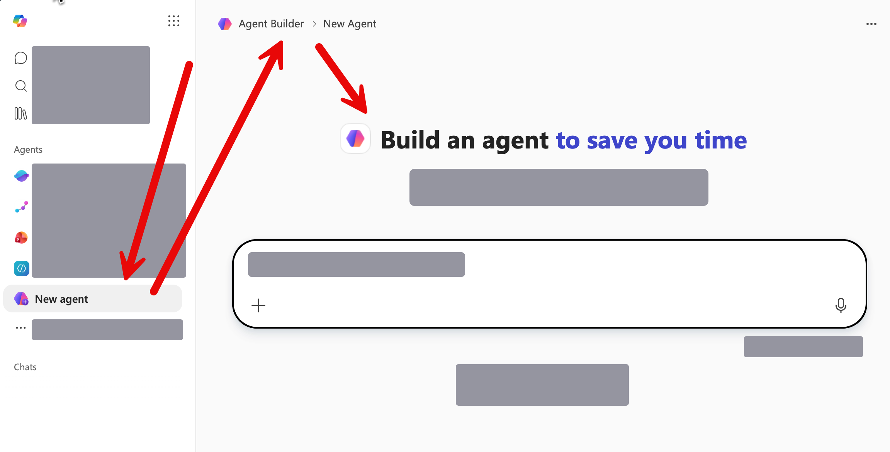

# เช็คลิสต์ก่อนเข้าอบรม

กรุณาตรวจสอบรายการด้านล่างนี้ก่อนวันอบรม เพื่อให้แน่ใจว่า account ของพวกเราพร้อมใช้งานในวันฝึกอบรม

---

## ✅ 1. ตรวจสอบ License

- [ ] ลงชื่อเข้าใช้ Microsoft 365 ที่ [https://www.office.com](https://www.office.com) ด้วย account ที่ได้รับมาจากองค์กร
- [ ] ตรวจสอบว่า account มี **Microsoft 365 Copilot License** (หรือ Microsoft 365 E3/E5 + Copilot add-on)
  - วิธีตรวจสอบ: ไปที่ [https://m365copilot.com](https://m365copilot.com) 
    1. เช็คในส่วนด้านบนว่ามีโหมด 2 แบบให้เลือกหรือไม่ (Work และ Web) (บางกรณีอาจจะแค่แสดงเป็น icon 2 อัน)
    2. เช็คด้านขวาว่าเห็นรายการเมนูของ Agent หรือไม่ (ถ้าเห็นแสดงว่าได้สิทธิ์ใช้งานแล้ว)
    

> **⚠️หมายเหตุ:** หากตรวจสอบแล้วพบว่ามีรายการใดที่ยังไม่พร้อม กรุณาติดต่อ **IT Admin** หรือ **ผู้ดูแลระบบขององค์กร** ล่วงหน้าอย่างน้อย **1-2 วันทำการ** ก่อนวันอบรม เพื่อให้สามารถแก้ไขได้ทันเวลา

---

## ✅ 2. ตรวจสอบการใช้งาน Copilot ใน Microsoft 365 Apps

### Word
- [ ] เปิด [https://word.new](https://word.new) หรือเปิด Word บนเครื่อง
- [ ] ตรวจสอบว่ามีปุ่ม **Copilot** **ปรากฏอยู่บน Ribbon (แถบเมนูด้านบน) หรือเป็นไอคอนที่มุมขวาล่างของหน้าจอ** 
  
> **⚠️หมายเหตุ:** ไม่จำเป็นต้องเห็นปุ่ม Copilot ในทั้ง 2 ตำแหน่ง แค่ที่ใดที่หนึ่งก็ถือว่าใช้งานได้แล้ว แต่ถ้าไม่เห็นในทั้ง 2 ตำแหน่งเลย ให้ติดต่อ IT Admin เพื่อตรวจสอบ License และการตั้งค่าล่วงหน้า

#### แบบที่ 1: ปุ่ม Copilot บน Ribbon 

#### แบบที่ 2: ไอคอน Copilot ที่มุมขวาล่าง 

### Excel
- [ ] เปิด [https://excel.new](https://excel.new) หรือเปิด Excel บนเครื่อง
- [ ] ตรวจสอบว่ามีปุ่ม **Copilot** **ปรากฏอยู่บน Ribbon (แถบเมนูด้านบน) หรือเป็นไอคอนที่มุมขวาล่างของหน้าจอ** ในตำแหน่งเดียวกับ Word

### PowerPoint
- [ ] เปิด [https://powerpoint.new](https://powerpoint.new) หรือเปิด PowerPoint บนเครื่อง
- [ ] ตรวจสอบว่ามีปุ่ม **Copilot** **ปรากฏอยู่บน Ribbon (แถบเมนูด้านบน) หรือเป็นไอคอนที่มุมขวาล่างของหน้าจอ** ในตำแหน่งเดียวกับ Word

> **⚠️หมายเหตุ:** ไม่จำเป็นต้องเห็นปุ่ม Copilot ในทั้ง 2 ตำแหน่ง แค่ที่ใดที่หนึ่งก็ถือว่าใช้งานได้แล้ว แต่ถ้าไม่เห็นในทั้ง 2 ตำแหน่งเลย ให้ติดต่อ IT Admin เพื่อตรวจสอบ License และการตั้งค่าล่วงหน้า

---

## ✅ 3. ตรวจสอบความสามารถในการสร้าง Agent ใหม่

- [ ] เปิด Copilot Chat ที่ [https://m365copilot.com/](https://m365copilot.com/)
- [ ] ในเมนูด้านซ้าย เช็คว่ามีตัวเลือกเมนู Agent หรือไม่
- [ ] ตรวจสอบว่ามีปุ่ม **+** หรือ **New Agent** ปรากฏให้กดได้หรือไม่
- [ ] ลองคลิกเพื่อเข้าสู่หน้า Agent Builder และตรวจสอบว่าสามารถเข้าถึงหน้าดังกล่าวได้

> **⚠️ หมายเหตุ:** ถ้าไม่เห็นตัวเลือก Create Agent หรือเข้าหน้า Agent Builder ไม่ได้ ให้แจ้ง IT Admin ตรวจสอบสิทธิ์การใช้งานล่วงหน้า เนื่องจากฟีเจอร์นี้อาจถูกจำกัดโดย Policy ขององค์กร

---

## ⚠️ พบปัญหา?

หากตรวจสอบแล้วพบว่ามีรายการใดที่ยังไม่พร้อม กรุณาติดต่อ **IT Admin** หรือ **ผู้ดูแลระบบขององค์กร** ล่วงหน้าอย่างน้อย **1-2 วันทำการ** ก่อนวันอบรม เพื่อให้สามารถแก้ไขได้ทันเวลา
