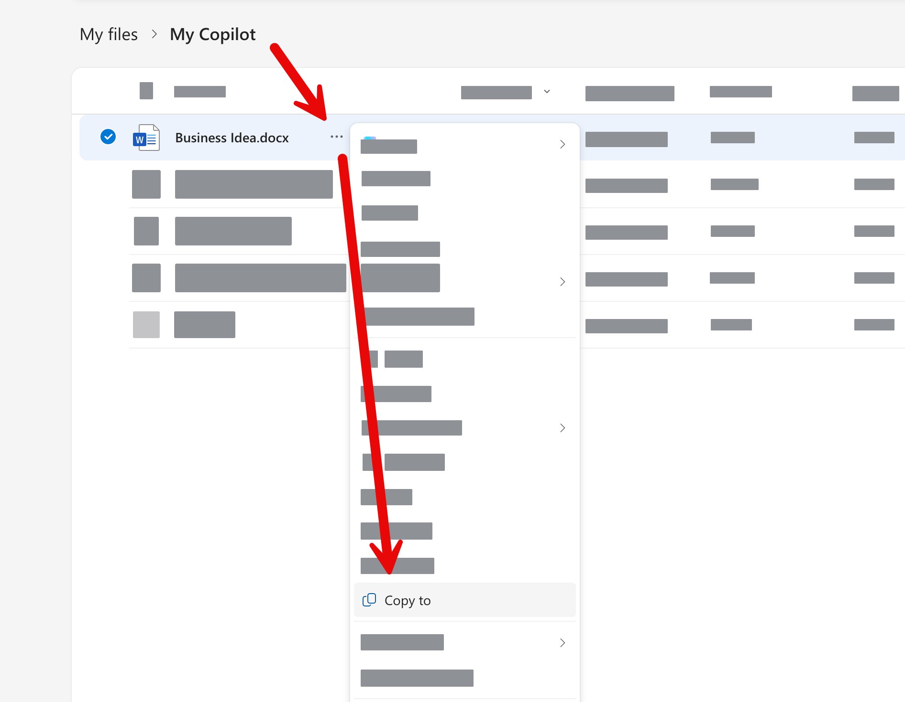
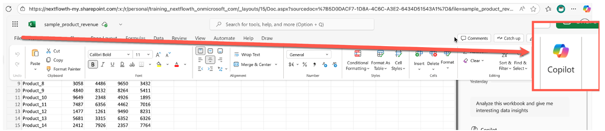
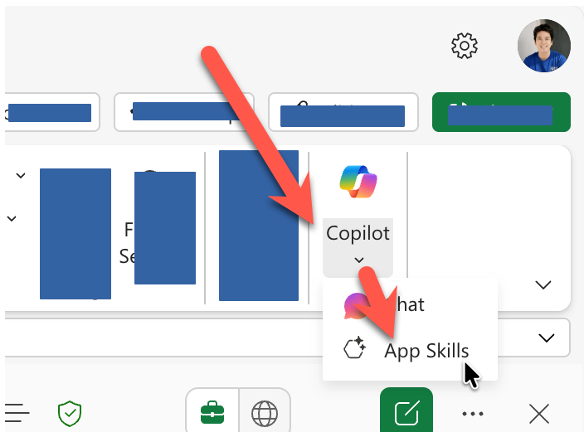

# Excel: ทำงานกับ Spreadsheet ด้วย AI

> ในแบบฝึกหัดนี้ การใช้งานจะแตกต่างกันตามประเภทของ Account ที่ใช้งาน Copilot นะครับ


## หากพวกเราแชร์ M365 Account กันใช้ ต้องสร้างสำเนาไฟล์ใหม่ก่อนเริ่มทำ Exercise

1. ให้ทำการคลิกขวาที่ไฟล์เอกสารใน OneDrive บนเว็บเบราเซอร์ 
2. แล้วเลือก "Copy To" เพื่อทำสำเนาไฟล์ใหม่



3. คลิกขวาที่ไฟล์สำเนา แล้วเลือกคำสั่ง "Rename" เพื่อเปลี่ยนชื่อไฟล์ให้ต่อชื่อตัวเราห้อยท้าย เพื่อไม่ให้สับสนกับไฟล์ของคนอื่น


## 1. หากยังไม่ได้อัพโหลดไฟล์ 

1. เปิด Web browser
2. เปิด link  https://onedrive.microsoft.com
3. Login ด้วย Microsoft account ขององค์กร
4. สร้าง folder ใหม่สำหรับ upload ไฟล์ ชื่อ **My Copilot**
5. ทำการอัพโหลดไฟล์ **sample_product_revenue.xlsx** (ได้จาก zip file) ขึ้นไปใน **My Copilot** folder
6. หรือเปิดไฟล์จาก link นี้


## 2. เปิดไฟล์ Excel บน Web



1. จาก OneDrive คลิกขวาที่ไฟล์ sample_product_revenue.xlsx 
2. จากเมนูเลือก Open > Open in browser
3. จากเมนู Home tab > กดเปิด Copilot Chat


## 3. สั่งให้ Copilot ช่วยวิเคราะห์ข้อมูล

1. ใช้คำสั่ง prompt ด้านล่างเพื่อให้ Copilot วิเคราะห์ data insight 
   
   ```
   วิเคราะห์ sheet ทัั้งหมด และบอก data insights ที่น่าสนใจหน่อย
   ```
   ```
   Analyze this workbook and give me interesting data insights
   ```

2. ใช้คำสั่ง prompt ด้านล่างเพื่อให้ Copilot สร้างกราฟแท่งของ 5 สินค้ามีที่มูลค่าสูงสุด
   ```
   สร้างกราฟแท่งแสดงรายการสินค้ายอดขายสูงสุด 5 อันดับหน่อย
   ```

   ```
   Create a bar chart of the top 5 products by revenue
   ```
  


3. ใช้คำสั่ง prompt ด้านล่างเพื่อให้ Copilot สร้าง formular ในการคำนวณให้ 
   ```
   คิดสูตร formula คำนวนยอดขายของสินค้าแต่ละตัวเป็น percent ต่อยอดขายรวมของสินค้าทุกตัวให้หน่อย
   ```

   ```
   Create a formula to calculate the percentage of total revenue for each product
   ```
   

> Copilot อาจจะมีการเสนอตัวว่าสามารถใส่ formula ใน column ใหม่ได้ แต่จะเป็นการสร้างไฟล์ใหม่ให้ ดาวน์โหลดแทน และอาจจะไม่มี formula ในไฟล์สำเร็จที่สร้างให้

## 4. การใช้งาน Copilot App Skill สำหรับผู้ใช้ที่มี License

1. จากเมนูด้านบนของ Excel กดเลือกเปิดเมนู Copilot ที่อยู่ด้านขวาสุด
2. เลือก App Skill



3. จากหน้าต่าง Copilot ให้ใช้ prompt ด้านล่างในการสร้าง column และ formular

   ```
   Create column next to Q4 with sum of total revenue for each product
   ```

4. จากหน้าต่าง Copilot ให้ใช้ prompt ด้านล่างในการกำหนด Conditional formatting

   ```
   Apply conditional formatting to highlight products with revenue greater than 3000. Use green fill for cells that meet this condition.Us ered fill for cells that do not meet this condition.
   ```

5. จากหน้าต่าง Copilot ให้ใช้ prompt ด้านล่างในการสร้าง column chart

   ```
   Create a column chart for top 5 products in q1
   ```
