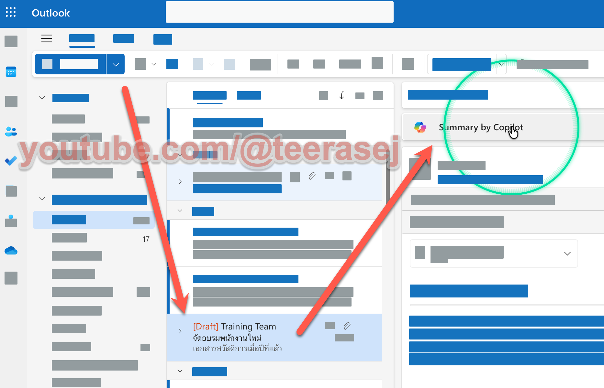
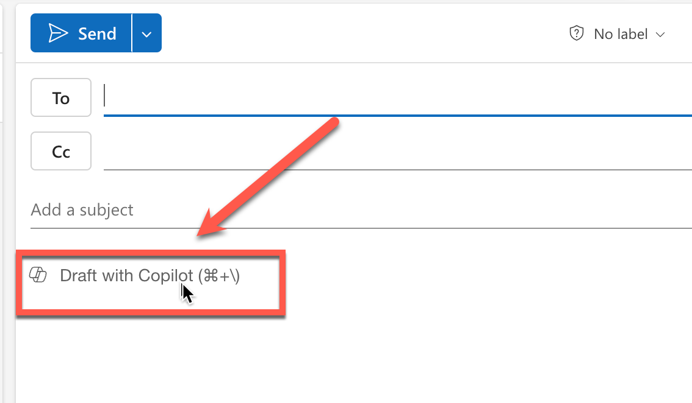

# Exercise: สรุปและร่าง Email ด้วย Copilot in Outlook

## Exercise Overview

เราจะใช้ Copilot in Outlook เพื่อสรุป Email thread และร่าง Email ตอบกลับด้วยน้ำเสียงแบบมืออาชีพ

## Prerequisites

1. มี Microsoft 365 Copilot license
2. ลงชื่อเข้าใช้ Outlook บน Web ด้วยบัญชีองค์กร
3. มี Email thread สำหรับทดลองสรุปอย่างน้อย 1 รายการ

## Scenario 1: ติดตามงานและร่างข้อความตอบกลับ

### Practice 1: สรุป Email thread 

#### Steps

1. เปิด Email thread ที่ต้องการตรวจสอบ
2. เลือก **Summarize by Copilot** หรือ **Summarize** ที่ด้านบนของ Email thread
3. ตรวจสอบชื่อบุคคล วันที่ ประเด็นสำคัญ และงานที่ต้องทำกับ Email ต้นฉบับ



### Practice 2: ร่าง Email นัดหมาย 

#### Steps

1. เลือก **New mail**
2. จาก toolbar เลือก **Copilot** แล้วเลือก **Draft with Copilot**



3. วาง prompt ด้านล่าง แล้วสร้างแบบร่าง

```text
ร่าง Email ภาษาไทยถึงผู้จัดการธนาคารเพื่อขอนัดหมายพูดคุยเรื่องการสนับสนุนเงินทุนสำหรับธุรกิจบริการทำความสะอาด
น้ำเสียงเป็นมืออาชีพและเป็นมิตร
ความยาวไม่เกิน 150 คำ
เสนอช่วงเวลานัดหมาย 2 ช่วง และปิดท้ายด้วยคำขอให้ยืนยันเวลาที่สะดวก
```

4. ตรวจสอบชื่อผู้รับ วัตถุประสงค์ วันเวลา และข้อมูลที่ Copilot สร้างขึ้น
5. ปรับ tone หรือ length เพิ่มเติมหากจำเป็น
6. เลือก **Keep it** เมื่อตรวจสอบแบบร่างแล้ว


> แบบฝึกหัดนี้ไม่ต้องส่ง Email จริง

## Checkpoint

- สรุป Email ระบุประเด็นสำคัญและงานที่ต้องทำตรงกับ thread ต้นฉบับ
- แบบร่างมีวัตถุประสงค์ ช่วงเวลานัดหมาย และคำขอให้ตอบกลับครบ
- ไม่มีชื่อ วันที่ หรือตัวเลขที่ Copilot สร้างเพิ่มโดยไม่ได้ตรวจสอบ

## Expected Output

- สรุป Email thread 1 ชุด และแบบร่าง Email ที่ตรวจทานแล้ว 1 ฉบับ

