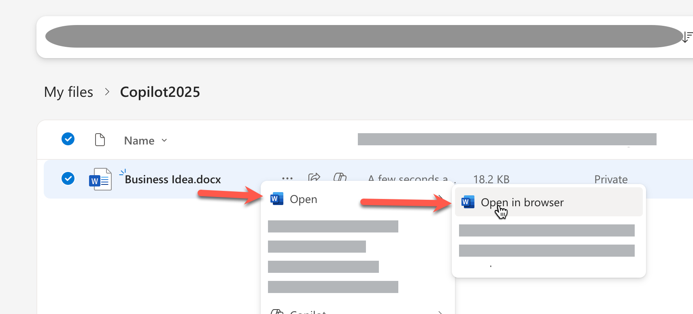
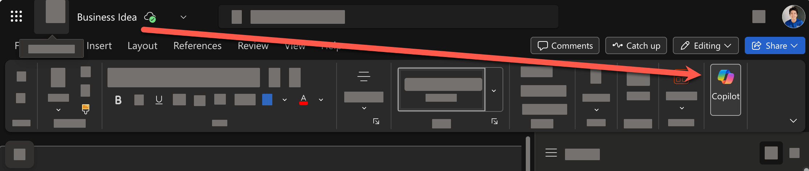

# Word: ทำงานเอกสารด้วย AI

> ในแบบฝึกหัดนี้ การใช้งานจะแตกต่างกันตามประเภทของ Account ที่ใช้งาน Copilot นะครับ


## 1. สรุปข้อมูล หรือให้ Copilot วิเคราะห์เนื้อหาในเอกสาร
1. จาก OneDrive ให้คลิกขวาที่ไฟล์ word บนหน้าเว็บ และคลิก Open > Open in web app เพื่อเปิดไฟล์เอกสารใน Microsoft Word บนเว็บเบราว์เซอร์
   

2. กดเปิด Copilot ได้จากด้านบนขวาของแถบเครื่องมือ Microsoft Word
    
3. สั่งให้ Copilot ช่วยสรุปเนื้อหาในเอกสารให้ โดยใช้คำสั่ง prompt ต่อไปนี้
   
   ```
   สรุปเนื้อหาสำคัญในเอกสารนี้เป็น 5 หัวข้อ พร้อมแนะนำขั้นตอนถัดไป
   ```
   คัดลอกและวาง prompt ด้านบน ในห้องแชท และกดปุ่ม enter หรือปุ่มส่ง
   

1. ตรวจสอบผลลัพธ์ที่ได้จาก Copilot
2. ด้านล่างสุดของคำตอบ กดปุ่ม "Add to Doc" เพื่อแทรกผลลัพธ์ลงในเอกสาร

## 2. จัดเรียงเนื้อหาเป็นตาราง

1. เลือกข้อความที่ขึ้นต้นด้วยรายการตัวเลขให้ครบทุกข้อ และกดปุ่มไอคอนรูปปากกาวิเศษด้านล่างซ้ายของข้อความที่เลือก
   
2. เลือกคำสั่ง Visualize as a table
   
3. ตรวจสอบผลลัพธ์ในรูปแบบตาราง
4. กดปุ่ม **Keep it** เพื่อยืนยันการแสดงผลในรูปแบบตาราง

