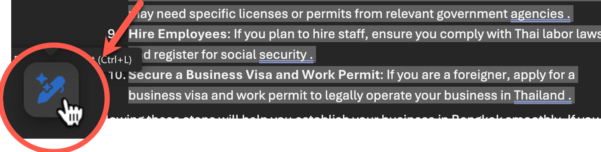
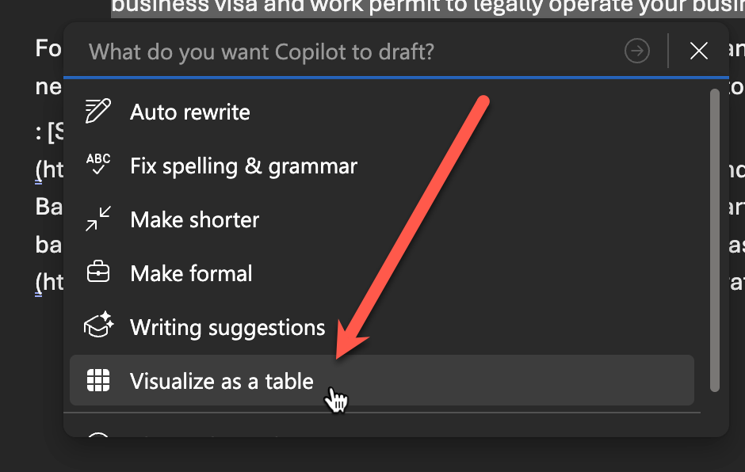

# Feature 2: ให้ออกไอเดีย และแปลงเป็น Table

## 1. ให้ Copilot ช่วยออกไอเดีย

> ในแบบฝึกหัดนี้ การใช้งานจะแตกต่างกันตามประเภทของ Account ที่ใช้งาน Copilot นะครับ

1. จากหน้าต่างที่เปิดอยู่ สั่งให้ Copilot ช่วยสรุปแนวทางทำธุรกิจใหม่ โดย copy ใช้คำสั่ง prompt ต่อไปนี้ในห้องแชท Copilot
   
   ```
   วิธีการตั้งธุรกิจใหม่ในกรุงเทพฯ? ตอบเป็นรายการตัวเลข
   ```

2. ตรวจสอบผลลัพธ์ที่ได้จาก Copilot
3. กดปุ่ม **insert** (หรือ **Add to doc**) ด้านล่างของข้อความผลลัพธ์ หรือจะกดปุ่ม copy และวางข้อความด้านล่างของเนื้อหาเดิมในเอกสารก็ได้
   

## 2. แปลงเป็นตาราง

> ขั้นตอนต่อไปนี้จะสามารถทำได้เฉพาะผู้ใช้ที่มี License เท่านั้น

1. เลือกข้อความที่ขึ้นต้นด้วยรายการตัวเลขให้ครบทุกข้อ และกดปุ่มไอคอนรูปปากกาวิเศษด้านล่างซ้ายของข้อความที่เลือก
   
2. เลือกคำสั่ง Visualize as a table
   
3. ตรวจสอบผลลัพธ์ในรูปแบบตาราง
4. กดปุ่ม Keep it เพื่อยืนยันการแสดงผลในรูปแบบตาราง

## 3. สร้างโลโก้สำหรับธุรกิจ

1. จากหน้าต่าง Copilot ให้ใช้ prompt ด้านล่างกับ Copilot ต่อจากขั้นตอนก่อนหน้านี้

   ```
   Create a logo for this business
   ```

2. รอให้ Copilot สร้างรูปจนเสร็จ
3.  คลิกบริเวณส่วนหัวของเอกสาร
4.  คลิกขวาที่รูป > เลือก Copy Image > และ paste รูปลงไปในเอกสาร
