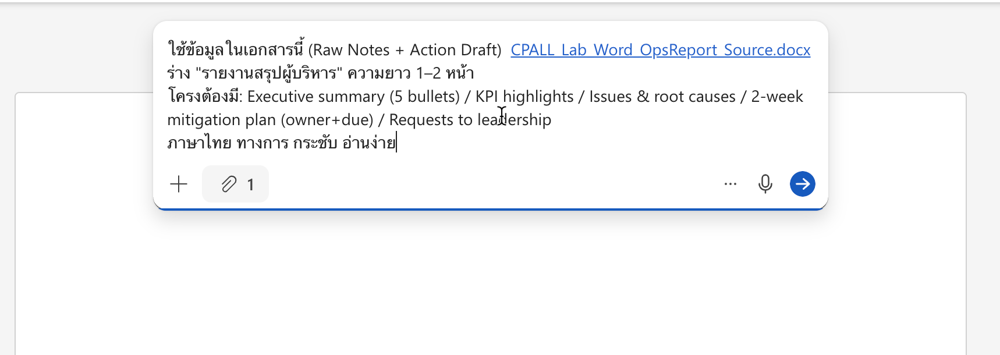
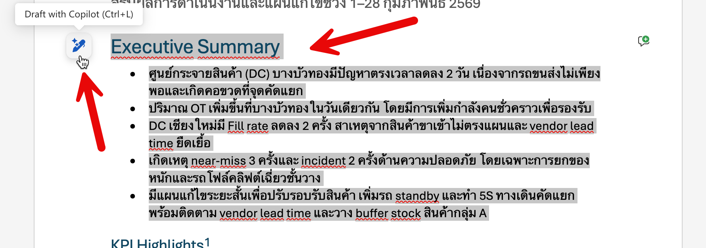
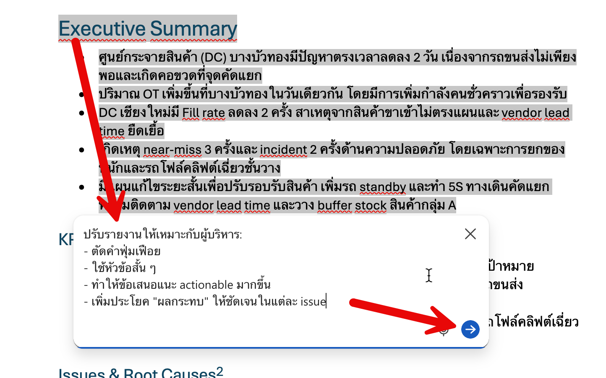
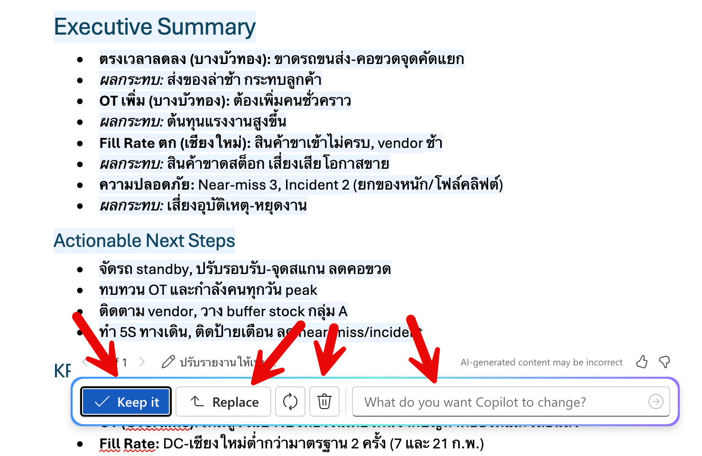

#   Auto Report Writing ด้วย Copilot in Word

## Scenario

แบบฝึกหัดนี้ให้ผู้เรียนใช้ Copilot ใน Word เพื่อร่างรายงานผู้บริหารจากเอกสารต้นฉบับ
พร้อมปรับภาษาให้เป็นทางการและสร้าง Action plan ที่นำไปใช้งานจริงได้

## Prerequisites

1. มีไฟล์ `Krungsri_BranchOps_Report_Source.docx` จากชุดเวิร์คชอป
2. อัพโหลดไฟล์ขึ้น OneDrive และรอให้ระบบทำดัชนี
3. เข้าใช้งาน Word บน Microsoft 365 ได้

## Steps

## Step 0: เตรียมไฟล์เอกสารต้นฉบับ

1. อัพโหลดไฟล์ `Krungsri_BranchOps_Report_Source.docx` ที่ได้จาก Zip ไฟล์ ขึ้นไปบน OneDrive ของเรา
2. ทิ้งเวลาไว้สักพัก ก่อนเริ่มขั้นตอนถัดไป เพื่อให้ Microsoft 365 ประมวลผลไฟล์และสร้าง index สำหรับ Copilot ให้เรียบร้อย


## Step 1: เปิดไฟล์และเปิด Copilot

1. เปิด Word ใน Microsoft 365 - https://word.cloud.microsoft/
2. กดปุ่ม **Create blank document**
3. เราจะเข้ามาที่หน้าเอกสารเปล่า ไปที่ขั้นตอนถัดไป


## Step 2: ร่างรายงานฉบับแรก

1. จะมี prompt box ปรากฎขึ้นด้านบนของเอกสารเปล่า ให้เรา copy prompt ด้านล่างนี้ไปวางใน prompt box และกดปุ่ม Generate

```
ใช้ข้อมูลในเอกสารนี้ (Raw Notes + Action Draft) 
```

2. จากนั้นพิมพ์ "/" เพื่อเรียกหน้าจอ attach ไฟล์ ให้ค้นหา และเลือกไฟล์ `Krungsri_BranchOps_Report_Source.docx` ที่เราอัพโหลดไว้ใน OneDrive

3. copy prompt ต่อไปนี้ไปวางต่อใน prompt box และกดปุ่ม Generate

```
ร่าง "รายงานสรุปผู้บริหาร" ความยาว 1–2 หน้า
โครงต้องมี: Executive summary (5 bullets) / KPI highlights (new account openings, customer retention, loan approval turnaround time, complaint) / Issues & root causes / 2-week mitigation plan (owner+due) / Requests to leadership
ภาษาไทย ทางการ กระชับ อ่านง่าย เหมาะสำหรับผู้บริหารธนาคารกรุงศรี
```

ภาพตัวอย่าง prompt จะประมาณด้านล่าง ก่อนกดปุ่มส่ง 



ตรวจงาน: ผลลัพธ์ต้องมีครบทุกหัวข้อ
- Executive summary
- KPI highlights
- Issues & root cause
- 2-week plan
- Requests


## Step 3: ปรับพวกเราภาพภาษาให้ทางการและกระชับ

1. ให้เลือกข้อความทั้งหมดในส่วน Executive Summary และกดปุ่มเรียก Draft with Copilot (รูปดินสอ) ที่อยู่ด้านซ้ายของข้อความที่เลือก
    

2. จะมี prompt box ปรากฎขึ้น ให้ copy prompt ด้านล่างนี้ไปวางใน prompt box และกดปุ่มส่ง

    ```
    ปรับรายงานให้เหมาะกับผู้บริหาร:
    - ตัดคำฟุ่มเฟือย
    - ใช้หัวข้อสั้น ๆ
    - ทำให้ข้อเสนอแนะ actionable มากขึ้น
    - เพิ่มประโยค "ผลกระทบ" ให้ชัดเจนในแต่ละ issue
    ```



3. Copilot จะแสดงแบบร่างใหม่ที่ปรับปรุงแล้วให้เรา ตรวจสอบความเรียบร้อย และกดปุ่ม **Replace** เพื่อยืนยันการใช้ข้อความนี้แทนที่ข้อความเดิม
     - หรือกดปุ่ม Keep it, Delete 🗑️, หรือพิมพ์ prompt เพื่อปรับแต่งเพิ่มเติมก็ได้
   

## Step 4: สร้างตาราง Action Plan

1. เลื่อนลงมาด้านล่างสุดของเอกสาร
2. กดปุ่มเรียก Draft with Copilot (รูปดินสอ) ที่อยู่ด้านซ้ายของเอกสาร
3. จะมี prompt box ปรากฎขึ้น ให้ copy prompt ด้านล่างนี้ไปวางใน prompt box และกดปุ่มส่ง

    ```
    สร้างตาราง Action plan โดยมีคอลัมน์: Action | Owner | Due | Expected outcome | Status
    ใช้ข้อมูลจากส่วน "รายการ Action ที่ต้องทำ (Draft)" และจัดให้อ่านง่าย
    ```

4. เปรียบเทียบตารางที่ได้กับข้อมูลในส่วน "รายการ Action ที่ต้องทำ (Draft)" เพื่อความถูกต้อง 


## Step 5: บันทึกไฟล์

1. ตรวจสอบความเรียบร้อยของรายงานและตาราง
2. ตั้งชื่อไฟล์ใหม่: `Krungsri_BranchOps_ExecutiveSummary.docx`


## Expected Output (สิ่งที่ควรได้)

- รายงานพร้อมส่งผู้บริหาร 1–2 หน้า
- มีตารางแผน 2 สัปดาห์ชัดเจน
- โทนเป็นทางการ แบบองค์กร

## Checkpoint

- โครงรายงานมีครบ: Executive summary, KPI highlights, Issues & root causes, 2-week plan, Requests
- ภาษากระชับและเหมาะกับผู้บริหาร
- ตาราง Action plan สอดคล้องกับข้อมูลต้นฉบับ

