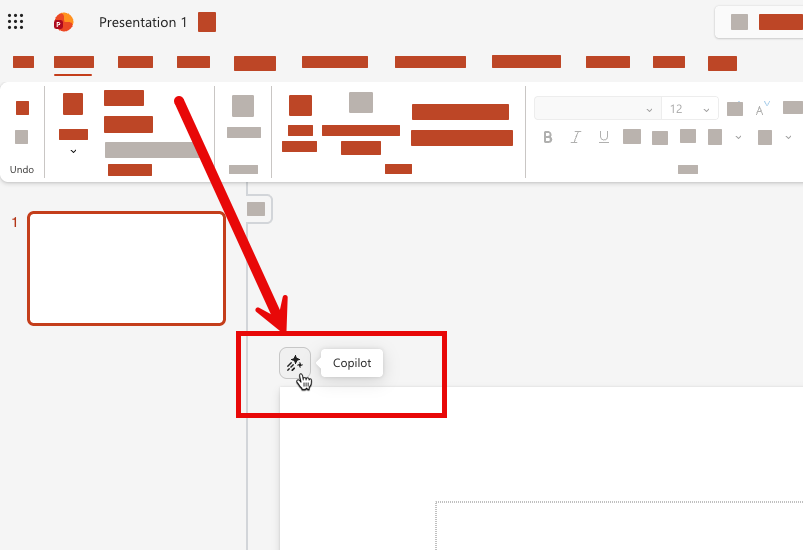
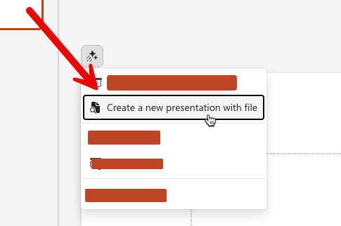
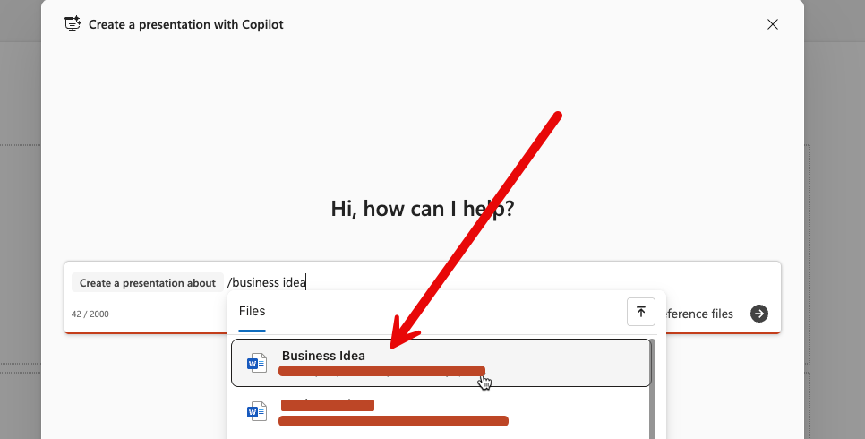
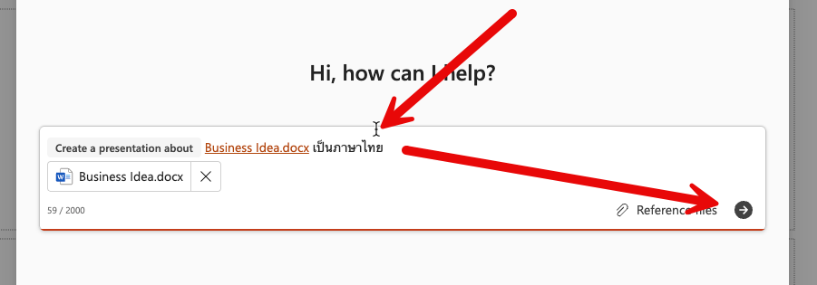
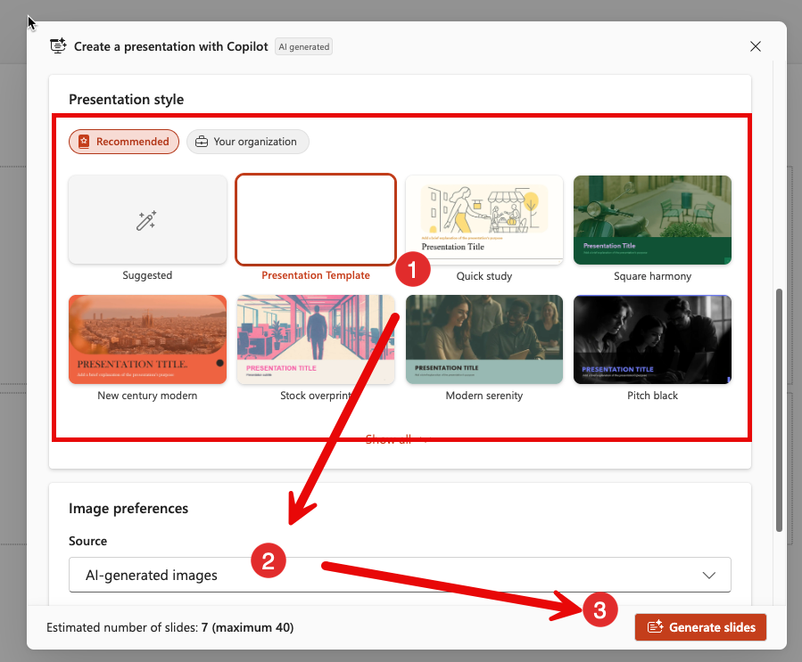

# Copilot in Powerpoint

## Scenario

แบบฝึกหัดนี้ให้ผู้เรียนใช้ Copilot ใน PowerPoint เพื่อสร้างงานนำเสนอจากไฟล์รายงาน
โดยเป้าหมายคือได้สไลด์ที่พร้อมสื่อสารประเด็นธุรกิจกับผู้บริหารหรือทีมงาน

## Prerequisites

1. เข้าถึง PowerPoint บน Microsoft 365 ได้
2. เตรียมไฟล์ `Krungsri_BranchOps_ExecutiveSummary.docx` ไว้ใน OneDrive
3. มีสิทธิ์ใช้งาน Copilot ตามประเภทบัญชี

## Steps

> ในแบบฝึกหัดนี้ การใช้งานจะแตกต่างกันตามประเภทของ Account ที่ใช้งาน Copilot นะครับ

## Step 1: เตรียมตัวก่อนเริ่มใช้งาน

1. เปิด Powerpoint ใน Microsoft 365 บนเว็บเบราว์เซอร์ [https://powerpoint.cloud.microsoft/](https://powerpoint.cloud.microsoft/) ด้วย account ที่มี 

## Step 2: สร้าง Presentation จากเนื้อหาไฟล์ (สำหรับผู้ใช้ที่มี License)

   1. กดปุ่ม Copilot จากด้านบนซ้ายของ slide หน้าที่เปิดอยู่ปัจจุบันตามภาพ 
      
   2. เลือกคำสั่ง "Create a new presentation with file" 
      
   3. ค้นหาไฟล์ **Krungsri_BranchOps_ExecutiveSummary.docx** ที่เราบันทึกไว้ใน exercise ที่แล้ว และเลือกไฟล์ เพื่อใส่ลงไปใน prompt
      
   4. กดปุ่มส่ง
    
      
   5. เลือก template ของงานนำเสนอ > เลือกรูปแบบของรูป เป็น Stock Image > กดปุ่ม Generate Slides เพื่อสร้างสไลด์
   
   6. รอ และตรวจสอบผลลัพธ์

## Checkpoint

- สไลด์ถูกสร้างจากไฟล์ต้นทางที่ถูกต้อง
- โครงเรื่องสไลด์อ่านเข้าใจได้ต่อเนื่อง
- เนื้อหาไม่หลุดประเด็นจากรายงานต้นฉบับ

## Expected Output

- ชุดสไลด์ที่สร้างด้วย Copilot อย่างน้อย 1 ชุด
- รูปแบบภาพและ template ตรงตามที่เลือก
     
