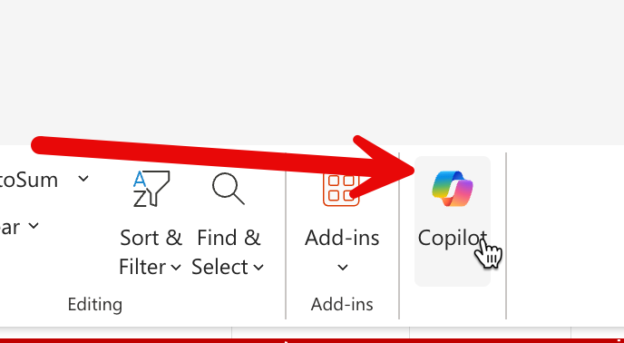

#  Data Exploration with Copilot in Excel

## Scenario

แบบฝึกหัดนี้ให้ผู้เรียนใช้ Copilot ใน Excel เพื่อสำรวจข้อมูล KPI หาแนวโน้มและความผิดปกติ
จากนั้นสรุปประเด็นสำคัญที่ผู้บริหารควรรู้เพื่อใช้ประกอบการตัดสินใจ

## Prerequisites

1. เปิดไฟล์ `Krungsri_BranchKPI_28days.xlsx` จาก OneDrive ได้
2. มี sheet `Summary` และ `KPI_Raw` พร้อมใช้งาน
3. เปิด Copilot Chat ใน Excel ได้

## Steps

## Step 1: เปิดไฟล์ Excel และเปิด Copilot Chat

1. จาก OneDrive ให้เปิดไฟล์ Excel ตัวอย่าง (Krungsri_BranchKPI_28days.xlsx)
2. เปิด Sheet "Summary"
3. เปิด Copilot Chat ใน Excel โดยกดที่ปุ่ม Copilot ด้านขวาบนของ Excel



## Step 2: ถามภาพรวม (Trend & Overview)

ในช่อง prompt ของ Copilot ให้ copy prompt และ paste ข้อความด้านล่างนี้เข้าไป 

```
สรุปภาพรวมผลการดำเนินงานของช่องทาง/ทีมทั้ง 4 แห่ง (สาขา, Mobile Banking, Contact Center, ทีมพิจารณาสินเชื่อ)
ในช่วง 28 วันที่ผ่านมา
พร้อมบอกแนวโน้มที่น่าสังเกต
```

## Step 3: หา Anomaly / ความผิดปกติ

1. เปิด sheet **KPI_Raw**
2. ในช่อง prompt ของ Copilot ให้ copy prompt และ paste ข้อความด้านล่างนี้เข้าไป 

```
ใส่สีพื้นหลังของ cell ในส่วน column Loan Approval Turnaround Time (วัน) เป็น 3 เฉดสีแดง เป็นโทนอ่อน-กลาง-เข้ม ตามช่วงของข้อมูล
```

3. ในช่อง prompt ของ Copilot ให้ copy prompt และ paste ข้อความด้านล่างนี้เข้าไป 

```
ช่วยตรวจหาวันหรือช่องทาง/ทีมที่มี
1) Loan Approval Turnaround Time (วัน) สูงกว่าค่าเฉลี่ยอย่างมีนัยสำคัญ
2) ช่องทางที่อัตรา cross-sell conversion ลดลงต่อเนื่อง
3) จำนวน complaint เพิ่มขึ้นผิดปกติ
ช่วยสรุปเป็นตารางสั้น ๆ เป็น sheet ชื่อ Anomaly 
```

## Step 4: โฟกัสประเด็นสำคัญ

ในช่อง prompt ของ Copilot ให้ copy prompt และ paste ข้อความด้านล่างนี้เข้าไป 

```
จากข้อมูลทั้งหมดนี้
เลือก 3 ประเด็นที่ผู้บริหารควรทราบมากที่สุด
พร้อมอธิบายสั้น ๆ ว่าทำไมประเด็นนี้จึงสำคัญ
```


## Expected Output (สิ่งที่ควรได้)

- รายการ trend
- รายการ anomaly
- Bullet insight เชิงข้อมูล 

## Checkpoint

- มีการสรุปภาพรวม 4 ช่องทาง/ทีมอย่างครบถ้วน
- มีตารางหรือรายการ anomaly ที่ตรวจสอบย้อนกลับได้จากข้อมูล
- มี 3 ประเด็นสำคัญพร้อมเหตุผลเชิงธุรกิจ