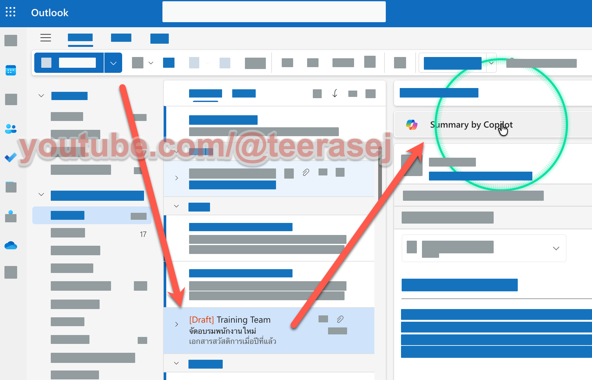
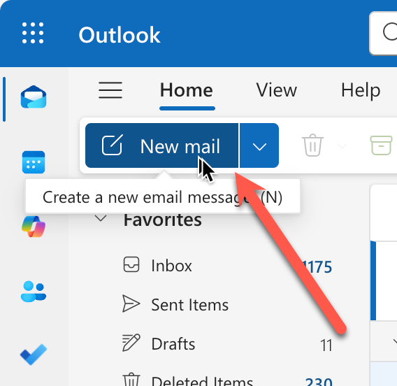
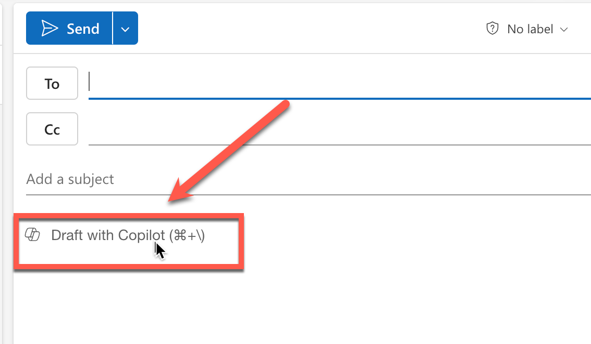
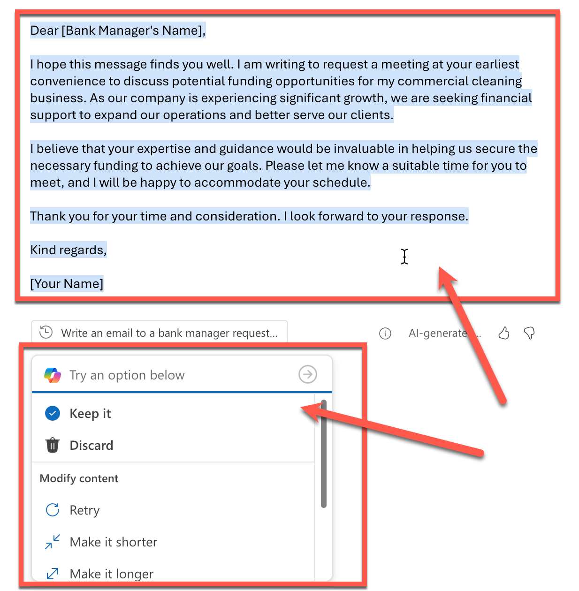
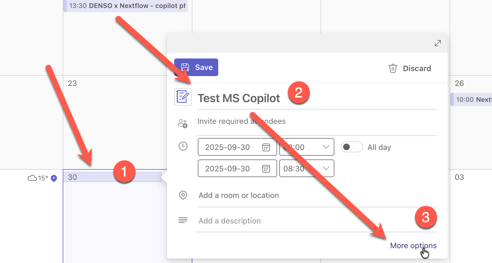
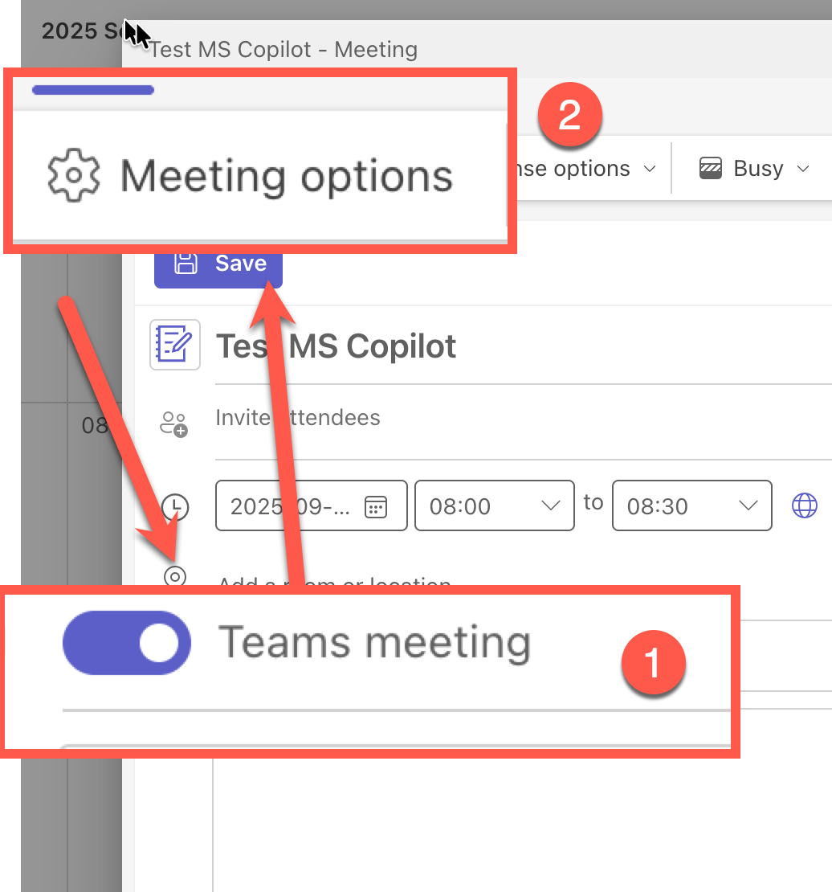
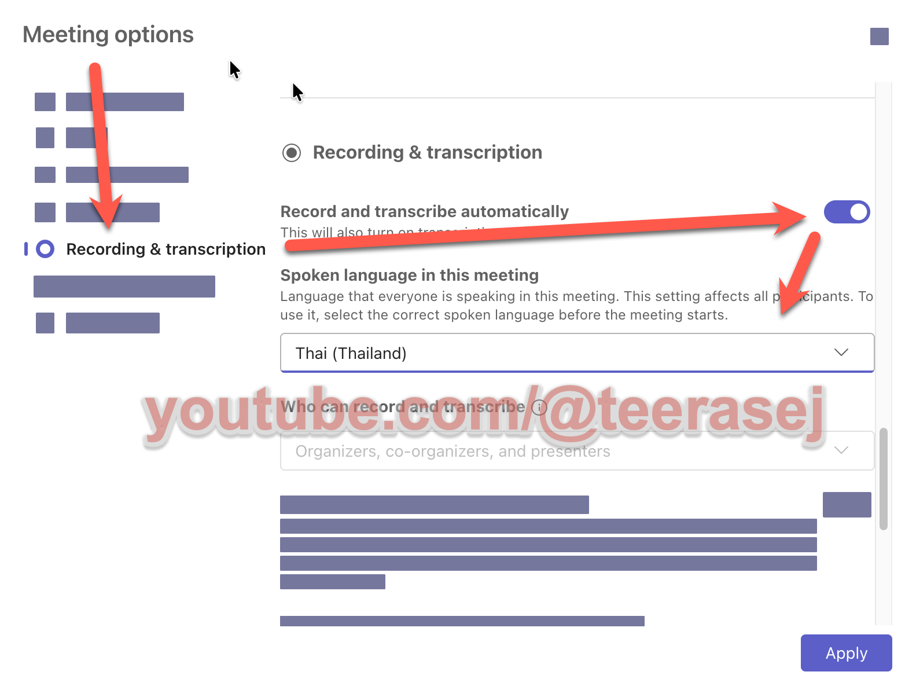
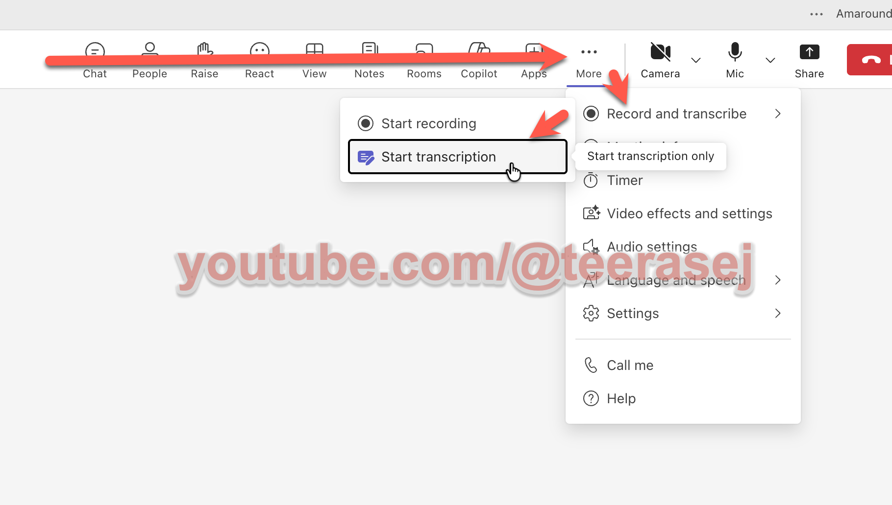
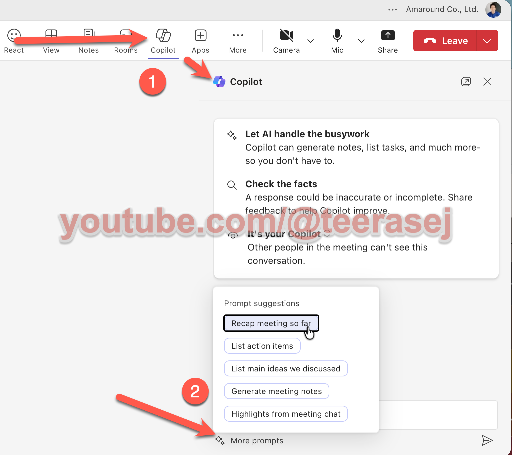
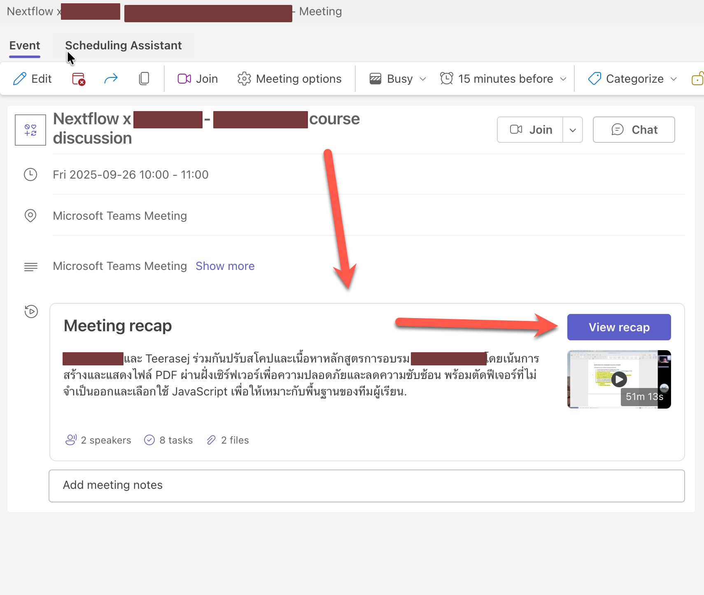

# Daily Communication ด้วย Copilot in Outlook + Teams

## Scenario

แบบฝึกหัดนี้ให้ผู้เรียนฝึกสื่อสารงานประจำวันด้วย Copilot ใน Outlook และ Teams
โดยเน้นการสรุปข้อมูล การร่างข้อความ และการดึง Action items จากการประชุม

## Prerequisites

1. เข้าใช้งาน Outlook และ Teams ด้วยบัญชีที่เข้าถึง Copilot ได้
2. มี email thread หรือ meeting ตัวอย่างสำหรับทดลอง
3. ตั้งค่า meeting ให้รองรับการบันทึก/ถอดเทปได้ (ถ้ามีนโยบายองค์กรรองรับ)

## Steps

## A) Outlook: สรุปและร่างอีเมลตอบกลับ

### Practice 1: สรุปเนื้อหา Email (สำหรับผู้ใช้แบบ free และแบบมี license)

1. ทำการเปิดเข้าใช้งาน [https://outlook.com](https://outlook.com) ด้วยบัญชีของตัวเอง
2. เปิดอีเมล thread ที่ต้องการให้ Copilot ช่วยสรุป
3. คลิกที่ปุ่ม Summarize ที่ด้านบนของหน้าต่าง Email
4. ตรวจสอบผลลัพธ์ที่ Copilot สรุปมาให้





### Practice 2: ร่าง Email 

1. ทำการเปิดเข้าใช้งาน [https://outlook.com](https://outlook.com) ด้วยบัญชีของตัวเอง
2. กดสร้าง mail ใหม่
   
3. กรอกหัวข้ออีเมลล์ 
    ```
    ปัญหา conversion lead ลดลง ช่องทาง Mobile Banking เดือน เม.ย.
    ```
4. จากหน้าร่าง email กดที่ไอคอนด้านหน้า Draft with Copilot 
      
5. เลือกคำสั่ง prompt 1 อย่างจากรายการต่อไปนี้ วางลงในกล่อง Prompt box และกดปุ่ม Generate

   ```
   ทีมบริการลูกค้าแจ้ง: ลูกค้าร้องเรียนเรื่องเอกสารขอสินเชื่อไม่ครบเพิ่มขึ้น 18% จำเป็นต้องมี checklist เอกสารก่อนยื่น
   ```
   ```
   ทีมขายแจ้ง: lead จาก Mobile Banking เข้าระบบ 1,680 ราย แต่ conversion ลดจาก 18% เหลือ 14% ขอแผน follow-up playbook
   ```
   ```
   ทีมพิจารณาสินเชื่อแจ้ง: loan approval turnaround time เพิ่มจาก 4.2 วัน เป็น 5.1 วัน ใบสมัครค้าง  28 ราย
   ขอแนวทาง lean review และ timeline การเร่งรัด
   ```
6. รอ Copilot แสดงแบบร่างให้ตรวจสอบ และเราสามารถใช้กล่องด้านล่าง เพื่อปรับแต่งแบบร่างได้ เช่น "write in thai" หรือ "ใช้คำสุภาพ และนัดเจอกันช่วงมื้ออาหารกลางวัน"
      
7. กดปุ่ม **Keep it** เพื่อยืนยันการใช้ข้อความ
      


## B) Teams: สรุปแชท/ประชุม + Action Items

### 1. การสร้าง Meeting ที่พร้อมถอดเทปการประชุม

1. เปิดโปรแกรม Microsoft Team > กดเปิด Calendar
2. กดสร้าง Meeting ใหม่ และตั้งชื่อให้เรียบร้อย
3. กดปุ่ม More option
   
    

4. กดเปิด **Team meeting** และเลือกเปิด meeting option จากด้านบน

    

5. เลื่อนลงมาด้านล่างของเมนู **Meeting option** > เลือก **Recording & transcription** > กดเปิด **Record and transcribe automatically** > เลือก **spoken language in this meeting** เป็นภาษาที่ต้องการ

    
    > อาจจะไม่สามารถเปิด transcribe ได้ ถ้า admin เป็นห่วงเรา และ block เราเอาไว้

### 2. การสั่งถอดเทปการประชุม ระหว่างการ meeting



1. กด Join เข้า Event ที่สร้างขึ้น
2. กดเปิดเมนู **more**
3. เลือก Record and transcribe
4. เลือก Start transcription
5. เลือกภาษาที่ต้องการ
6. กดปุ่ม ok 

### 3. การใช้งาน Copilot ระหว่างการประชุม

1. ในหน้าต่าง meeting กดเปิด Copilot
2. จากห้องแชท สามารถเลือก prompt สำเร็จรูปได้จาก more prompt





> หลังการบันทึกเสร็จสิ้น เราสามารถเข้าไปดูการถอดเทป และการสรุปของ Copilot ได้จากใน chat ของ meeting นั้นๆ หรือจะถามจาก Copilot Chat ใน Work mode ก็ได้
> 


### Practice 4: ใช้ Copilot สรุปการสนทนา

ใช้ Copilot สรุปประเด็นสำคัญจาก Meeting ที่ถูกบันทึกไว้ได้ เช่น

```
สรุปประเด็นสำคัญจากการประชุมนี้ โดยแยกเป็น
- Decisions (การตัดสินใจที่เกิดขึ้น)
- Action items (สิ่งที่ต้องทำ + Owner + Due date)
- Risks/Dependencies (ความเสี่ยงและสิ่งที่ต้องขึ้นต่อกัน)
```

### Practice 5: ร่างข้อความประกาศให้ทีมปฏิบัติการ

```
ช่วยร่างข้อความประกาศให้ทีมที่ปรึกษาและทีมบริการลูกค้า 5 บรรทัด โทนชัดเจน สุภาพ
```

## Checkpoint

- สรุป email ได้ใจความครบและอ่านง่าย
- แบบร่าง email มีโทนเหมาะสมและพร้อมส่งจริง
- สรุปประชุมมี Decisions, Action items, Risks/Dependencies ครบถ้วน

## Expected Output

- สรุป email อย่างน้อย 1 ฉบับ
- แบบร่าง email อย่างน้อย 1 ฉบับ
- สรุปประชุมพร้อมรายการงานที่ต้องทำ
