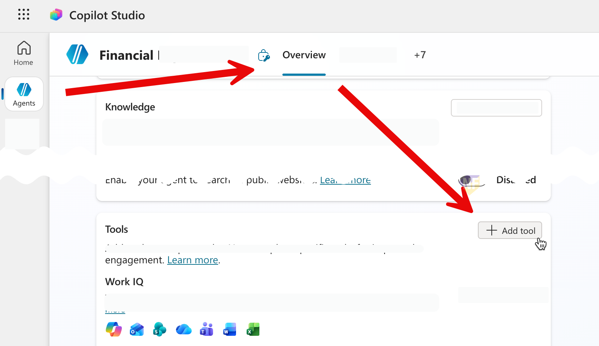

# แบบฝึกหัดที่ 5: เพิ่ม Agent Flow สำหรับส่ง email

🔑 **ต้องการ M365 Copilot License + สิทธิ์เข้าใช้ Copilot Studio**

แบบฝึกหัดนี้จะพาเราไปสู่การทำ **Action / Automation** ผ่าน **Agent Flow** ใน Copilot Studio โดยยังคงใช้สถานการณ์ของ `Financial Report Assistant` เดิม เพื่อให้ สามารถส่งสรุปรายงานทางอีเมลไปยังผู้รับที่ต้องการได้ผ่าน flow ธุรกิจที่ควบคุม input, output, และข้อความตอบกลับได้ชัดเจนกว่าเดิม


---

## Practice 1: ทบทวน flow เดิมและกำหนดเป้าหมายของ action

1. เปิด Agent `Financial Report Assistant` ที่สร้างจาก Module 2
2. เช็คดู instructions และ orchestration ของ Agent ว่ายังเหมาะสมกับการทำงานแบบ hybrid conversation หรือไม่

---

## Practice 2: สร้าง Agent Flow และใช้ Send an email (V2)

1. จากเมนูด้านซ้ายของ Copilot Studio portal ให้เลือก flow > กด **Create new flow** > ตั้งชื่อ flow ว่า

   ```text
   Send Result by Email 
   ```
2. เราจะเข้าสู่หน้า Agent flow designer ให้กดปุ่ม **Save draft** ก่อนที่จะดำเนินขั้นตอนต่อไป
   
3. จากด้านบนซ้าย ให้อยู่ในส่วนของหน้า Designer > คลิกที่ชื่อเพื่อเปลี่ยนชื่อเป็น
   - ชื่อ flow:
      ```text
      Send Result by Email 
      ```
   - Input parameters: `AnalysisSummary`, `ReviewerEmail`
   - Output parameters: `ResponseMessage`
   - ใน flow นี้ให้สร้างขั้นตอนธุรกิจแบบตรงไปตรงมา: ส่งอีเมลสรุปผลไปยัง reviewer แล้วส่งข้อความยืนยันกลับไปที่ Agent

4. ที่ action `When an agent calls the flow` ให้เพิ่ม input parameters 2 ค่าเป็นประเภทดังนี้

   ```text
   AnalysisSummary (text)
   ```
   ```text
   ReviewerEmail (email)
   ```
   

5. สังเกตว่า input เหล่านี้คือค่าที่ Topic จะส่งเข้ามาให้ flow ใช้งานต่อใน action อื่นๆ
6. ใต้ action `When an agent calls the flow` ให้เพิ่ม action `Send an email (V2)` จาก Office 365 Outlook
   
7. กำหนดค่าหลักของ `Send an email (V2)` ตามนี้

   ### To
   1. จากช่อง To ให้กดเลือกปุ่มรูปเฟือง (⚙) เพื่อเลือก **Use dynamic content**
   2. จากนั้นเลือกหา Action ชื่อ `When an agent calls the flow`
   3. เลือกชื่อตัวแปร ReviewerEmail ที่เราสร้างไว้
   

   ```text
   ReviewerEmail
   ```

   ### Subject
   คัดลอกข้อความนี้ไปใส่ในช่อง Subject
   ```text
   Monthly financial report summary
   ```

   ### Body
   คัดลอกข้อความนี้ไปใส่ในช่อง Body โดยทำการแทนที่ค่าตัวแปร `{{AnalysisSummary}}` ด้วย input parameter `AnalysisSummary` ที่เราสร้างไว้ใน action `When an agent calls the flow` เช่นเดียวกับขั้นตอนที่ทำในช่อง To
   ```html
   Hello,
   Here is the monthly financial report summary generated by the agent.
   {{AnalysisSummary}}
   ```

8. ที่ action `Respond to the agent` ให้กำหนดชื่อของตัวแปร output กลับมายัง Agent 1 ค่า

   ```text
   ResponseMessage
   ```

9. ให้คัดลอกตัวอย่างข้อความกำหนดลงในค่าตัวแปร **ResponseMessage** โดยให้แทนที่ข้อความ `{{ReviewerEmail}}` ด้วยตัวแปร input `ReviewerEmail` ที่เราสร้างไว้ใน action `When an agent calls the flow`

   ### ResponseMessage
   ```text
   Report summary sent to {{ReviewerEmail}}.
   ```
   
10. กด **Save draft** และ **Publish** ให้เรียบร้อย

> ⚠️ **Note:** Microsoft Learn ระบุว่า `Send an email (V2)` ไม่ได้ส่ง `message id` กลับมาให้ใช้ต่อในแบบตรงๆ ดังนั้นในแบบฝึกหัดนี้ให้ใช้ `ResponseMessage` เป็นผลลัพธ์หลักที่ Topic จะนำไปแสดงในแชต

---

## Practice 3: ผูก Agent Flow ที่ Publish แล้วเข้ากับ Agent ผ่าน Tools

1. กลับไปที่หน้า **Overview** ของ Agent `Financial Report Assistant`
2. เลื่อนมาที่ส่วน **Tools** แล้วกด **Add a tool**
   
3. เลือก Agent Flow 
4. เลือก flow ที่เพิ่ง publish ไว้ (`Send Result by Email`)
5. กดปุ่ม **Add and configure**
6. ตรวจสอบ **Name** และ **Description** ของ Tool 
7. ตรวจสอบ **Input parameters** ว่าตรงกับที่เรากำหนดไว้ใน flow หรือไม่
8. กดปุ่ม back (⬅️) และตรวจว่า Tool แสดงในรายการของ Agent เรียบร้อย
9. กดกลับมาที่หน้า **Overview** ของ Agent เพื่อเช็คดูว่า Tool ที่เพิ่งเพิ่มเข้ามาแสดงในรายการเรียบร้อยแล้ว

> 💡 **Tip:** ในเวิร์กช็อปเวอร์ชันนี้ เราผูกความสามารถส่งอีเมลในระดับ Agent (Overview > Tools) ก่อน แล้วค่อยทดสอบการเรียกใช้จากบทสนทนา

---

## Practice 4: ทดสอบการเรียก Tool และการยืนยันสิทธิ์ (Authenticate)

1. เปิด **Test your agent**
2. เริ่มด้วย prompt ตัวอย่างนี้

   ```text
   ส่ง email ให้หน่อย
   ```

3. สังเกตว่าเมื่อ Agent พยายามเรียก Tool ครั้งแรก ระบบควรแสดงขั้นตอนให้ผู้ใช้ **authenticate/consent** เพื่อใช้สิทธิ์อีเมลของผู้ใช้
4. ดำเนินการ sign in หรือกดยืนยันสิทธิ์ให้ครบ 
5. ระบบอาจจะมีการถามรายละเอียดเพิ่มเติม เช่น ชื่อผู้รับ หรือ ข้อความสรุปผล ให้ตอบกลับตามที่ระบบถาม
6. แล้วส่ง prompt 
   ```text
   ช่วยส่งสรุปรายงานการเงินรายเดือน "ยอดกำไรลดลง 5%" ให้ training@nextflow.in.th
   ```
7. ตรวจว่าระบบเรียก Tool สำเร็จและมีข้อความยืนยันกลับมา เช่น

   ```text
   Report summary sent to finance-manager@krungsri.example.
   ```

8. ตรวจเช็คปลายทางอีเมลของผู้รับว่ามีอีเมลสรุปรายงานส่งไปเรียบร้อยหรือไม่

> ⚠️ **Note:** ถ้า tenant ขององค์กรจำกัดสิทธิ์ connector อาจยังเรียก Tool ไม่ผ่านในห้องทดสอบ ให้ถือเป็น expected behavior ด้าน security และบันทึกผลไว้

---

## สรุป

ในแบบฝึกหัดนี้ พวกเราได้สร้างและ publish Agent Flow สำหรับส่งอีเมล แล้วผูก flow นั้นเข้ากับ Agent ผ่านหน้า **Overview > Tools** จากนั้นทดสอบการเรียกใช้งานจริงในแชต รวมถึงตรวจขั้นตอน **authenticate/consent** ก่อนส่งอีเมล เพื่อให้มั่นใจว่า Agent ทำงานได้ถูกต้องตามสิทธิ์ผู้ใช้

ขั้นตอนถัดไป → [กลับไปที่สารบัญ Copilot Studio](../README.md)