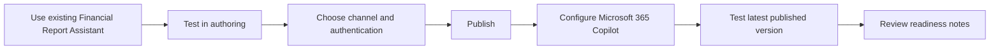

# แบบฝึกหัดที่ 5: เลือก Channel และ Publish Agent

แบบฝึกหัดนี้จะพาเราต่อยอดจากงานที่ทำเสร็จในแบบฝึกหัดที่ 4 โดยใช้ **Financial Report Assistant** ตัวเดิม แล้วโฟกัสเรื่อง **Channel selection**, **Authentication**, **Publishing** และการตรวจความพร้อม หลัง publish

## ก่อนเริ่ม: ตรวจความพร้อม

ควรยืนยันก่อนเริ่มว่า

- ผู้เรียนอยู่ใน Copilot Studio environment ที่ **publish ได้** และมีสิทธิ์ maker ที่เหมาะสม
- tenant มี license และ capacity ที่อนุญาตให้ publish ตามนโยบายขององค์กร
- ผู้เรียนและผู้สอนมีสิทธิ์ใช้ Microsoft 365 Copilot และองค์กรอนุญาตให้ publish หรืออนุมัติ Agent ใน Microsoft 365 Copilot
- ใช้เฉพาะข้อมูลตัวอย่าง ห้ามใส่ข้อมูลการเงินจริง ข้อมูล HR หรือข้อมูลอ่อนไหวลงใน Agent หรือบทสนทนา

> **⚠️ Note:** Copilot Studio trial ใช้สร้างและทดสอบ Agent ใน test panel ได้ แต่ใช้ publish ไม่ได้ หาก publish ไม่ได้ ให้จับภาพ screenshot และติดต่อผู้ดูแล environment แทนการพยายามหลีกเลี่ยงนโยบายที่องค์กรตั้งไว้

> **💡 Tip:** สำหรับ hands-on นี้ ให้ใช้ Agent เดิมที่ทำต่อเนื่องมาจากแบบฝึกหัดที่ 4

---

## Practice 1: เลือก Channel และวิธีเข้าถึง

เปรียบเทียบทางเลือกก่อน deploy

| Channel | เหมาะกับ | ขอบเขตของแบบฝึกหัดนี้ |
|---|---|---|
| **Microsoft 365 Copilot** | ผู้ใช้ภายในองค์กรที่ลงชื่อเข้าใช้ด้วยบัญชีงาน และมีสิทธิ์ใช้ Microsoft 365 Copilot | **เส้นทาง hands-on หลัก** ผู้เรียนทุกคนจะ publish และทดสอบด้วยตนเองใน Microsoft 365 Copilot |
| **Demo website** | การทดสอบกับเพื่อนร่วมทีมหรือ stakeholder ภายใน | ใช้สำหรับการสาธิตเท่านั้น URL ไม่ใช่ production และห้ามส่งให้ลูกค้า |
| **Custom/live website** | Agent ที่พร้อมให้ผู้ใช้จริงเข้าถึงบนเว็บไซต์ | อยู่นอกขอบเขต เพราะต้องออกแบบ web integration และ security เพิ่มเติม |

1. สำหรับ hands-on นี้ ให้เลือก **Microsoft 365 Copilot** เป็น target channel
2. เลือกใช้ **Authenticate with Microsoft** สำหรับเส้นทาง Microsoft 365 Copilot
3. ห้ามเลือก **No authentication** สำหรับ Agent นี้ และห้ามใช้ข้อมูลการเงินจริงหรือ HR จริงในการทดสอบ

---

## Practice 2: ตั้งค่า Authentication และ Publish Agent

1. เปิด Agent `Financial Report Assistant` ที่ต่อเนื่องมาจากแบบฝึกหัดที่ 4
2. เปิด **Settings** ของ Agent แล้วไปที่ **Security** > **Authentication**
3. เลือก **Authenticate with Microsoft** แล้วกด **Save**
4. เปิด Agent สำหรับแก้ไข แล้วกด **Publish**
5. ยืนยันการ publish และรอจนระบบแสดงว่า publish สำเร็จ
6. หาก publish ไม่สำเร็จ ให้บันทึก status หรือ error message และติดต่อผู้ดูแล environment

> **💡 Tip:** ก่อนกด publish ให้เช็คว่า Tool และ Topic ที่ต่อยอดมาจากแบบฝึกหัดก่อนหน้าอยู่ในสถานะพร้อมใช้งาน

> **💡 Tip:** การเปลี่ยน authentication จะมีผลกับผู้ใช้หลัง publish แล้วเท่านั้น

---

## Practice 3: เชื่อมต่อและทดสอบ Agent ใน Microsoft 365 Copilot

1. เปิดเมนู **Channels** ของ Agent
2. เลือก **Teams and Microsoft 365 Copilot**
3. ในส่วน **Turn on Microsoft 365** ให้ยืนยันว่าเลือก **Make agent available in Microsoft 365 Copilot** แล้ว
4. กด **Add channel** เพื่อเชื่อมต่อ Agent กับ Microsoft 365 Copilot
5. หน้าตั้งค่านี้ใช้ร่วมกับ Teams ตามชื่อใน Copilot Studio แต่สำหรับแบบฝึกหัดนี้ ให้ใช้งานและทดสอบ Agent ใน **Microsoft 365 Copilot** เท่านั้น
6. หากองค์กรกำหนดให้มีการอนุมัติ ให้ส่ง Agent เพื่อให้ Microsoft 365 admin review ก่อนเริ่มทดสอบ
7. หลัง Agent พร้อมใช้งาน ให้เปิด Microsoft 365 Copilot เริ่มบทสนทนาใหม่ พิมพ์ `@` แล้วเลือก Agent ของตนเอง จากนั้นจึงถามคำถามทดสอบ
8. ทดสอบด้วยบัญชีของผู้สร้าง Agent ก่อน และห้ามเปิดให้ผู้ใช้วงกว้าง เว้นแต่ผู้สอนหรือผู้ดูแลอนุญาต

> **⚠️ Note:** หาก Agent ยังไม่ปรากฏใน Microsoft 365 Copilot อาจกำลังรอการอนุมัติหรือถูกจำกัดด้วยนโยบาย tenant ให้บันทึกปัญหาและติดต่อ Microsoft 365 admin

---

## Practice 4: ตรวจสอบความพร้อมหลัง Publish (Quick Readiness Check)

1. เปิด **Test your agent** แล้วลอง prompt ที่ครอบคลุมงานจริงอย่างน้อย 2 แบบ
   - คำสั่งให้วิเคราะห์รายงานการเงินจากไฟล์
   - คำสั่งให้ช่วยส่งสรุปผ่านอีเมลตาม flow ที่ต่อไว้
2. ตรวจว่า Agent ยังรักษาขอบเขตงานด้านการเงิน และตอบกรณีนอกขอบเขตอย่างเหมาะสม
3. บันทึกผลการทดสอบสั้นๆ 2-3 ข้อ เช่น
   - ผ่าน: route ไป Topic และเรียก Tool ได้ตามคาด
   - ต้องปรับ: ข้อความตอบกลับบางช่วงยังไม่ชัดเจน
4. หากเจอปัญหาจากสิทธิ์หรือ policy ของ tenant ให้บันทึกอาการและส่งต่อผู้ดูแล environment

> **💡 Tip:** ให้ใช้การตรวจแบบสั้นแต่ครบเส้นทาง เพื่อยืนยันว่า version ที่ publish พร้อมใช้งานใน Microsoft 365 Copilot

---

## สรุป

ในแบบฝึกหัดนี้ พวกเราได้ใช้ **Financial Report Assistant** ตัวเดิมจากแบบฝึกหัดที่ 4 เพื่อเลือก channel ที่เหมาะสม ตั้งค่า authentication, publish, เชื่อมต่อ Microsoft 365 Copilot และตรวจความพร้อมหลัง publish แบบรวบรัด

ขั้นตอนถัดไป → [เติมข้อมูลใน AI Agent Canvas](../exercise-1-agent-canvas-template/README.md)

## อ่านเพิ่มเติม

- [Microsoft Learn: Publish and deploy your agent](https://learn.microsoft.com/microsoft-copilot-studio/publication-fundamentals-publish-channels)
- [Microsoft Learn: Connect and configure an agent for Teams and Microsoft 365](https://learn.microsoft.com/microsoft-copilot-studio/publication-add-bot-to-microsoft-teams)
- [Microsoft Learn: Set up Agent Store in Microsoft 365 Copilot](https://learn.microsoft.com/microsoft-365/copilot/copilot-agent-store)
- [Microsoft Learn: Configure user authentication in Copilot Studio](https://learn.microsoft.com/microsoft-copilot-studio/configuration-end-user-authentication)
- [Microsoft Learn: Copilot Studio licensing FAQ](https://learn.microsoft.com/microsoft-copilot-studio/faq-billing-licensing)
- [Microsoft Learn: Publish an agent to a live or demo website](https://learn.microsoft.com/microsoft-copilot-studio/publication-connect-bot-to-web-channels)
