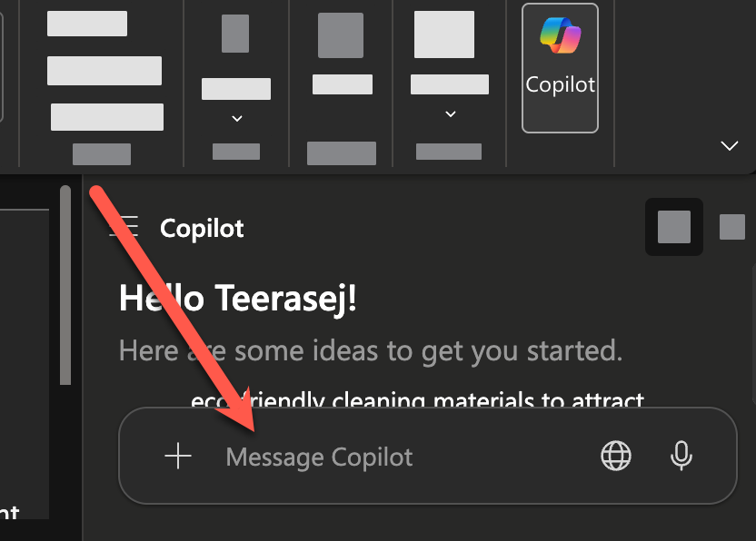
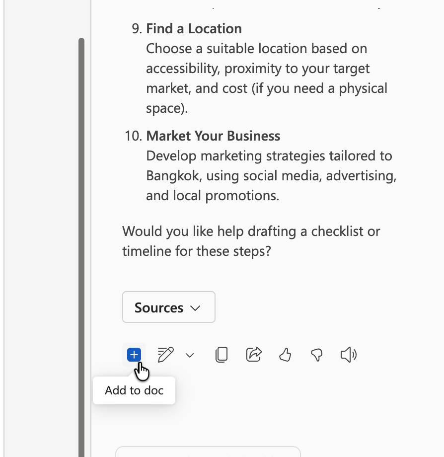
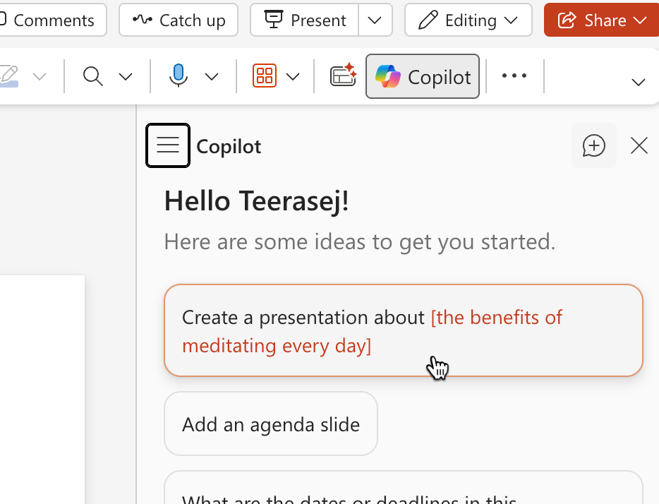
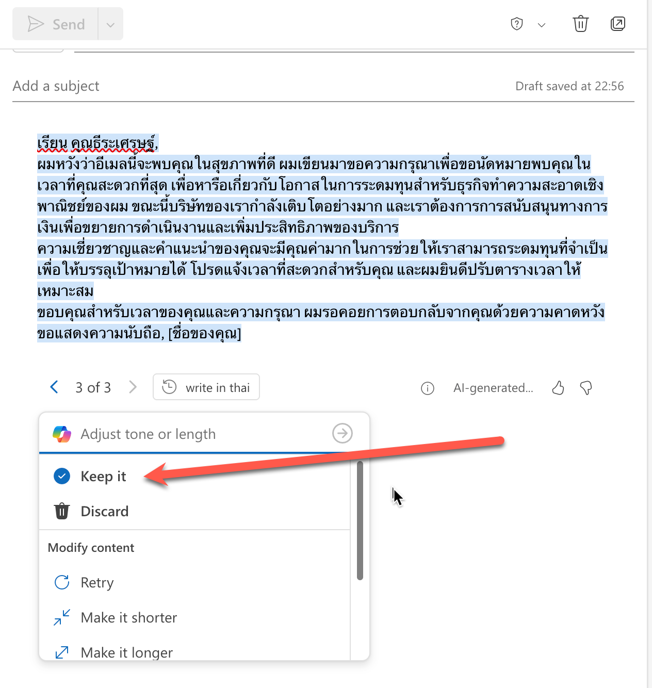

# Exercise: Copilot in Microsoft 365 Apps

## Exercise Overview

- **เวลา:** 10:45–12:00 (75 นาที)
- **เป้าหมาย:** ทำ relay ผ่าน Word, PowerPoint, Excel และ Outlook โดยส่งต่อ context อย่างมีคุณภาพ
- **ผลลัพธ์:** concept brief, presentation outline, revenue insight และ email draft

## Prerequisites

- ดาวน์โหลด [business-idea.docx](../../files/m365-copilot/business-idea.docx), [business-presentation.pptx](../../files/m365-copilot/business-presentation.pptx) และ [product-revenue.xlsx](../../files/m365-copilot/product-revenue.xlsx)
- เปิดใช้ Copilot ใน Word, PowerPoint, Excel และ Outlook
- ทำงานเป็นกลุ่ม 4 คน หรือหมุนทำแต่ละ station คนละประมาณ 15 นาที

> **หมายเหตุเกี่ยวกับภาพ:** ภาพมาจาก source exercise เดิมโดยไม่แก้ไข จึงอาจเห็นชื่อผู้ใช้ tenant บริษัท ชื่อไฟล์ หรือ prompt เดิม ให้ยึดชื่อไฟล์ ค่า และ prompt ที่เขียนในขั้นตอนปัจจุบัน

## Scenario 1: App relay จากแนวคิดสู่ข้อความติดตาม

ทีมต้องใช้ข้อมูลชุดเดียวกันสร้างเอกสาร นำเสนอ วิเคราะห์ และสื่อสาร แต่ละแอปเป็นจุดส่งไม้ต่อ หากข้อมูลต้นทางผิด งานถัดไปก็ผิดตาม

### Practice 1: Word และ PowerPoint

#### Steps

1. เปิด `business-idea.docx` ใน Word บนเว็บ


2. เปิด **Copilot** จาก ribbon ของ Word


3. วาง prompt นี้ใน Copilot:

```text
จากเอกสารนี้ สร้าง concept brief ภาษาไทยไม่เกิน 1 หน้า
มีหัวข้อ: Customer need, Proposed service, Differentiator, Assumptions, Questions to validate
ใช้เฉพาะข้อมูลในเอกสาร หากไม่พบให้เขียน "ต้องตรวจสอบ"
```



4. ตรวจว่าทุก claim มาจากไฟล์และแก้ข้อความที่กว้างเกินไป
5. เลือก **Insert** หรือ **Add to doc** เพื่อนำ concept brief ที่ตรวจแล้วเข้าเอกสาร หาก UI ไม่มีปุ่มนี้ให้ใช้ **Copy** แล้ววางท้ายเอกสาร



6. เปิด `business-presentation.pptx` ใน PowerPoint แล้วเปิด Copilot pane



7. ใช้ Copilot เพื่อสร้างหรือปรับ outline 5 สไลด์: challenge, audience, offer, evidence needed, next step
8. ตรวจ speaker notes และรูปภาพ ไม่ใช้ภาพหรือสถิติที่ไม่มีแหล่งที่มา

### Practice 2: Excel และ Outlook

#### Steps

1. เปิด `product-revenue.xlsx` ใน Excel บนเว็บ


2. เปิด Copilot จาก ribbon


3. ใช้ prompt:

```text
วิเคราะห์รายได้รายไตรมาสใน workbook นี้
แสดง 3 insight: สินค้าที่เติบโตมากที่สุด สินค้าที่ลดลง และรูปแบบที่ควรตรวจสอบต่อ
อ้างอิงชื่อ sheet และช่วงเซลล์สำหรับตัวเลขทุกข้อ
อย่าสรุปสาเหตุหากข้อมูลไม่มีหลักฐาน
```

4. ตรวจผลรวมและเปอร์เซ็นต์กับเซลล์ต้นทางด้วยตนเองอย่างน้อย 2 ค่า
5. เปิด Outlook แล้วเลือก **New mail**


6. เลือก **Draft with Copilot**


7. ใช้ prompt:

```text
ร่างอีเมลภาษาไทยถึงทีมโครงการ สรุป insight ที่ตรวจสอบแล้ว 3 ข้อ
เสนอ next step 2 ข้อ และขอให้ผู้รับทบทวน concept brief กับ presentation
โทนร่วมมือ ความยาวไม่เกิน 160 คำ
อย่าเพิ่มตัวเลขหรือข้อสรุปใหม่
```

8. ตรวจผลลัพธ์และแก้ตัวเลขหรือข้อความที่ไม่ตรงกับ source


9. เมื่อร่างผ่านการตรวจแล้ว ให้เลือก **Keep it** เพื่อนำข้อความลงใน draft



10. ตรวจผู้รับ ตัวเลข ไฟล์แนบ และน้ำเสียงอีกครั้ง แต่ยังไม่กด **Send**

## Checkpoint

- relay ใช้ source เดียวกันและไม่มี claim ใหม่ที่ขาดหลักฐาน
- Excel insight อ้างอิงช่วงเซลล์และผู้เรียนตรวจเลขอย่างน้อย 2 ค่า
- Outlook draft ไม่มีข้อมูลผู้รับจริงหรือไฟล์แนบผิด

## Expected Output

concept brief, presentation outline, revenue insight และ email draft ที่สามารถส่งต่อให้เพื่อนตรวจได้

## Optional Extension

ให้ผู้เรียนอีกคนรับเฉพาะ email draft แล้วลองย้อนกลับไปหา source ของทุก claim หากหาไม่ได้ให้ติดป้าย “orphan claim” และแก้ก่อนใช้
