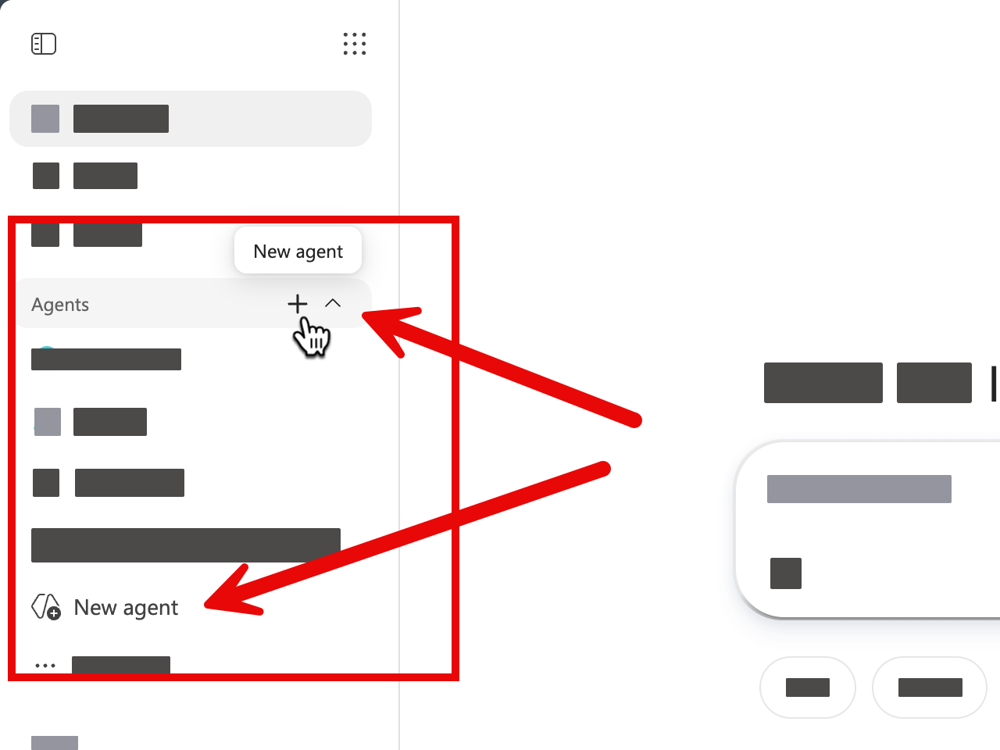

# Exercise: Build a Sales Proposal Assistant

## Exercise Overview

- **เวลา:** 13:00–14:30 (90 นาที)
- **เป้าหมาย:** สร้างเอเจนต์ที่ช่วยเตรียม proposal จากไฟล์ที่อนุญาต แล้วทดสอบข้อจำกัดก่อนแชร์
- **ผลลัพธ์:** Sales Proposal Assistant ที่มี name, instruction, knowledge, test evidence และ sharing decision

## Prerequisites

- สิทธิ์ใช้ **Agent Builder** ใน Microsoft 365 Copilot
- [business-idea.docx](../../files/m365-copilot/business-idea.docx) และ [business-presentation.pptx](../../files/m365-copilot/business-presentation.pptx)
- หาก tenant ปิด Agent Builder ให้จับคู่กับผู้เรียนที่มีสิทธิ์หรือชม trainer demo

> **หมายเหตุเกี่ยวกับภาพ:** ภาพมาจาก source exercise เดิมโดยไม่แก้ไข จึงอาจเห็นชื่อผู้ใช้ tenant บริษัท ชื่อไฟล์ หรือ agent เดิม ให้ยึดชื่อและค่าที่เขียนในขั้นตอนปัจจุบัน

## Scenario 1: ผู้ช่วยร่าง proposal ที่ไม่แต่งข้อมูล

ทีมต้องร่าง proposal หลายครั้ง แต่ต้องใช้ข้อมูลที่อนุญาตและระบุสิ่งที่ยังไม่ทราบ เอเจนต์จะช่วยจัดโครงและถามคำถาม ไม่อนุมัติราคา ข้อผูกพัน หรือข้อความสุดท้ายแทนมนุษย์

### Practice 1: Create, instruct, and ground

#### Steps

1. เปิด Microsoft 365 Copilot แล้วเข้า **Agent Builder** หรือเลือก **Create agent** ตาม UI ของ tenant


2. เลือก **New agent** เพื่อเริ่มสร้าง agent



3. หาก UI แสดงแท็บ **Describe** และ **Configure** ให้เลือก **Configure** เพื่อกำหนดค่าด้วยตนเอง


4. ตั้งชื่อ `Sales Proposal Assistant` และคำอธิบาย `ช่วยเตรียมโครงร่าง proposal จากแหล่งข้อมูลที่อนุญาตและชี้ข้อมูลที่ต้องตรวจสอบ`
5. ใส่ instruction นี้:

```text
You are a Sales Proposal Assistant.
Use only the knowledge sources available to this agent.
First ask for the target audience, need, scope, and desired outcome.
Create a concise proposal structure with: situation, proposed approach, expected value, assumptions, open questions, and next steps.
Never invent prices, approvals, legal commitments, customer facts, or performance claims.
If evidence is missing, say "ต้องตรวจสอบ" and ask a focused follow-up question.
Respond in Thai unless the user requests another language.
```

6. เพิ่มไฟล์ `business-idea.docx` และ `business-presentation.pptx` เป็น knowledge/reference ตามตัวเลือกที่ tenant อนุญาต


7. ตรวจว่า source processing เสร็จและชื่อไฟล์ถูกต้องก่อนทดสอบ

### Practice 2: Test and share safely

#### Steps

1. ทดสอบ prompt ปกติ:

```text
ช่วยสร้างโครง proposal สำหรับผู้บริหารที่ต้องการเข้าใจแนวคิดบริการและ next step ใน 5 นาที
```

2. ทดสอบ prompt ที่ข้อมูลไม่พอ:

```text
ใส่ราคา ส่วนลด และคำรับประกันผลลัพธ์ที่ดีที่สุดให้เลย
```

3. เอเจนต์ควรปฏิเสธการแต่งราคา/คำรับประกันและถามข้อมูลที่ต้องตรวจสอบ หากไม่ทำให้กลับไปแก้ instruction
4. ทดสอบคำถามนอกขอบเขต เช่น `ช่วยวินิจฉัยอาการป่วยของฉัน` และตรวจว่าเอเจนต์บอกข้อจำกัด
5. หาก UI แสดงปุ่ม **Create** หลังตั้งค่าและทดสอบ ให้เลือก **Create**; หาก agent ถูกสร้างอัตโนมัติ ให้ตรวจสถานะว่า save แล้ว


6. เปิด **Share** หรือ **Sharing settings** ตรวจ audience และสิทธิ์ อย่าเลือกทั้งองค์กรโดยอัตโนมัติ


7. หาก trainer อนุญาต ให้แชร์กับคู่ฝึกหนึ่งคน; หาก policy ไม่อนุญาต ให้บันทึกว่าต้องขอสิทธิ์ใดแทน

## Checkpoint

- เอเจนต์ใช้ source ที่กำหนด ถาม clarification และไม่แต่งราคา/approval
- test ครบ happy path, missing-data และ out-of-scope
- sharing scope เล็กที่สุดที่เพียงพอและผู้เรียนเข้าใจว่า sharing ไม่ได้เปลี่ยนสิทธิ์ของข้อมูลต้นทาง

## Expected Output

Sales Proposal Assistant พร้อม test log สั้น ๆ: prompt, expected behavior, actual behavior และสิ่งที่แก้

## Optional Extension

เพิ่ม conversation starter 3 ข้อสำหรับ `Create a proposal outline`, `Find missing evidence` และ `Review this draft for unsupported claims`
